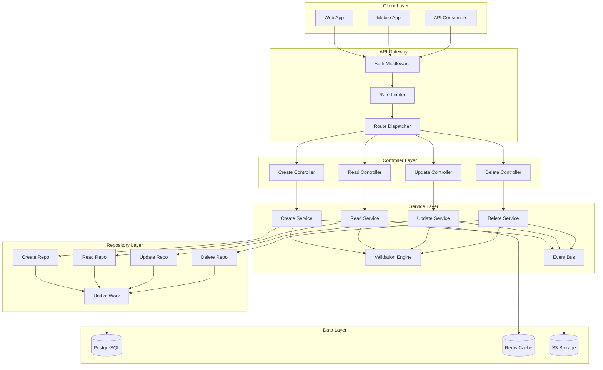
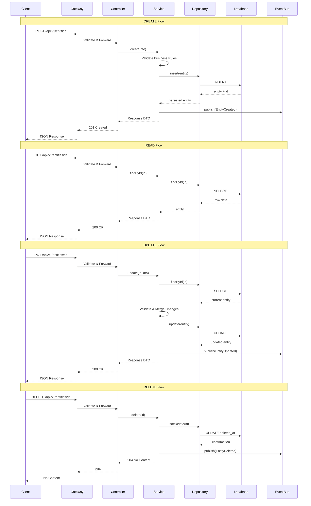
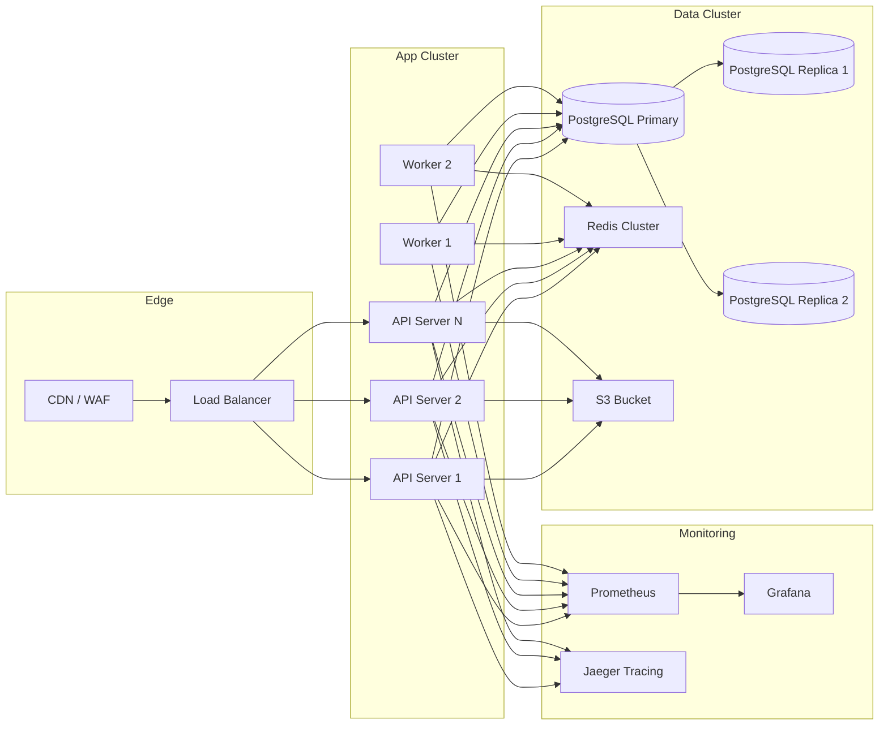

# CRUD Architecture

## 1. CRUD System Overview

The APEX-OS Business Platform implements a layered CRUD (Create, Read, Update, Delete) architecture that governs all persistent data operations across the system. This architecture ensures consistent data handling, validation, and access control for every entity in the platform.

### Core Principles

- **Separation of Concerns**: Each CRUD operation is isolated into distinct layers (Controller → Service → Repository → Database)
- **Validation at Boundaries**: All input is validated at the API boundary before reaching business logic
- **Audit Trail**: Every mutation operation is logged with timestamp, user, and change details
- **Soft Deletes**: Entities are soft-deleted by default; hard deletes require explicit admin action
- **Pagination & Filtering**: All list endpoints support cursor-based pagination and field-level filtering

### Entity Categories

| Category | Examples | Storage |
|----------|----------|---------|
| Core Business | Orders, Customers, Products | PostgreSQL |
| User Management | Users, Roles, Permissions | PostgreSQL |
| Content | Articles, Media, Documents | PostgreSQL + S3 |
| Audit | Logs, Events, History | PostgreSQL (partitioned) |
| Cache | Sessions, Rate Limits | Redis |

---

## 2. CRUD Component Diagram

---

## 3. CRUD Data Flow Diagram

---

## 4. CRUD Deployment Diagram

---

## 5. CRUD Technology Stack

| Layer | Technology | Version | Purpose |
|-------|-----------|---------|---------|
| Language | TypeScript | 5.x | Type-safe application code |
| Runtime | Node.js | 20 LTS | JavaScript runtime |
| Web Framework | Express.js | 4.x | HTTP routing & middleware |
| ORM | Prisma | 5.x | Database abstraction & migrations |
| Validation | Zod | 3.x | Schema validation at boundaries |
| Authentication | Passport.js | 0.7 | Multi-strategy auth |
| Authorization | CASL | 6.x | Permission-based access control |
| Caching | ioredis | 5.x | Redis client for cache layer |
| Queue | BullMQ | 5.x | Background job processing |
| Object Storage | AWS S3 SDK | 3.x | File & media storage |
| Logging | Pino | 8.x | Structured logging |
| Tracing | OpenTelemetry | 1.x | Distributed tracing |
| Testing | Vitest | 1.x | Unit & integration tests |
| Container | Docker | 24.x | Application containerization |
| Orchestration | Kubernetes | 1.28 | Container orchestration |
| CI/CD | GitHub Actions | - | Build, test, deploy pipeline |
| IaC | Terraform | 1.6 | Infrastructure provisioning |
| Monitoring | Prometheus + Grafana | - | Metrics & dashboards |
| Alerting | PagerDuty | - | Incident response |

### Database Schema Conventions

- All tables use UUID primary keys
- Timestamps: `created_at`, `updated_at`, `deleted_at` (soft delete)
- Audit fields: `created_by`, `updated_by`
- Indexes on all foreign keys and frequently queried columns
- Partitioning on audit/log tables by date range

### API Conventions

- RESTful endpoints under `/api/v1/`
- JSON request/response bodies
- Standard HTTP status codes
- Cursor-based pagination (`?cursor=&limit=`)
- Field filtering (`?fields=id,name,status`)
- Sorting (`?sort=-created_at`)
- Rate limiting per API key/user tier
