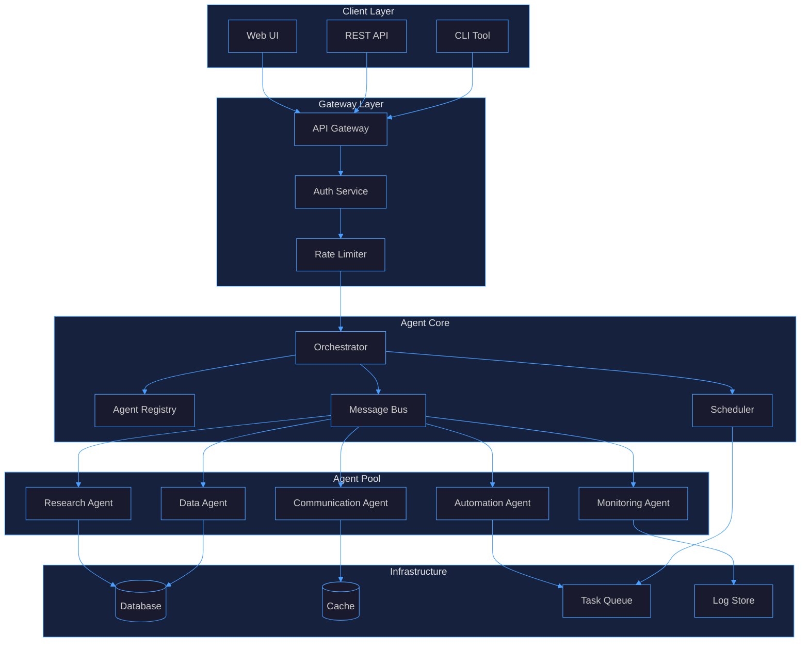
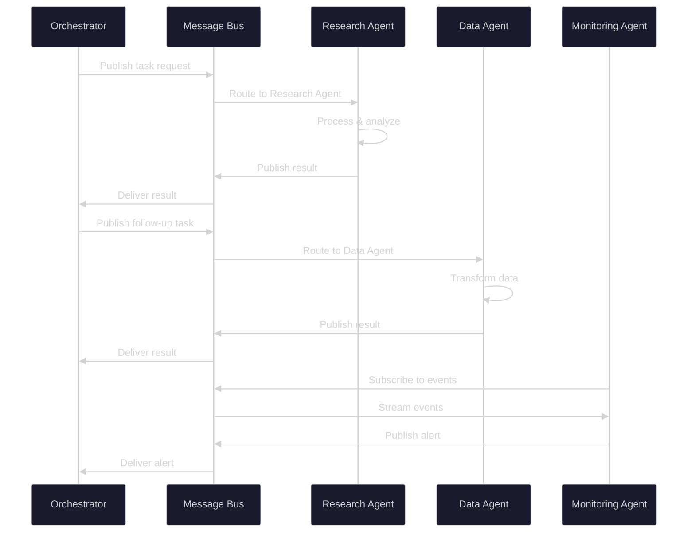
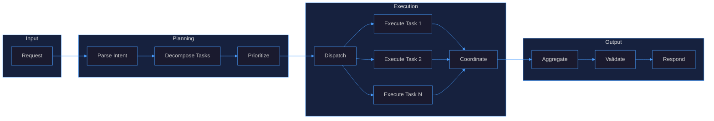
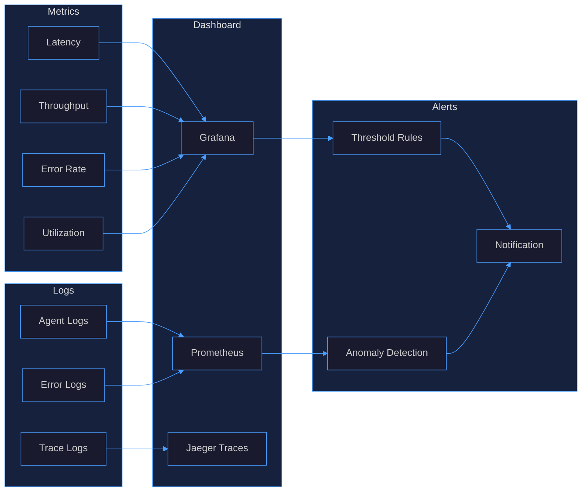

# Agent Integration

## 1. Agent Architecture

## 2. Agent Types

| Type | Purpose | Trigger | Output |
|------|---------|---------|--------|
| **Research Agent** | Information gathering, analysis, summarization | Scheduled / On-demand | Reports, insights |
| **Data Agent** | ETL, transformation, validation | Event-driven | Clean datasets |
| **Monitoring Agent** | Health checks, alerting, anomaly detection | Continuous | Alerts, metrics |
| **Automation Agent** | Workflow execution, task automation | Event / Schedule | Completed tasks |
| **Communication Agent** | Notifications, user interaction | Event-driven | Messages, emails |

### Agent Properties

- **Autonomy Level**: Fully autonomous, semi-autonomous (human-in-loop), manual
- **Scope**: Global (cross-domain), domain-specific, task-specific
- **State**: Stateless, stateful (session-persistent)
- **Concurrency**: Single-instance, multi-instance, pooled

## 3. Agent Communication

### Communication Patterns

- **Request/Response**: Synchronous task execution with result
- **Publish/Subscribe**: Asynchronous event-driven messaging
- **Broadcast**: One-to-many notification distribution
- **Pipeline**: Sequential data flow through agents

## 4. Agent Orchestration

### Orchestration Strategies

| Strategy | Description | Use Case |
|----------|-------------|----------|
| **Sequential** | Tasks execute in order | Dependent workflows |
| **Parallel** | Tasks execute concurrently | Independent tasks |
| **Hierarchical** | Parent spawns child agents | Complex decompositions |
| **Event-Driven** | Agents react to events | Real-time processing |
| **Hybrid** | Mixed strategies | Production systems |

## 5. Agent Monitoring

### Monitoring Layers

- **Infrastructure**: CPU, memory, disk, network per agent
- **Application**: Request rate, latency, error rate, queue depth
- **Business**: Task completion rate, SLA adherence, cost per task
- **Security**: Auth failures, anomaly detection, audit trails

### Key Metrics

| Metric | Description | Threshold |
|--------|-------------|-----------|
| `agent_latency_ms` | End-to-end task latency | < 5000ms |
| `agent_error_rate` | Failed tasks / total tasks | < 1% |
| `agent_throughput` | Tasks completed per minute | > 10/min |
| `agent_queue_depth` | Pending tasks in queue | < 100 |
| `agent_utilization` | Active agents / total agents | 40-80% |
