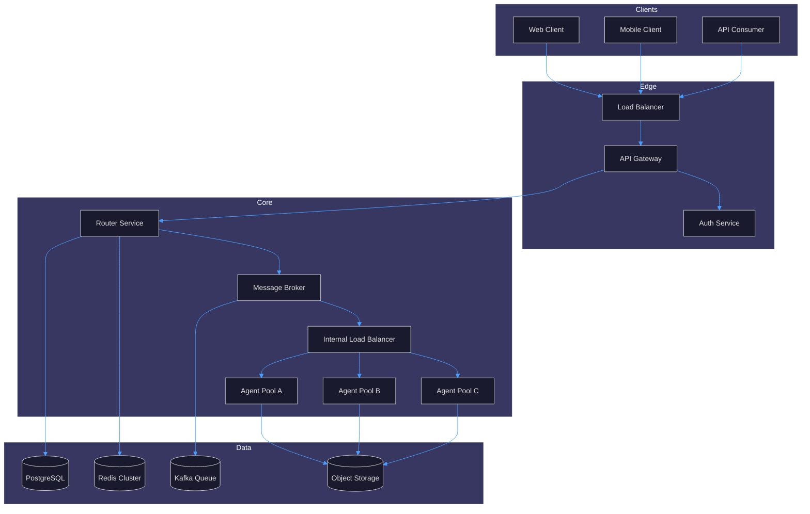
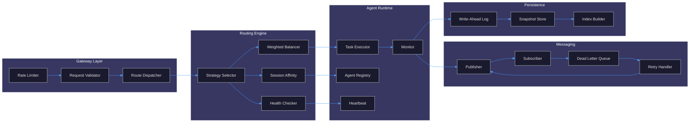
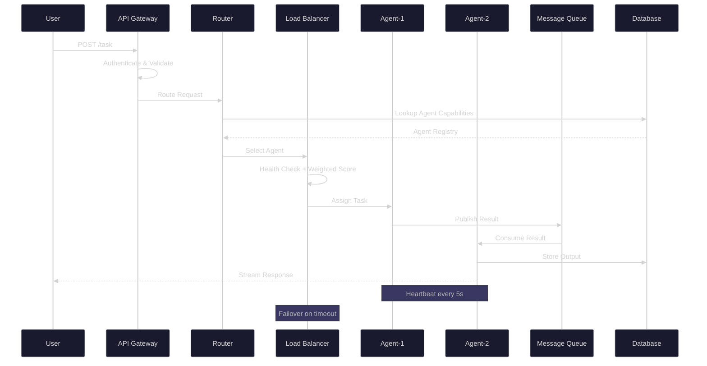
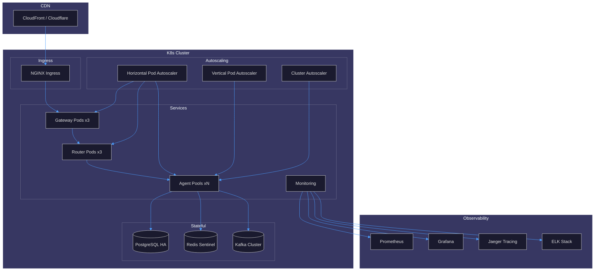
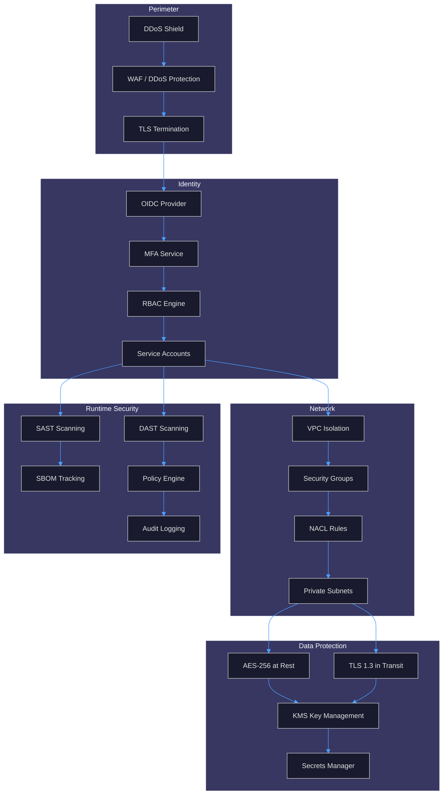

# Agent-Reach Architecture

Multi-agent communication platform with routing, load balancing, and fault tolerance.

## 1. System Architecture

## 2. Component Diagram

## 3. Data Flow

## 4. Deployment Architecture

## 5. Security Architecture

## Key Design Decisions

| Concern | Decision | Rationale |
|---------|----------|-----------|
| Routing | Weighted round-robin with health checks | Balances load while respecting agent capacity |
| Messaging | Kafka with DLQ | Durable, replayable, handles backpressure |
| State | PostgreSQL + Redis | Strong consistency for metadata, speed for sessions |
| Scaling | HPA + Cluster Autoscaler | Scales agents horizontally under load |
| Security | Zero-trust with mTLS | Every service authenticates every request |
| Observability | Prometheus + Jaeger + ELK | Metrics, traces, and logs in one stack |

## Fault Tolerance

- **Agent failure**: Health checker detects missed heartbeats; tasks re-queued to healthy agents
- **Broker failure**: Kafka replication factor 3; automatic leader election
- **Database failure**: PostgreSQL HA with automatic failover via Patroni
- **Gateway failure**: Multiple replicas behind load balancer; stateless design
- **Cascading failure**: Circuit breakers between services; bulkhead isolation per agent pool
