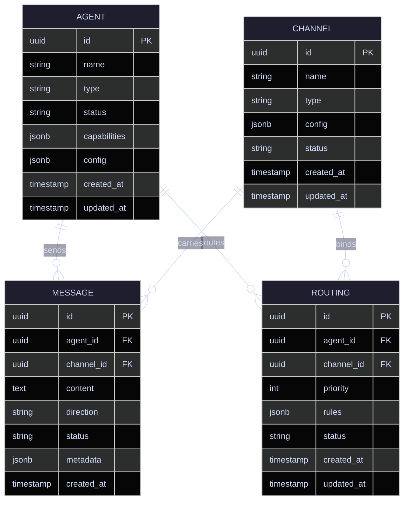

# Agent Reach Data Model

## Entity-Relationship Diagram

## Agent Entity Schema

| Column | Type | Constraints | Description |
|---|---|---|---|
| id | uuid | PK, default gen_random_uuid() | Unique agent identifier |
| name | varchar(255) | NOT NULL | Human-readable agent name |
| type | varchar(50) | NOT NULL | Agent category (e.g., `chat`, `voice`, `automation`) |
| status | varchar(20) | NOT NULL, default `'active'` | Lifecycle state: `active`, `paused`, `archived` |
| capabilities | jsonb | NOT NULL, default `'[]'` | Array of capability strings (e.g., `["search", "code_exec"]`) |
| config | jsonb | NOT NULL, default `'{}'` | Agent-specific configuration (model, prompts, limits) |
| created_at | timestamptz | NOT NULL, default now() | Record creation time |
| updated_at | timestamptz | NOT NULL, default now() | Last modification time |

**Indexes:** `idx_agent_type` on `(type)`, `idx_agent_status` on `(status)`

## Message Entity Schema

| Column | Type | Constraints | Description |
|---|---|---|---|
| id | uuid | PK, default gen_random_uuid() | Unique message identifier |
| agent_id | uuid | FK → agent.id, NOT NULL | Originating or target agent |
| channel_id | uuid | FK → channel.id, NOT NULL | Channel the message belongs to |
| content | text | NOT NULL | Message payload (plain text or serialized JSON) |
| direction | varchar(10) | NOT NULL | `inbound` or `outbound` |
| status | varchar(20) | NOT NULL, default `'pending'` | Delivery state: `pending`, `delivered`, `failed` |
| metadata | jsonb | NOT NULL, default `'{}'` | Headers, thread refs, attachments |
| created_at | timestamptz | NOT NULL, default now() | Message creation time |

**Indexes:** `idx_message_agent` on `(agent_id)`, `idx_message_channel` on `(channel_id)`, `idx_message_created` on `(created_at DESC)`

## Channel Entity Schema

| Column | Type | Constraints | Description |
|---|---|---|---|
| id | uuid | PK, default gen_random_uuid() | Unique channel identifier |
| name | varchar(255) | NOT NULL | Human-readable channel name |
| type | varchar(50) | NOT NULL | Channel kind (e.g., `slack`, `email`, `webhook`, `sms`) |
| config | jsonb | NOT NULL, default `'{}'` | Channel-specific settings (endpoint, credentials ref, rate limits) |
| status | varchar(20) | NOT NULL, default `'active'` | Operational state: `active`, `disabled`, `error` |
| created_at | timestamptz | NOT NULL, default now() | Record creation time |
| updated_at | timestamptz | NOT NULL, default now() | Last modification time |

**Indexes:** `idx_channel_type` on `(type)`, `idx_channel_status` on `(status)`

## Routing Table Schema

| Column | Type | Constraints | Description |
|---|---|---|---|
| id | uuid | PK, default gen_random_uuid() | Unique routing rule identifier |
| agent_id | uuid | FK → agent.id, NOT NULL | Agent this rule applies to |
| channel_id | uuid | FK → channel.id, NOT NULL | Channel this rule binds to |
| priority | integer | NOT NULL, default 100 | Lower number = higher priority (evaluated first) |
| rules | jsonb | NOT NULL, default `'{}'` | Matching conditions (keywords, intents, schedules) |
| status | varchar(20) | NOT NULL, default `'active'` | Rule state: `active`, `disabled` |
| created_at | timestamptz | NOT NULL, default now() | Record creation time |
| updated_at | timestamptz | NOT NULL, default now() | Last modification time |

**Indexes:** `idx_routing_agent` on `(agent_id)`, `idx_routing_channel` on `(channel_id)`, `idx_routing_priority` on `(priority ASC)`

**Unique Constraint:** `uq_routing_agent_channel` on `(agent_id, channel_id)` — one routing rule per agent-channel pair.

## Relationships Summary

- **Agent → Message**: One-to-many (an agent sends/receives many messages)
- **Channel → Message**: One-to-many (a channel carries many messages)
- **Agent ↔ Channel**: Many-to-many via **Routing** (an agent can be reachable on multiple channels; a channel can serve multiple agents)
