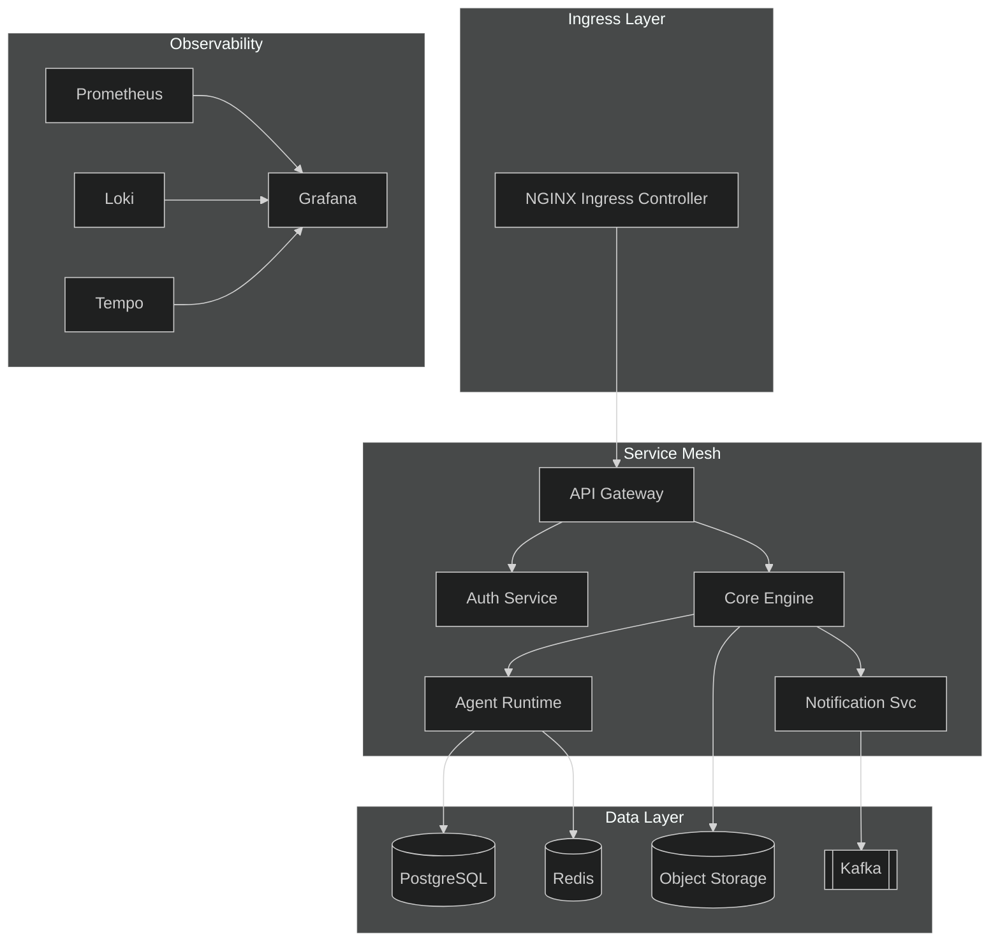
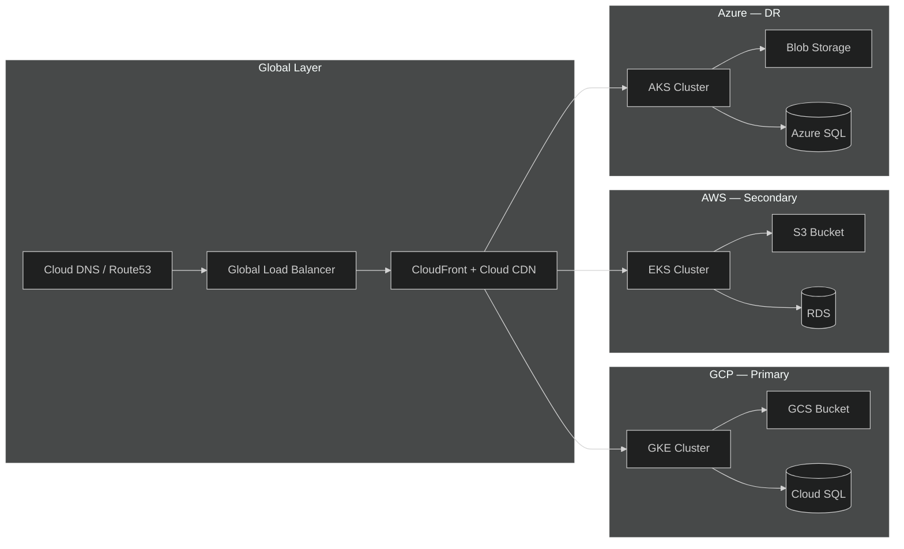
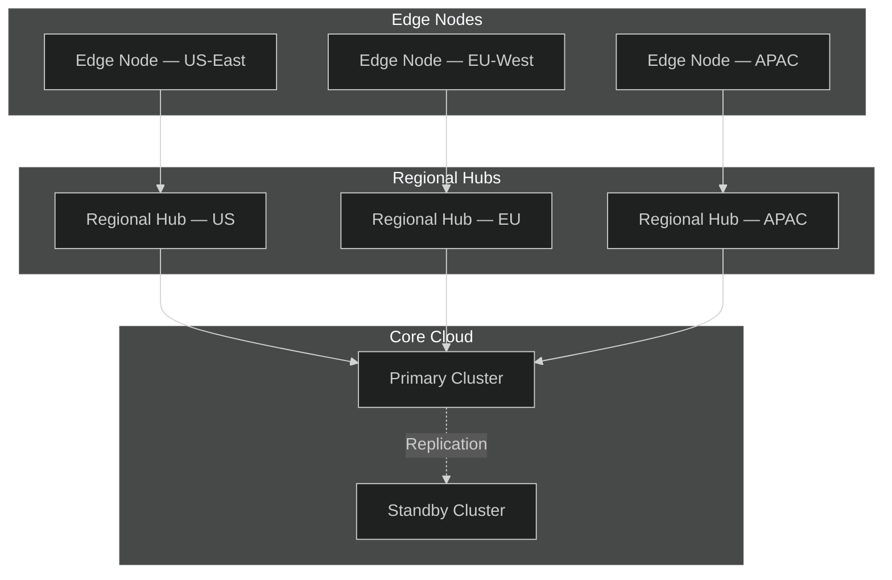
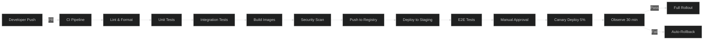

# Agent Reach — Deployment Guide

## 1. Kubernetes Deployment



**Key manifests:** `deploy/k8s/{deployment,service,ingress,hpa,pdb}.yaml`

---

## 2. Multi-Cloud Deployment



**Failover:** health-check driven DNS failover; RPO < 5 min, RTO < 15 min.

---

## 3. Edge Deployment



**Edge capabilities:** local inference, cache-first reads, store-and-forward messaging.

---

## 4. CI/CD Pipeline



**Tools:** GitHub Actions → ArgoCD → Kubernetes. Canary via Flagger.

---

## 5. Monitoring Setup

```mermaid
%%{init: {'theme': 'dark'}}%%
graph TD
    subgraph Collection["Collection"]
        OTEL[OpenTelemetry Collector]
        PROM2[Prometheus]
        FLUENT[Fluent Bit]
    end

    subgraph Storage["Storage"]
        TSDB[(Prometheus TSDB)]
        LOKI2[(Loki)]
        TEMP[(Tempo)]
        ELK[(Elasticsearch)]
    end

    subgraph Visualization["Visualization"]
        GRAF2[Grafana Dashboards]
        KIBANA[Kibana]
    end

    subgraph Alerting["Alerting"]
        ALERT[Alertmanager]
        PAGER[PagerDuty]
        SLACK[Slack Webhook]
    end

    subgraph SLO["SLO Tracking"]
        BURN[Error Budget]
        SLO[SLO Dashboard]
    end

    OTEL --> TSDB
    OTEL --> TEMP
    PROM2 --> TSDB
    FLUENT --> LOKI2
    FLUENT --> ELK
    TSDB --> GRAF2
    LOKI2 --> GRAF2
    TEMP --> GRAF2
    ELK --> KIBANA
    TSDB --> ALERT
    ALERT --> PAGER
    ALERT --> SLACK
    TSDB --> BURN
    BURN --> SLO
```

**Key dashboards:** service-latency, agent-throughput, error-rate, cost-per-request.

---

## Quick Reference

| Concern | Tooling |
|---------|---------|
| Container orchestration | Kubernetes (GKE/EKS/AKS) |
| GitOps | ArgoCD |
| CI | GitHub Actions |
| Secrets | External Secrets Operator + Vault |
| Service mesh | Istio |
| Observability | Prometheus + Grafana + Loki + Tempo |
| Log aggregation | Fluent Bit → Loki / Elasticsearch |
| Tracing | OpenTelemetry → Tempo |
| Alerting | Alertmanager → PagerDuty / Slack |
