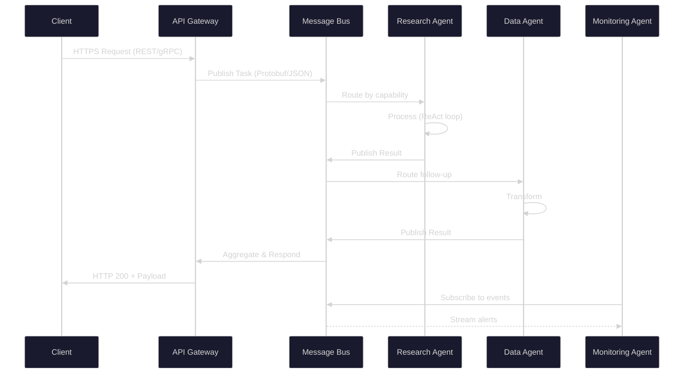
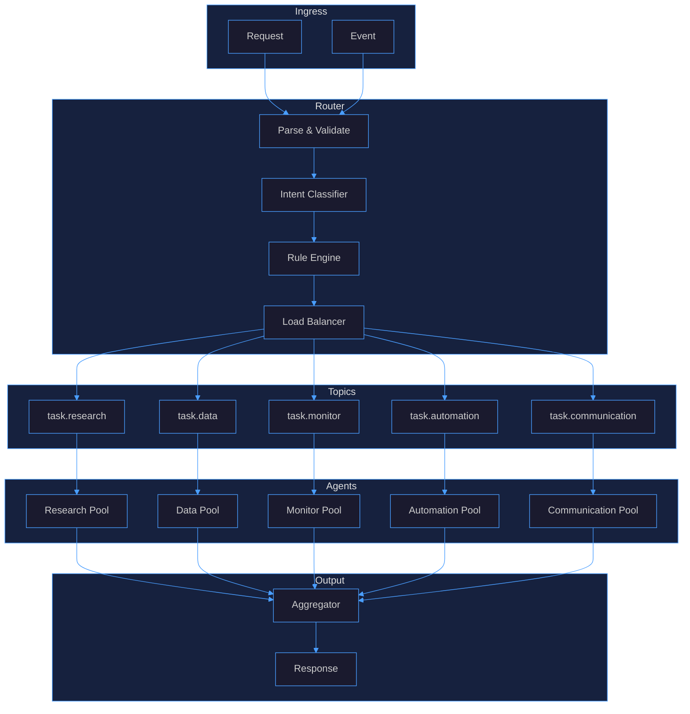
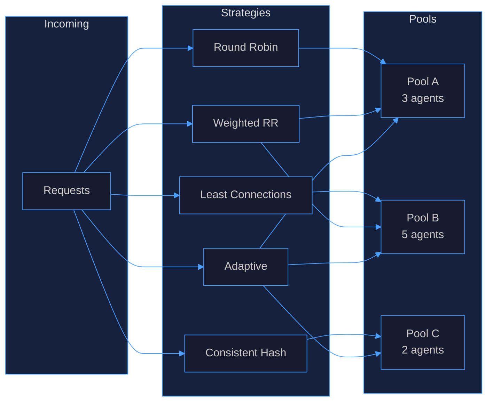
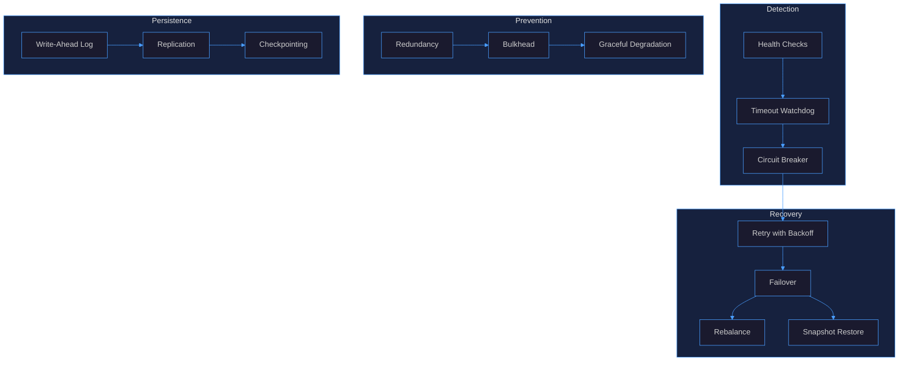
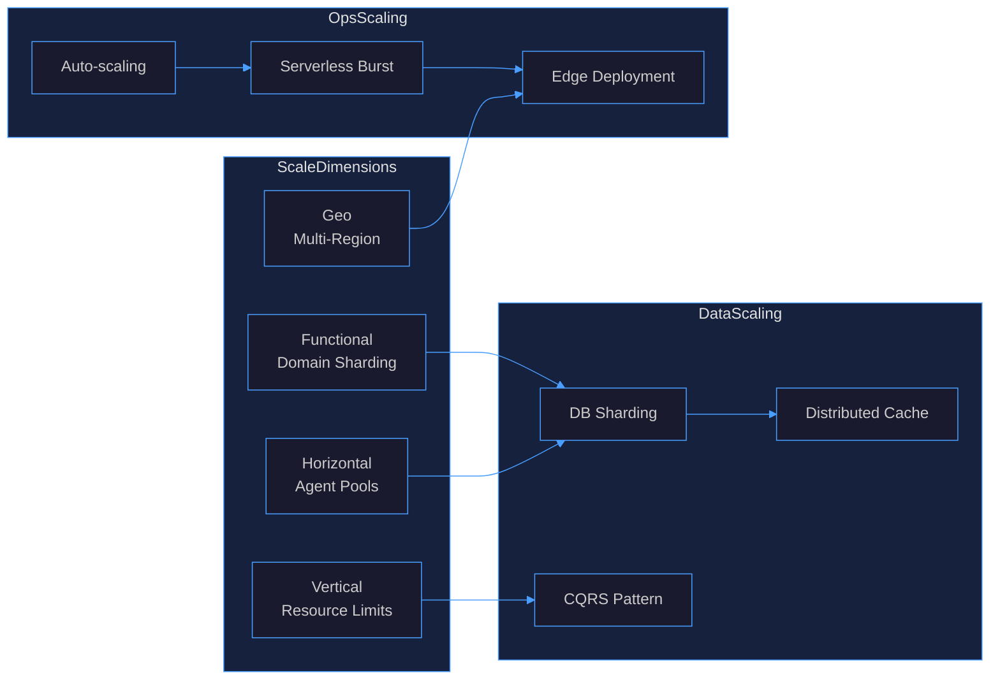

# Agent Reach Implementation

## 1. Communication Protocols

Agent Reach uses a layered protocol stack for inter-agent communication, supporting both synchronous and asynchronous patterns.



### Protocol Layers

| Layer | Protocol | Purpose | Format |
|-------|----------|---------|--------|
| Transport | HTTP/2, WebSocket | Client-facing, streaming | JSON, Protobuf |
| Messaging | AMQP / NATS | Inter-agent async | Protobuf, Avro |
| RPC | gRPC | Synchronous agent calls | Protobuf |
| Event | CloudEvents | Cross-service events | JSON |

### Message Envelope

```json
{
  "id": "msg-uuid-v4",
  "source": "orchestrator",
  "target": "research-agent",
  "type": "task.request",
  "priority": 5,
  "ttl_ms": 30000,
  "trace_id": "trace-uuid",
  "payload": { "query": "..." },
  "metadata": { "tenant": "acme", "retry": 0 }
}
```

## 2. Message Routing Architecture

The routing layer uses a hybrid approach: content-based routing for task dispatch, topic-based pub/sub for events, and direct addressing for request/response.



### Routing Strategies

- **Content-based**: Inspect message payload to select target agent pool
- **Topic-based**: Publish to named topics; agents subscribe by capability
- **Direct**: Point-to-point for request/response with correlation ID
- **Broadcast**: Fan-out to all agents for discovery or health checks
- **Consistent Hashing**: Route by `hash(agent_id) % pool_size` for session affinity

## 3. Load Balancing Patterns

Agent Reach employs multiple load balancing strategies depending on traffic characteristics.



### Strategy Selection

| Pattern | Algorithm | Best For | Trade-off |
|---------|-----------|----------|-----------|
| Round Robin | Sequential dispatch | Homogeneous agents, uniform tasks | Ignores load |
| Least Connections | Track active tasks | Variable task duration | Slight overhead |
| Consistent Hash | `hash(key) % N` | Session affinity, cache locality | Rebalancing on resize |
| Weighted RR | Capacity-weighted | Heterogeneous agent capacity | Static weights |
| Adaptive | Real-time metrics | Dynamic workloads | Complexity, feedback loops |

### Backpressure

- **Queue depth limit**: Reject or shed load when `queue_depth > threshold`
- **Rate limiting**: Token bucket per tenant and per agent type
- **Circuit breaker**: Fail fast when error rate exceeds 50% over 30s window
- **Graceful degradation**: Fall back to cached results or simplified responses

## 4. Fault Tolerance Strategies

Agent Reach implements fault tolerance at multiple levels: message delivery, agent execution, and system-wide resilience.



### Fault Tolerance Matrix

| Failure Mode | Strategy | Implementation |
|-------------|----------|----------------|
| Agent crash | Auto-restart + failover | Kubernetes liveness probe, restart policy |
| Message loss | Persistent queue + ACK | NATS JetStream, manual ACK mode |
| Network partition | Quorum + split-brain prevention | Raft consensus, majority partition |
| Cascading failure | Bulkhead + circuit breaker | Per-agent thread pools, error threshold |
| Data corruption | Checksums + replication | CRC32 validation, 3x replication |
| Poison message | Dead-letter queue | Max retry count, DLQ with alert |

### Retry Policy

```
attempt 1: immediate
attempt 2: 100ms + jitter
attempt 3: 500ms + jitter
attempt 4: 2s + jitter
attempt 5: 10s + jitter
→ dead-letter queue
```

## 5. Scalability Considerations

Agent Reach is designed for horizontal scalability across multiple dimensions.



### Scaling Triggers

| Metric | Scale Up | Scale Down | Cooldown |
|--------|----------|-----------|----------|
| CPU > 70% | +2 agents | - | 60s |
| Queue depth > 50 | +3 agents | - | 120s |
| Latency p99 > 2s | +2 agents | - | 90s |
| Error rate > 5% | +1 agent (failover) | - | 30s |
| CPU < 30% | - | -1 agent | 300s |

### Scalability Patterns

- **Stateless agents**: Enable horizontal scaling without session migration
- **Shared-nothing architecture**: Each agent pool operates independently
- **CQRS**: Separate read/write paths for query-heavy workloads
- **Event sourcing**: Replay events for recovery and audit
- **Cell-based deployment**: Isolate failure domains per tenant or region
- **Backpressure propagation**: Flow control from agents up to clients

### Capacity Planning

| Tier | Agents | Throughput | Latency SLA |
|------|--------|------------|-------------|
| Small | 5-10 | 100 req/s | < 500ms |
| Medium | 10-50 | 1,000 req/s | < 300ms |
| Large | 50-200 | 10,000 req/s | < 200ms |
| Enterprise | 200+ | 100,000 req/s | < 100ms |
