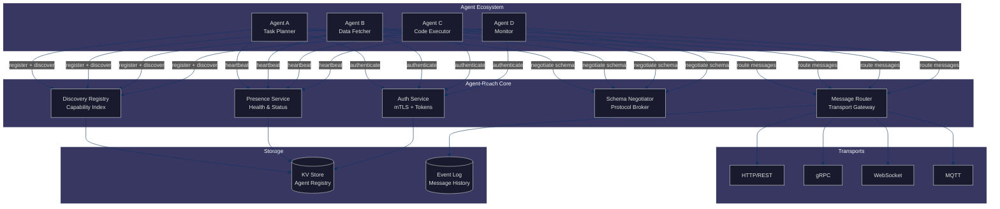
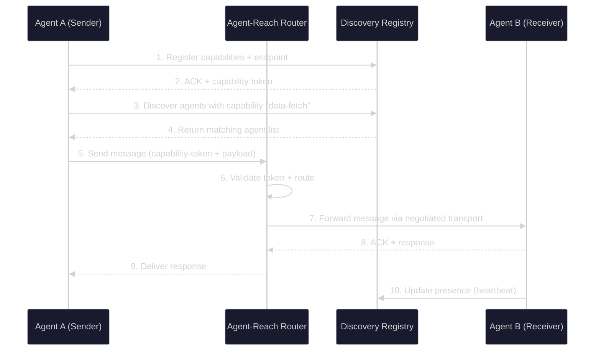

# Agent-Reach: Research & Concept

> **Status:** Top Project Concept — APEX-OS Business Platform  
> **Date:** 2026-10-02  
> **Author:** Research Division

---

## 1. Overview

**Agent-Reach** is a proposed agent communication and discovery layer for the APEX-OS Business Platform. It provides a unified protocol and infrastructure for autonomous AI agents to discover, authenticate, communicate, and collaborate across heterogeneous environments — spanning local edge devices, cloud services, and multi-tenant SaaS platforms.

### Problem Statement

Current agent-to-agent communication is fragmented. Each platform (LangChain, CrewAI, AutoGen, OpenAI Swarm) implements its own discovery, messaging, and coordination mechanisms. There is no standard way for an agent to:

- Discover other agents by capability, not just endpoint
- Establish trust and authenticate across organizational boundaries
- Route messages through heterogeneous transports (HTTP, gRPC, WebSocket, MQTT)
- Negotiate protocols and schemas dynamically
- Maintain presence and health across ephemeral agent lifecycles

### Vision

Agent-Reach becomes the **"DNS + Postal Service" for agents** — a lightweight, extensible layer that handles discovery, routing, authentication, and delivery so agent frameworks can focus on reasoning and task execution.

### Core Principles

| Principle | Description |
|-----------|-------------|
| **Capability-first discovery** | Agents advertise what they *can do*, not just where they live |
| **Transport-agnostic** | Same message semantics over HTTP, gRPC, WebSocket, or MQTT |
| **Zero-trust by default** | Mutual TLS + capability tokens for every interaction |
| **Schema negotiation** | Agents agree on message formats at connection time |
| **Ephemeral-friendly** | Designed for agents that spin up/down in seconds |

---

## 2. Architecture

### High-Level Component Diagram



### Message Flow Sequence



### Data Model

```mermaid
%%{init: {'theme':'dark', 'themeVariables': {'primaryColor':'#1a1a2e','primaryTextColor':'#e0e0e0','primaryBorderColor':'#16213e','lineColor':'#0f3460','secondaryColor':'#533483','tertiaryColor':'#e94560','background':'#0f0f23','mainBkg':'#1a1a2e','secondBkg':'#16213e','textColor':'#e0e0e0','fontSize':'14px'}}}%%
erDiagram
    AGENT {
        string agent_id PK
        string name
        string owner_org
        string status
        timestamp last_seen
        string mtls_fingerprint
    }
    CAPABILITY {
        string capability_id PK
        string agent_id FK
        string name
        string description
        json input_schema
        json output_schema
        int priority
    }
    ENDPOINT {
        string endpoint_id PK
        string agent_id FK
        string transport_type
        string url
        int priority
        boolean healthy
    }
    MESSAGE {
        string message_id PK
        string sender_id FK
        string receiver_id FK
        string capability_id FK
        json payload
        string status
        timestamp created_at
    }
    AGENT ||--o{ CAPABILITY : advertises
    AGENT ||--o{ ENDPOINT : exposes
    AGENT ||--o{ MESSAGE : sends/receives
```

---

## 3. Key Features

### 3.1 Capability-Based Discovery

Agents register with a **capability manifest** — a structured description of what they can do, including input/output schemas, SLAs, and resource requirements. Discovery queries match on capability semantics, not just string matching.

```json
{
  "capability_id": "data-fetch-v2",
  "name": "Fetch External Data",
  "description": "Retrieves data from REST APIs with retry logic",
  "input_schema": { "type": "object", "properties": { "url": { "type": "string" } } },
  "output_schema": { "type": "object", "properties": { "data": {}, "status": { "type": "integer" } } },
  "sla": { "max_latency_ms": 5000, "availability": 0.99 },
  "tags": ["http", "fetch", "external"]
}
```

### 3.2 Multi-Transport Routing

The router abstracts transport selection. Senders specify a capability; the router picks the best available transport based on latency, cost, and reliability preferences.

| Transport | Use Case | Latency | Reliability |
|-----------|----------|---------|-------------|
| HTTP/REST | Simple request/response | Medium | High |
| gRPC | Streaming, low-latency | Low | High |
| WebSocket | Real-time bidirectional | Low | Medium |
| MQTT | IoT, edge, pub/sub | Variable | Medium |

### 3.3 Schema Negotiation Protocol

When two agents connect for the first time, they negotiate a shared message schema. The Schema Negotiator supports:

- **Version negotiation** — pick highest mutually supported version
- **Format selection** — JSON, Protobuf, MessagePack, or CBOR
- **Compression** — none, gzip, zstd
- **Fallback chain** — ordered list of acceptable schemas

### 3.4 Presence & Health Monitoring

The Presence Service tracks agent liveness via configurable heartbeat intervals. Agents can be:

- **Active** — heartbeating within SLA
- **Degraded** — heartbeating but with elevated latency
- **Offline** — missed heartbeats; messages queued or rejected
- **Draining** — gracefully shutting down; no new messages accepted

### 3.5 Zero-Trust Security

Every interaction is authenticated and authorized:

- **Mutual TLS** for transport-level identity
- **Capability tokens** (short-lived, scoped JWTs) for authorization
- **Per-message signatures** for integrity verification
- **Audit logging** of all discovery and message events

### 3.6 Message Guarantees

Configurable delivery semantics per message:

- **Fire-and-forget** — no delivery guarantee (lowest latency)
- **At-least-once** — retried until ACK (default)
- **Exactly-once** — deduplicated via idempotency keys
- **Ordered** — sequence numbers for in-order delivery

---

## 4. Comparison with Existing Platforms

| Feature | Agent-Reach | MCP (Model Context Protocol) | A2A (Agent-to-Agent, Google) | LangGraph | CrewAI | AutoGen |
|---------|-------------|---------------------------|------------------------------|-----------|--------|---------|
| **Primary Focus** | Discovery + routing + transport | Tool/context sharing | Agent-to-agent tasks | Stateful graphs | Role-based crews | Conversation patterns |
| **Discovery Model** | Capability-first, semantic | Server-listed tools | Agent cards (well-known URI) | None (explicit wiring) | None (explicit crews) | None (explicit groups) |
| **Transport** | Pluggable (HTTP/WS/gRPC/MQTT) | stdio / HTTP+SSE | HTTP/JSON-RPC | In-process | In-process | In-process |
| **Schema Negotiation** | Built-in, multi-format | Fixed (tool schemas) | Fixed (task schema) | N/A | N/A | N/A |
| **Presence/Health** | Built-in heartbeat service | None | None | Checkpoint-based | None | None |
| **Security Model** | mTLS + capability tokens | OAuth (server-side) | API keys / OAuth | None built-in | None built-in | None built-in |
| **Delivery Guarantees** | Configurable (fire-and-forget to exactly-once) | None (sync only) | Task-based (async) | Deterministic replay | None | None |
| **Multi-tenancy** | Native (org-scoped) | No | No | No | No | No |
| **Ephemeral Agents** | First-class (auto-registration/deregistration) | No | No | No | No | No |
| **Maturity** | Proposed | Emerging (Anthropic) | Emerging (Google) | Production | Production | Production |

### Key Differentiators

1. **vs MCP:** MCP is a tool-context protocol for LLM ↔ tool interaction. Agent-Reach is an agent-to-agent communication layer. They are complementary — Agent-Reach can transport MCP tool calls between agents.

2. **vs A2A:** Google's A2A focuses on task delegation between agents. Agent-Reach is broader — it handles discovery, routing, presence, and transport abstraction, not just task execution.

3. **vs LangGraph/CrewAI/AutoGen:** These are orchestration frameworks that assume explicit wiring. Agent-Reach provides the implicit discovery and communication layer these frameworks lack.

---

## 5. Implementation Requirements

### 5.1 Technology Stack

| Layer | Technology | Rationale |
|-------|-----------|-----------|
| Core Router | Rust or Go | Performance, memory safety, async I/O |
| Discovery Registry | etcd or Consul | Distributed KV with watch/notify |
| Message Broker | NATS or NATS JetStream | Lightweight, multi-transport, at-least-once delivery |
| Schema Registry | Protobuf + custom registry | Versioned, language-agnostic schemas |
| Auth | SPIFFE/SPIRE + JWT | Workload identity, short-lived tokens |
| Observability | OpenTelemetry + Prometheus | Standard tracing and metrics |
| SDK | Python, TypeScript, TypeScript | Broadest agent framework coverage |

### 5.2 API Surface

```
# Discovery
POST   /v1/agents/register
DELETE /v1/agents/{id}/deregister
GET    /v1/agents?capability={name}&tag={tag}
GET    /v1/agents/{id}

# Messaging
POST   /v1/messages/send
POST   /v1/messages/stream
GET    /v1/messages/{id}/status

# Schema Negotiation
POST   /v1/negotiate
GET    /v1/schemas/{capability}

# Presence
POST   /v1/agents/{id}/heartbeat
GET    /v1/agents/{id}/health

# Admin
GET    /v1/admin/audit-log
GET    /v1/admin/metrics
```

### 5.3 Non-Functional Requirements

| Requirement | Target |
|-------------|--------|
| Discovery latency (p99) | < 50ms |
| Message routing latency (p99) | < 100ms |
| Throughput | 100K messages/sec per node |
| Availability | 99.99% (with clustering) |
| Agent registry size | 1M+ agents |
| Heartbeat interval | 5s default, configurable |
| Token TTL | 60s default, configurable |
| Message retention | 24h default, configurable |

### 5.4 Deployment Modes

1. **Embedded** — Library linked directly into agent processes (single-node, low latency)
2. **Sidecar** — Agent-Reach sidecar container alongside each agent (Kubernetes-native)
3. **Centralized** — Dedicated Agent-Reach cluster with agents connecting remotely (multi-tenant SaaS)

### 5.5 Milestones

| Phase | Scope | Timeline |
|-------|-------|----------|
| **M1: Foundation** | Core router, HTTP transport, basic discovery, Python SDK | 6 weeks |
| **M2: Multi-Transport** | gRPC + WebSocket transports, schema negotiation, presence service | 4 weeks |
| **M3: Production** | mTLS, capability tokens, NATS backend, observability, clustering | 4 weeks |
| **M4: Ecosystem** | TypeScript SDK, MCP bridge, A2A adapter, performance tuning | 4 weeks |

### 5.6 Risks & Mitigations

| Risk | Impact | Mitigation |
|------|--------|------------|
| Cold-start latency for ephemeral agents | High | Pre-warmed connection pools, lazy registration |
| Schema fragmentation across agents | Medium | Curated schema registry, community standards |
| NATS becoming a bottleneck | High | Partitioned streams, horizontal scaling |
| Security token theft | High | Short TTL, mTLS binding, hardware-backed keys |
| Discovery registry inconsistency | Medium | Eventual consistency with conflict-free replicated data types (CRDTs) |

---

## Summary

Agent-Reach fills a critical gap in the agent ecosystem: a **standardized, secure, and efficient communication and discovery layer** that existing frameworks and protocols do not provide. By abstracting discovery, routing, authentication, and transport, it allows agent builders to focus on agent logic rather than communication plumbing.

The concept is complementary to MCP, A2A, and existing orchestration frameworks — it can serve as the underlying transport for all of them.
