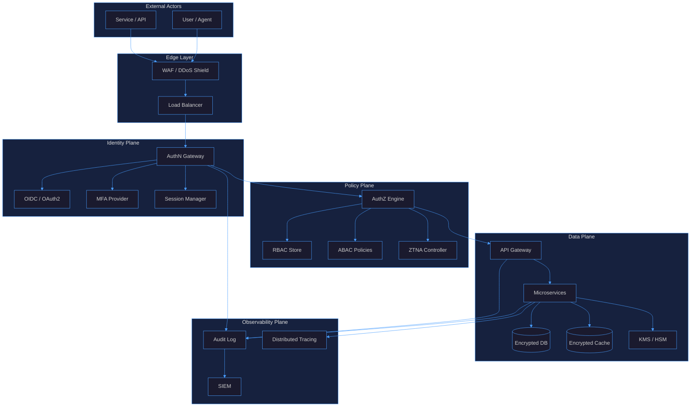
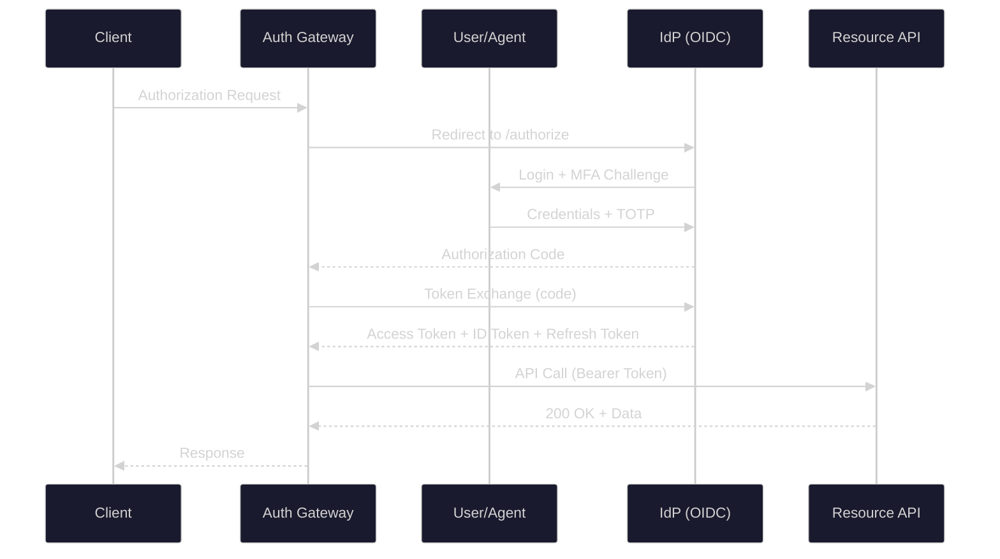
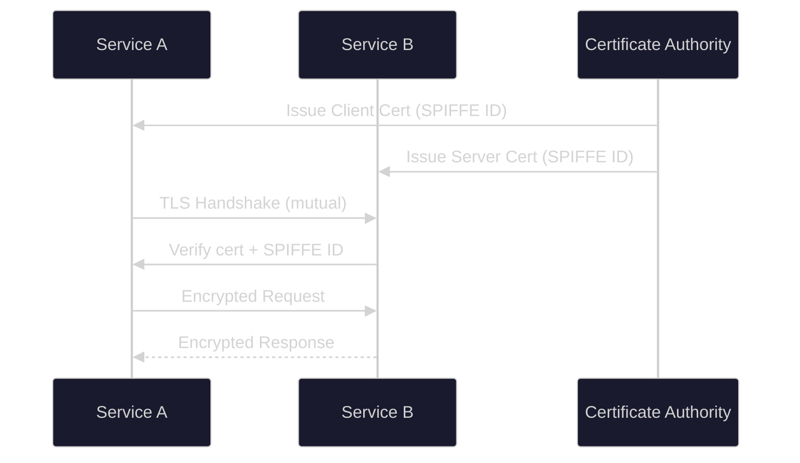
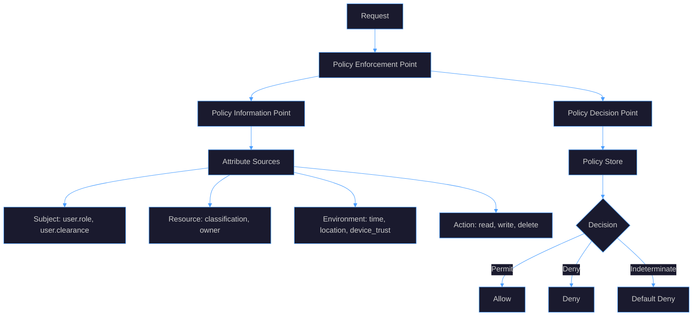
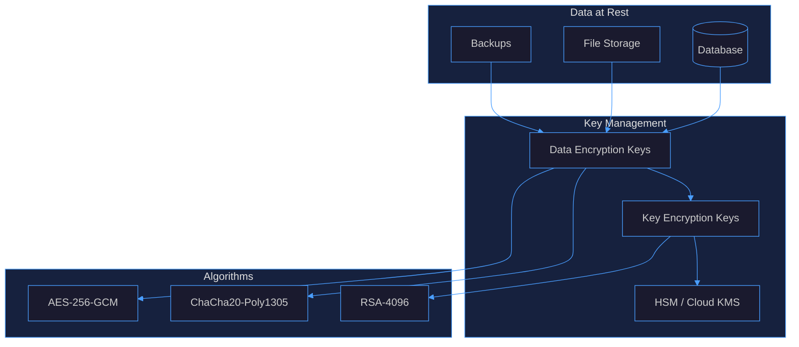
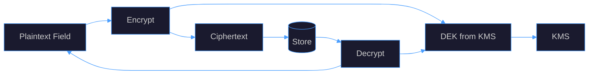
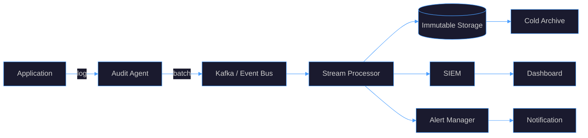

# Agent-Reach Security
## 1. Security Architecture

## 2. Authentication Patterns
### 2.1 OAuth2 + OIDC (Primary)

### 2.2 mTLS (Service-to-Service)

### 2.3 API Key + HMAC (Legacy/External)
- API keys stored as salted hashes (bcrypt/argon2)
- HMAC-SHA256 request signing with timestamp + nonce
- Key rotation every 90 days; scope-limited keys per integration
### 2.4 Session Management
| Aspect | Policy |
|--------|--------|
| Token type | JWT (RS256) + opaque refresh |
| Access TTL | 15 minutes |
| Refresh TTL | 7 days (rotating) |
| Storage | HttpOnly + Secure + SameSite=Strict cookie |
| Revocation | Redis-backed denylist |
| Binding | Token bound to device fingerprint |
## 3. Authorization Patterns
### 3.1 RBAC (Role-Based Access Control)
```mermaid
%%{init: {'theme':'dark', 'themeVariables': {'primaryColor':'#1a1a2e','primaryTextColor':'#e0e0e0','lineColor':'#4a9eff','secondaryColor':'#16213e','tertiaryColor':'#0f3460','background':'#0d1117','mainBkg':'#1a1a2e','nodeBorder':'#4a9eff','clusterBkg':'#16213e','clusterBorder':'#4a9eff','titleColor':'#e0e0e0','edgeLabelBackground':'#1a1a2e'}}}%%
graph LR
    subgraph Roles["Roles"]
        R1[admin]
        R2[manager]
        R3[analyst]
        R4[viewer]
    end
    subgraph Perms["Permissions"]
        P1[read:*]
        P2[write:*]
        P3[read:financial]
        P4[write:financial]
        P5[read:reports]
        P6[admin:users]
    end
    subgraph Resources["Resources"]
        RES1[/api/v1/users]
        RES2[/api/v1/financial]
        RES3[/api/v1/reports]
        RES4[/api/v1/admin]
    end
    R1 --> P1 & P2 & P6
    R2 --> P3 & P4
    R3 --> P3 & P5
    R4 --> P5
    P1 --> RES1
    P2 & P3 & P4 --> RES2
    P5 --> RES3
    P6 --> RES4
```
### 3.2 ABAC (Attribute-Based Access Control)

### 3.3 Zero Trust Network Access (ZTNA)
- **Never trust, always verify** — every request authenticated + authorized
- **Least privilege** — minimal permissions per session
- **Micro-segmentation** — per-service network policies
- **Continuous validation** — re-auth on anomaly detection
- **Device posture** — check device health before granting access
### 3.4 Policy as Code (OPA/Rego)
```rego
package agentreach.authz
default allow = false
allow {
    input.user.clearance >= input.resource.classification
    input.user.department == input.resource.department
    input.action == "read"
    time.now_ns() < input.user.session_expiry
}
allow {
    input.user.role == "admin"
    input.action == "read"
}
```
## 4. Encryption Strategies
### 4.1 Encryption at Rest

### 4.2 Encryption in Transit
| Layer | Protocol | Notes |
|-------|----------|-------|
| External | TLS 1.3 | HSTS, cert pinning |
| Service-to-Service | mTLS (Istio/Linkerd) | SPIFFE identity |
| Database | TLS 1.2+ | Verify cert |
| Cache | TLS 1.2+ | AUTH + TLS |
| Message Queue | TLS + SASL | SASL/SCRAM or mTLS |
### 4.3 Field-Level Encryption

### 4.4 Key Management
- **Envelope encryption**: DEK encrypts data, KEK encrypts DEK
- **Key rotation**: Automatic every 90 days (DEK), 1 year (KEK)
- **Key hierarchy**: Root key (HSM) → KEK → DEK
- **Key versioning**: Multiple active versions for rotation
- **Key destruction**: Crypto-shredding for data deletion
## 5. Audit Logging
### 5.1 Audit Event Schema
```mermaid
%%{init: {'theme':'dark', 'themeVariables': {'primaryColor':'#1a1a2e','primaryTextColor':'#e0e0e0','lineColor':'#4a9eff','secondaryColor':'#16213e','tertiaryColor':'#0f3460','background':'#0d1117','mainBkg':'#1a1a2e','nodeBorder':'#4a9eff','clusterBkg':'#16213e','clusterBorder':'#4a9eff','titleColor':'#e0e0e0','edgeLabelBackground':'#1a1a2e'}}}%%
classDiagram
    class AuditEvent {
        +string event_id
        +string timestamp
        +string event_type
        +string severity
        +Actor actor
        +Target target
        +Action action
        +Result result
        +Context context
        +string correlation_id
    }
    class Actor {
        +string id
        +string type
        +string ip
        +string user_agent
        +string session_id
    }
    class Target {
        +string resource_type
        +string resource_id
        +string service
    }
    class Action {
        +string verb
        +string method
        +string path
    }
    class Result {
        +string status
        +int http_status
        +string error_code
    }
    class Context {
        +string request_id
        +string trace_id
        +string tenant_id
        +string device_id
    }
    AuditEvent --> Actor & Target & Action & Result & Context
```
### 5.2 Audit Pipeline

### 5.3 Log Integrity
| Mechanism | Implementation |
|-----------|---------------|
| Tamper-evident | Hash chain (each log includes hash of previous) |
| Immutability | Write-once storage (WORM) |
| Signing | HMAC-SHA256 per log entry |
| Timestamping | RFC 3161 trusted timestamp |
| Retention | 7 years (compliance), 90 days hot |
### 5.4 Audit Events Catalog
| Category | Events |
|----------|--------|
| Authentication | login, logout, mfa_challenge, token_refresh, session_expired |
| Authorization | access_granted, access_denied, privilege_escalation, role_change |
| Data Access | read, write, delete, export, bulk_operation |
| Admin | user_created, user_deleted, config_changed, key_rotated |
| Security | anomaly_detected, rate_limit_hit, cert_expiring, policy_violation |
### 5.5 Compliance Mapping
| Standard | Requirements |
|----------|-------------|
| SOC 2 | Access controls, monitoring, incident response |
| GDPR | Data access logs, right to erasure, breach notification |
| HIPAA | PHI access audit, encryption, access controls |
| PCI DSS | Cardholder data access, encryption, audit trails |
| ISO 27001 | Risk assessment, access control, monitoring |
## Summary
| Pillar | Key Controls |
|--------|-------------|
| Authentication | OAuth2/OIDC, mTLS, MFA, short-lived tokens |
| Authorization | RBAC + ABAC, ZTNA, Policy-as-Code (OPA) |
| Encryption | AES-256-GCM at rest, TLS 1.3 in transit, envelope encryption |
| Audit | Immutable logs, hash chain, real-time SIEM, 7-year retention |
| Zero Trust | Never trust always verify, least privilege, continuous validation |
