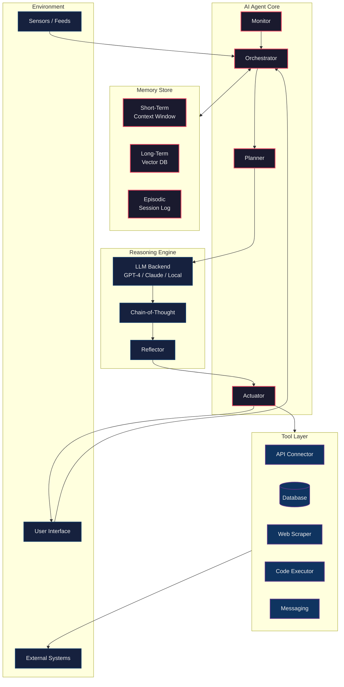
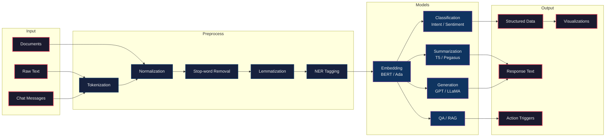
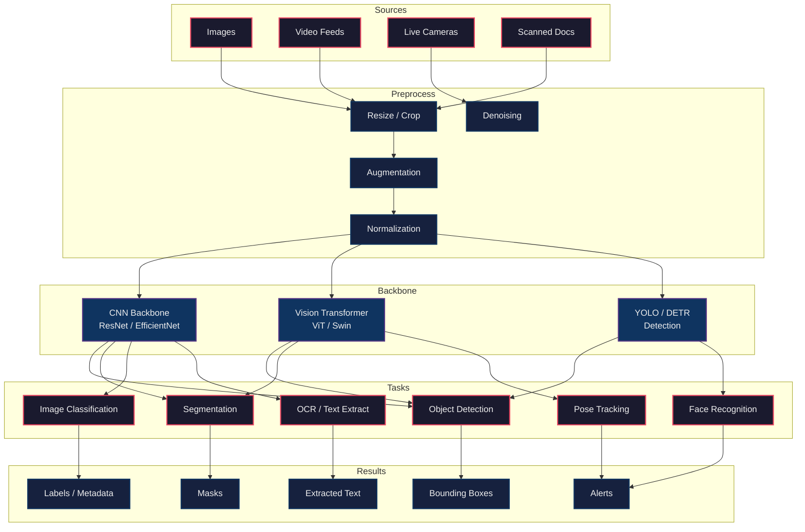
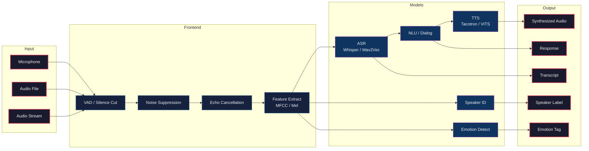

# APEX-OS AI Architecture

## 1. AI Agent Architecture



## 2. NLP Pipeline



## 3. Computer Vision Pipeline



## 4. Speech Pipeline



## 5. Knowledge Graph

```mermaid
graph TB
    classDef source fill:#1a1a2e,stroke:#e94560,stroke-width:2px,color:#eee
    classDef extract fill:#16213e,stroke:#0f3460,stroke-width:2px,color:#eee
    classDef graph fill:#0f3460,stroke:#533483,stroke-width:2px,color:#eee
    classDef query fill:#1a1a2e,stroke:#e94560,stroke-width:2px,color:#eee
    classDef app fill:#16213e,stroke:#0f3460,stroke-width:2px,color:#eee

    subgraph Sources
        DB2[(Relational DB)]:::source
        DOC2[Documents]:::source
        API2[APIs / Feeds]:::source
        ONT[Ontologies]:::source
    end

    subgraph Extraction
        NER2[NER / Entity Link]:::extract
        RE[Relation Extraction]:::extract
        EE[Event Extraction]:::extract
        TE[Triple Extraction]:::extract
    end

    subgraph GraphStore["Knowledge Graph Store"]
        NEO[(Neo4j /<br/>Property Graph)]:::graph
        RDF[(RDF /<br/>Triple Store)]:::graph
        EMB2[Vector Index<br/>Embeddings]:::graph
        ONT2[Schema /<br/>Ontology Layer]:::graph
    end

    subgraph Query
        SPARQL[SPARQL]:::query
        CYP[Cypher]:::query
        VEC[Vector Search]:::query
        LLMQ[LLM + Graph<br/>RAG]:::query
    end

    subgraph Applications
        REC[Recommendations]:::app
        QA2[Question Answering]:::app
        INF[Inference / Rules]:::app
        ANA[Analytics]:::app
        EXP[Explainability]:::app
    end

    DB2 --> TE
    DOC2 --> NER2
    API2 --> EE
    ONT --> ONT2
    NER2 --> RE
    RE --> TE
    EE --> TE
    TE --> NEO
    TE --> RDF
    NEO --> EMB2
    RDF --> EMB2
    ONT2 --> NEO
    ONT2 --> RDF
    NEO --> CYP
    RDF --> SPARQL
    EMB2 --> VEC
    NEO --> LLMQ
    RDF --> LLMQ
    CYP --> QA2
    SPARQL --> INF
    VEC --> REC
    LLMQ --> QA2
    LLMQ --> EXP
    CYP --> ANA
    SPARQL --> ANA
```
