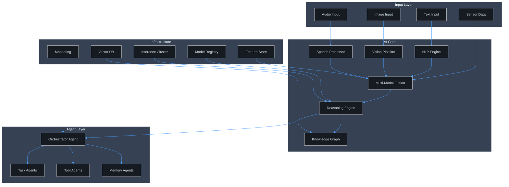
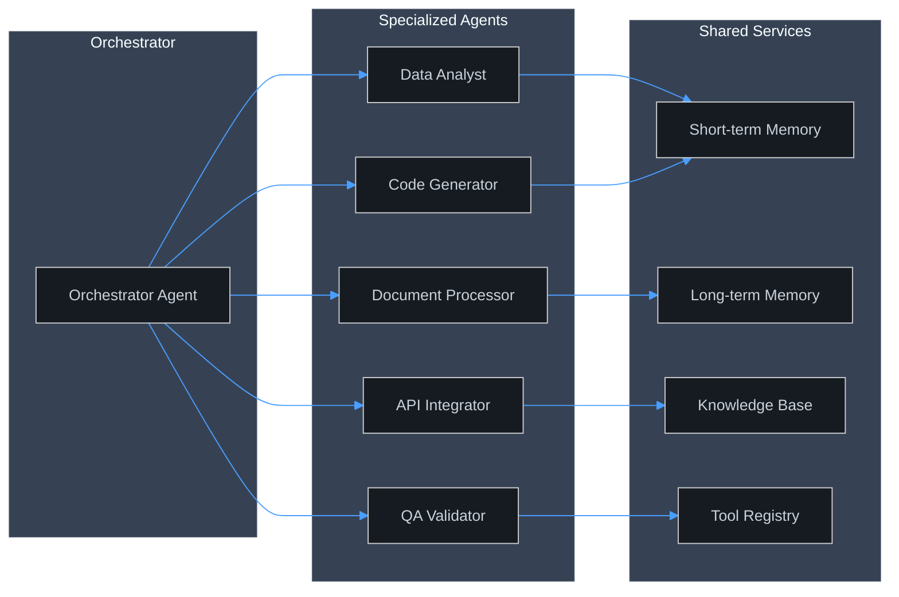
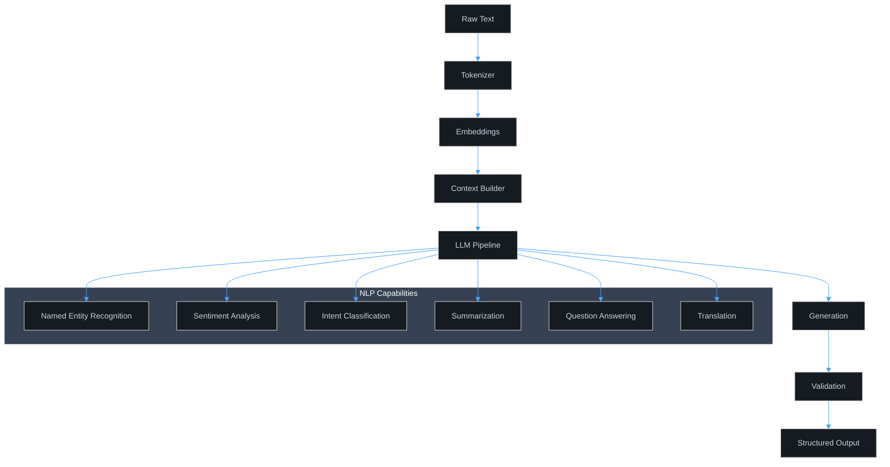
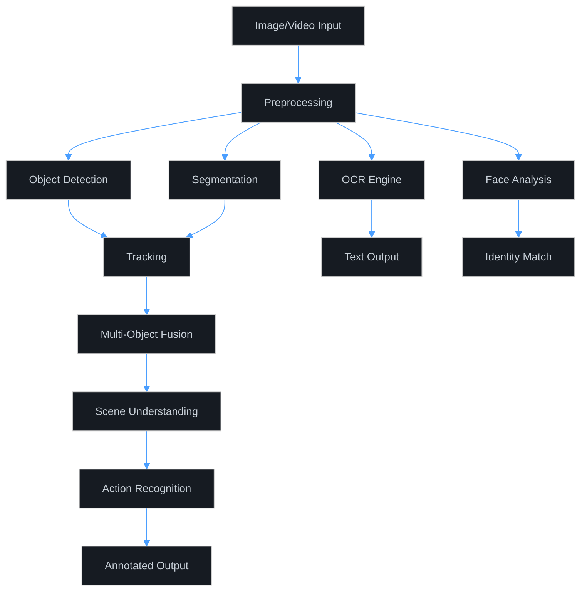
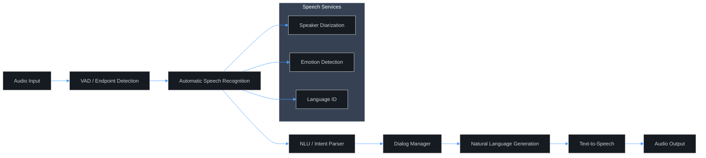

# APEX-OS AI Platform

## 1. AI Architecture

## 2. AI Agents

### Agent Responsibilities

| Agent | Role | Tools |
|-------|------|-------|
| Orchestrator | Routes tasks, manages workflow | Task planner, Router |
| Data Analyst | Queries, transforms, visualizes | SQL, Pandas, Charts |
| Code Generator | Writes, reviews, refactors | Linter, Compiler, Git |
| Document Processor | Parses, summarizes, extracts | OCR, NLP, Templates |
| API Integrator | Connects external services | HTTP, GraphQL, Webhooks |
| QA Validator | Tests, validates, reports | Assertions, Snapshots |

## 3. Natural Language Processing

### NLP Pipeline Stages

1. **Tokenization** — Split text into tokens (BPE/WordPiece)
2. **Embedding** — Map tokens to dense vectors
3. **Context Assembly** — Build prompt with retrieved context (RAG)
4. **Inference** — Run through transformer model
5. **Post-processing** — Format, filter, validate output
6. **Feedback Loop** — Log quality metrics for fine-tuning

## 4. Computer Vision

### Vision Models

| Task | Model | Output |
|------|-------|--------|
| Object Detection | YOLOv8 | Bounding boxes + labels |
| Segmentation | SAM | Pixel-level masks |
| OCR | Tesseract / TrOCR | Text strings |
| Face Recognition | ArcFace | Embedding vectors |
| Pose Estimation | MediaPipe | Keypoint coordinates |
| Depth Estimation | MiDaS | Depth maps |

## 5. Speech Processing

### Speech Pipeline

| Stage | Component | Description |
|-------|-----------|-------------|
| VAD | Silero VAD | Detect speech segments |
| ASR | Whisper / wav2vec2 | Transcribe audio to text |
| NLU | BERT-based | Extract intent + entities |
| DM | Rule + RL hybrid | Manage conversation state |
| NLG | GPT-based | Generate response text |
| TTS | Piper / Coqui | Synthesize natural speech |

### Supported Languages

- English, Arabic, Spanish, French, German
- Mandarin, Japanese, Korean
- Hindi, Portuguese, Russian
