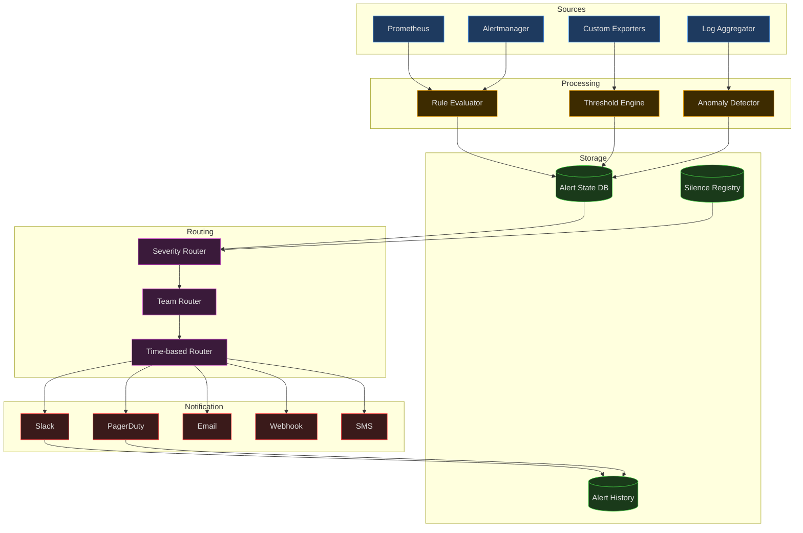
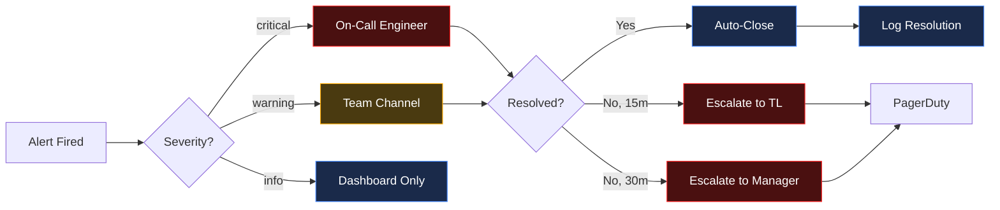
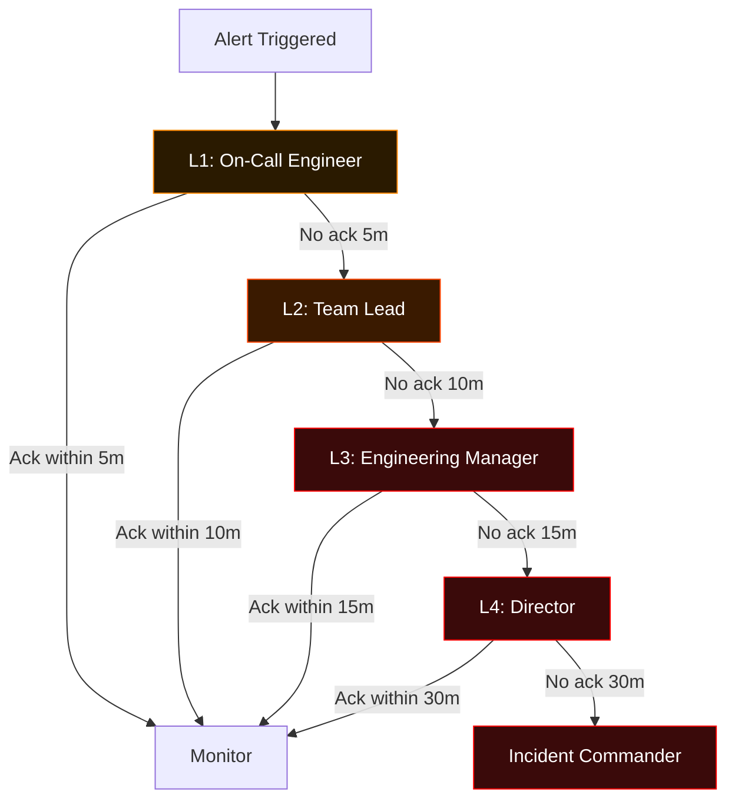
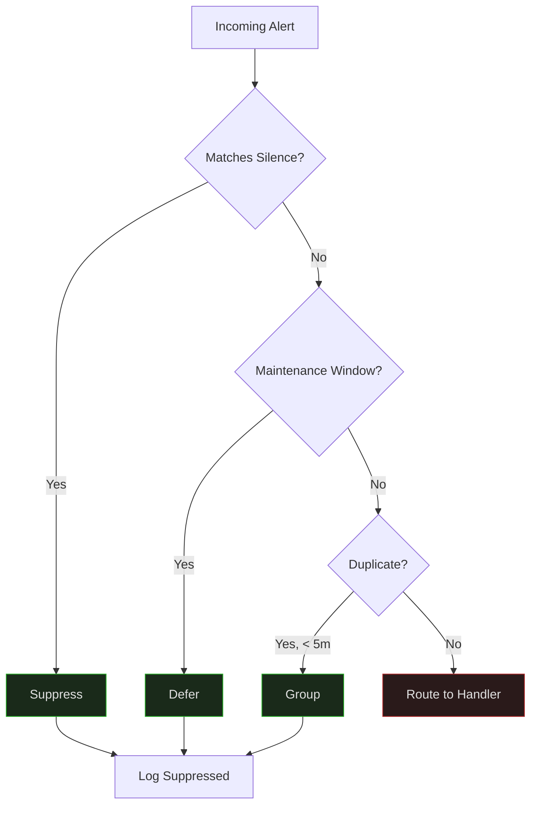

# Alerting

## 1. Architecture



## 2. Alert Rules

| Rule ID | Name | Condition | Severity | Duration |
|---------|------|-----------|----------|----------|
| R-001 | High CPU | `cpu_usage > 90%` | warning | 5m |
| R-002 | Critical CPU | `cpu_usage > 95%` | critical | 2m |
| R-003 | Memory Pressure | `mem_available < 10%` | warning | 5m |
| R-004 | Disk Full | `disk_free < 5%` | critical | 1m |
| R-005 | Service Down | `up == 0` | critical | 0m |
| R-006 | High Latency | `p99_latency > 2000ms` | warning | 3m |
| R-007 | Error Rate Spike | `error_rate > 5%` | critical | 2m |
| R-008 | DB Connections | `db_connections > 80%` | warning | 5m |
| R-009 | Queue Depth | `queue_messages > 10000` | warning | 5m |
| R-010 | SSL Expiry | `ssl_expiry_days < 14` | warning | 1h |
| R-011 | Pod Crash Loop | `restart_count > 5 in 10m` | critical | 0m |
| R-012 | API 5xx Burst | `5xx_rate > 10%` | critical | 1m |

## 3. Alert Routing



### Routing Table

| Severity | Primary Route | Secondary Route | Business Hours | After Hours |
|----------|--------------|-----------------|----------------|-------------|
| critical | PagerDuty (on-call) | Slack #alerts-critical | Immediate | Immediate |
| warning | Slack #alerts-warning | Email team lead | < 5 min | < 15 min |
| info | Dashboard | Log only | Batch | Batch |

## 4. Alert Escalation



### Escalation Policy

| Level | Role | Timeout | Action |
|-------|------|---------|--------|
| L1 | On-Call Engineer | 5 min | PagerDuty + Slack DM |
| L2 | Team Lead | 10 min | PagerDuty + Phone |
| L3 | Engineering Manager | 15 min | PagerDuty + Phone |
| L4 | Director | 30 min | Executive bridge |

## 5. Alert Suppression



### Suppression Rules

| Type | Scope | Duration | Auto-Expire |
|------|-------|----------|-------------|
| Silence | Single alert/rule | 1-24h | Yes |
| Maintenance | Service/group | Scheduled window | Yes |
| Grouping | Related alerts | 5 min window | No |
| Dependency | Downstream of known issue | Until parent resolves | Yes |
| Flapping | Alert toggling > 10x/hour | 30 min | Yes |

### Suppression Commands

```bash
# Silence a rule for 2 hours
apex alert silence --rule R-005 --duration 2h --reason "DB migration"

# Silence all alerts for a service during maintenance
apex alert silence --service payments --duration 4h --reason "v2.1 deploy"

# List active silences
apex alert silence --list

# Expire a silence early
apex alert silence --expire <silence-id>
```
