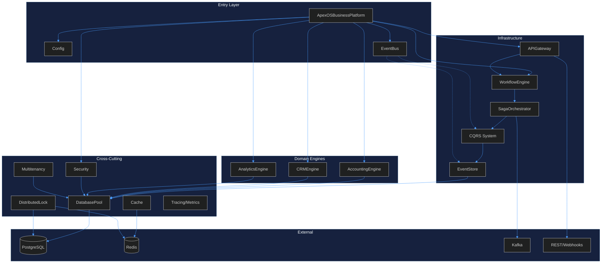
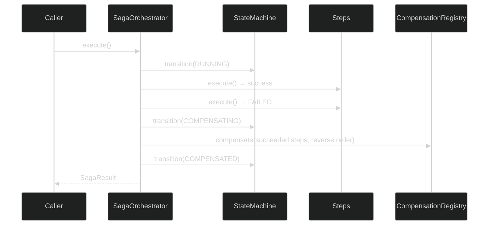
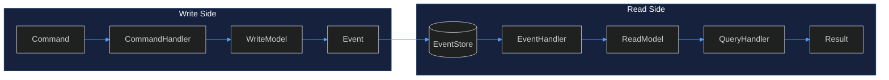
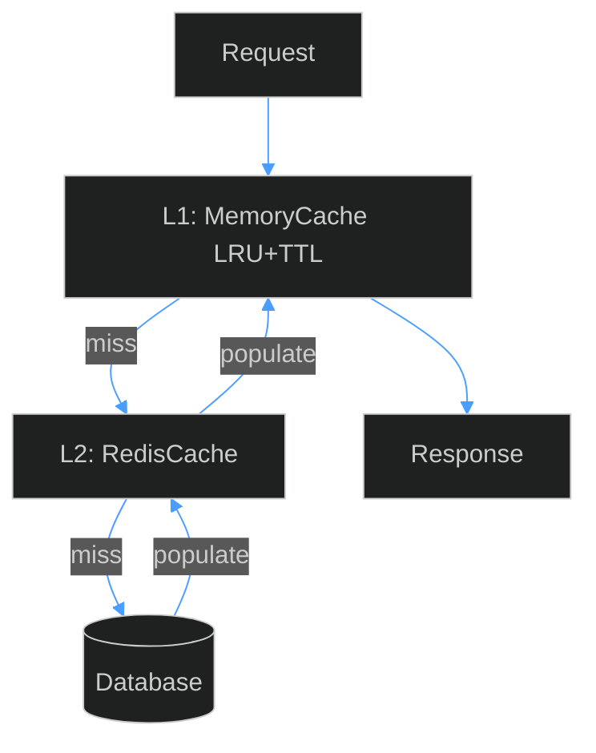
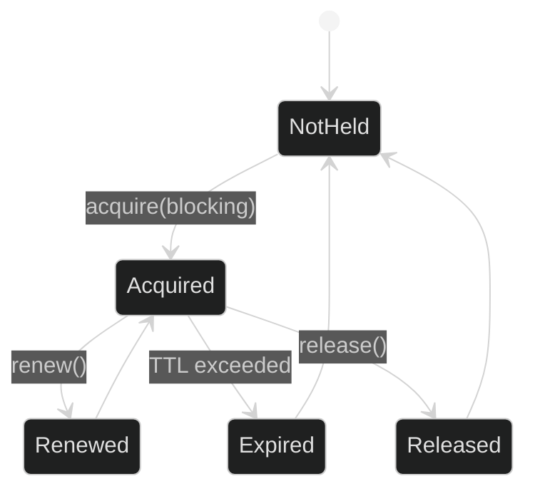
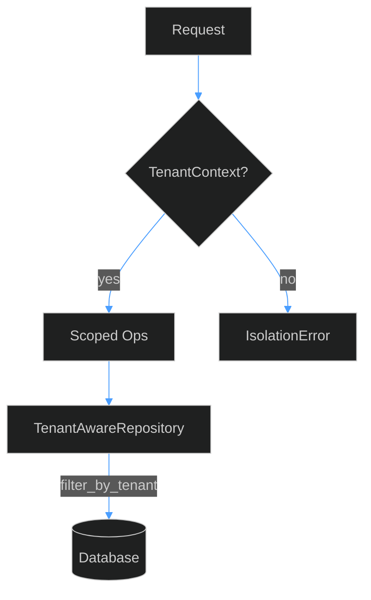
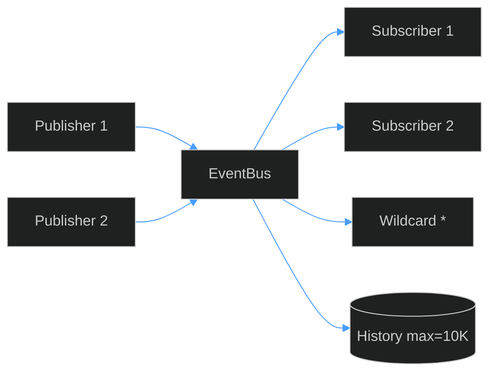
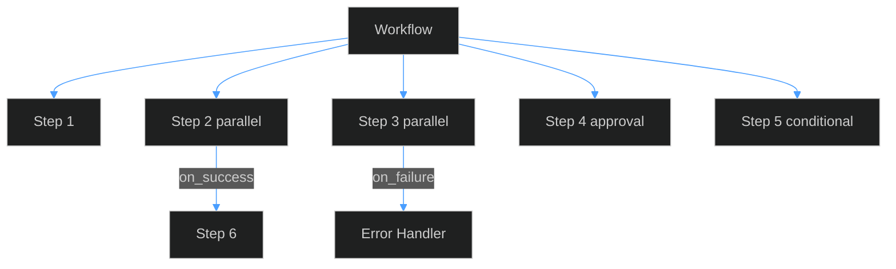
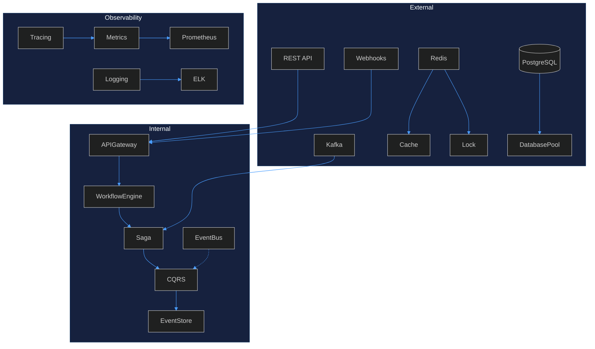

# ApexGraphSwarm — Architecture & Reusable Patterns Analysis

> Analysis of APEX-OS Business Platform as reference for ApexGraphSwarm orchestration stack.

## 1. Architecture Overview



## 2. Key Modules

| Module | Path | Purpose | Key Classes |
|--------|------|---------|-------------|
| Core | `core/` | Config + EventBus | `Config`, `EventBus`, `Event` |
| CQRS | `cqrs/` | Command/Query segregation | `Command`, `Query`, `CommandHandler`, `ReadModel`, `WriteModel` |
| Saga | `saga/` | Distributed transactions | `SagaOrchestrator`, `SagaStep`, `SagaResult`, `SagaStateMachine` |
| Event Sourcing | `event_sourcing/` | Append-only persistence | `EventStore`, `StoredEvent`, `ConcurrencyError` |
| Workflow | `workflow/` | Process automation | `WorkflowEngine`, `Workflow`, `WorkflowStep` |
| Integration | `integration/` | API + connectors | `APIGateway`, `RateLimiter`, `Route` |
| Database | `database/` | Connection pooling | `DatabasePool`, `session_scope` |
| Cache | `cache/` | Multi-tier caching | `MemoryCache`, `RedisCache` |
| Distributed Lock | `distributed_lock/` | Cross-process locking | `BaseDistributedLock`, `LockResult` |
| Multitenancy | `multitenancy/` | Tenant isolation | `TenantContext`, `TenantAwareRepository` |
| Security | `security/` | Auth + secrets | `Authenticator`, `SecretVault`, `JWTManager` |
| Metrics | `metrics/` | Observability | `Counter`, `Gauge`, `Histogram`, `Timer` |

## 3. Reusable Patterns

### 3.1 Saga Pattern



**Files:** `saga/orchestrator.py`, `compensation.py`, `retry.py`, `state_machine.py`, `timeout.py`

**Reusable:** `SagaStep` (action + compensation + retry + timeout + deps), `SagaOrchestrator` (sequential/parallel), `SagaStateMachine`, `CompensationRegistry`, `RetryExecutor`, `TimeoutManager`

### 3.2 CQRS + Event Sourcing



**Files:** `cqrs/base.py`, `cqrs/commands.py`, `cqrs/events.py`, `cqrs/command_handlers.py`, `cqrs/read_models.py`, `event_sourcing/event_store.py`

**Reusable:** Frozen dataclasses (`Command`/`Query`/`Event`), abstract `CommandHandler`/`QueryHandler`, `ReadModel.project()`, `WriteModel.apply()`, SQLite-backed `EventStore` with optimistic concurrency

### 3.3 Connection Pool

```mermaid
%%{init: {'theme':'dark', 'themeVariables': {'primaryColor':'#1a1a2e','primaryTextColor':'#e0e0e0','lineColor':'#4a9eff','primaryBorderColor':'#4a9eff','clusterBkg':'#16213e','clusterBorder':'#0f3460'}}}%%
classDiagram
    class DatabasePool {
        -_instance: DatabasePool
        -_pools: Dict~str,Engine~
        +create_pool(name, url, pool_size, max_overflow) Engine
        +session_scope(name) Generator
        +health_check(name) bool
        +dispose_pool(name) void
    }
    DatabasePool --> QueuePool : PostgreSQL
    DatabasePool --> StaticPool : SQLite :memory:
```

**File:** `database/pool.py` — Thread-safe singleton, `session_scope()` auto-commit/rollback, `QueuePool` for PG, `StaticPool` for SQLite, health check via `SELECT 1`

### 3.4 Multi-Tier Cache



**Files:** `cache/memory_cache.py`, `redis_cache.py`, `invalidation.py`, `warming.py`, `statistics.py`

**Reusable:** `MemoryCache` (LRU eviction, per-entry TTL, `get_or_set()`), `RedisCache`, invalidation/warming strategies, hit/miss stats

### 3.5 Distributed Lock



**Files:** `distributed_lock/base.py`, `redis_lock.py`, `database_lock.py`, `lock_renewal.py`, `deadlock_detector.py`

**Reusable:** `BaseDistributedLock` (context manager), `LockMetadata` (owner/token/TTL), `LockResult`, Redis + DB implementations, renewal + deadlock detection

### 3.6 Tenant Isolation



**Files:** `multitenancy/isolation.py`, `models.py`, `security.py`

**Reusable:** `TenantContext` (context manager), `ContextVar` + `threading.local` hybrid, `@require_tenant` decorator, `TenantAwareRepository`, `TenantBoundary.validate_same_tenant()`

### 3.7 Event Bus



**File:** `core/event_bus.py` — In-process pub/sub, wildcard subscription, bounded history, exception isolation

### 3.8 Workflow Engine



**File:** `workflow/engine.py` — Versioned workflows, parallel groups, conditional branching, human-in-the-loop, retry with delay

## 4. Performance Characteristics

| Aspect | Characteristic | Evidence |
|--------|---------------|----------|
| Event Store | O(1) append, O(n) stream read | SQLite + indexes on `(stream_id, version)`, `event_type`, `timestamp` |
| Connection Pool | Configurable pool + overflow | `QueuePool` pool_size=5, max_overflow=10, recycle=3600 |
| Cache L1 | O(1) get/set, LRU eviction | `OrderedDict`, max_size=1024, TTL=300s |
| Event Bus | O(n) publish (n=subscribers) | In-process, no serialization, history bounded 10K |
| Saga | Sequential: O(steps), Parallel: O(max_step) | `ThreadPoolExecutor`, configurable max_parallel |
| Distributed Lock | O(1) acquire/release | Redis SET NX PX or DB row lock |
| Tenant Isolation | O(1) context lookup | `ContextVar` + thread-local hybrid |
| Config | O(depth) dot-notation | Nested dict traversal, no external deps |

**Scalability:** Event sourcing enables horizontal read scaling; CQRS separates read/write workloads; Saga parallel execution reduces latency; multi-tier cache reduces DB load; connection pooling prevents exhaustion.

## 5. Integration Points



| Point | Mechanism | File |
|-------|-----------|------|
| REST API | `APIGateway` + `Route` | `integration/gateway.py` |
| Webhooks | `WebhookReceiver` | `integration/webhook_receiver.py` |
| Kafka | `KafkaConnector` | `integration/kafka_connector.py` |
| Redis | Cache, Lock, Rate Limiter | `cache/redis_cache.py`, `distributed_lock/redis_lock.py` |
| PostgreSQL | `DatabasePool` + `QueuePool` | `database/pool.py` |
| Data Exchange | CSV/Excel handlers | `data_exchange/csv_handler.py` |
| REST Client | Outbound HTTP | `integration/rest_client.py` |

## Summary

Most reusable patterns for ApexGraphSwarm: **Saga orchestration** (multi-agent task coordination with compensation), **CQRS + Event Sourcing** (audit trails for agent actions), **Distributed locking** (race condition prevention), **Tenant isolation** (agent context separation), **Multi-tier caching** (reduces redundant computation), **Event bus** (inter-agent communication), **Connection pooling** (resource management).
