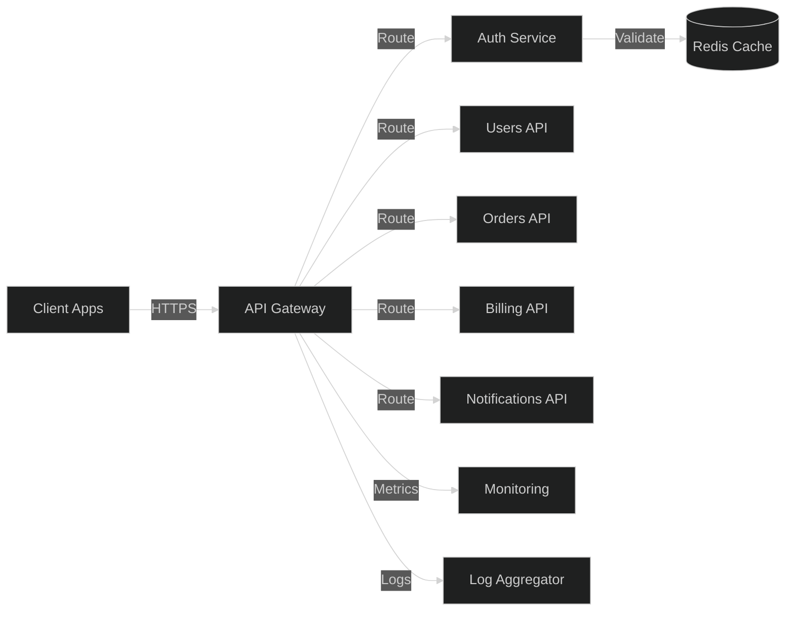
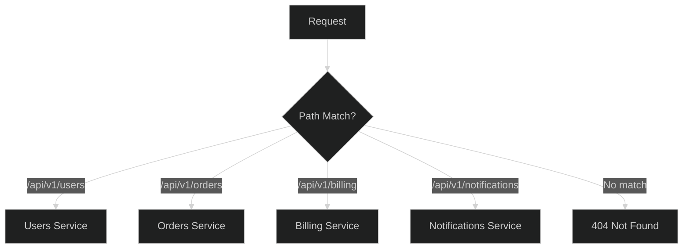
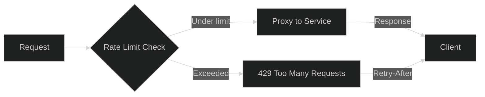
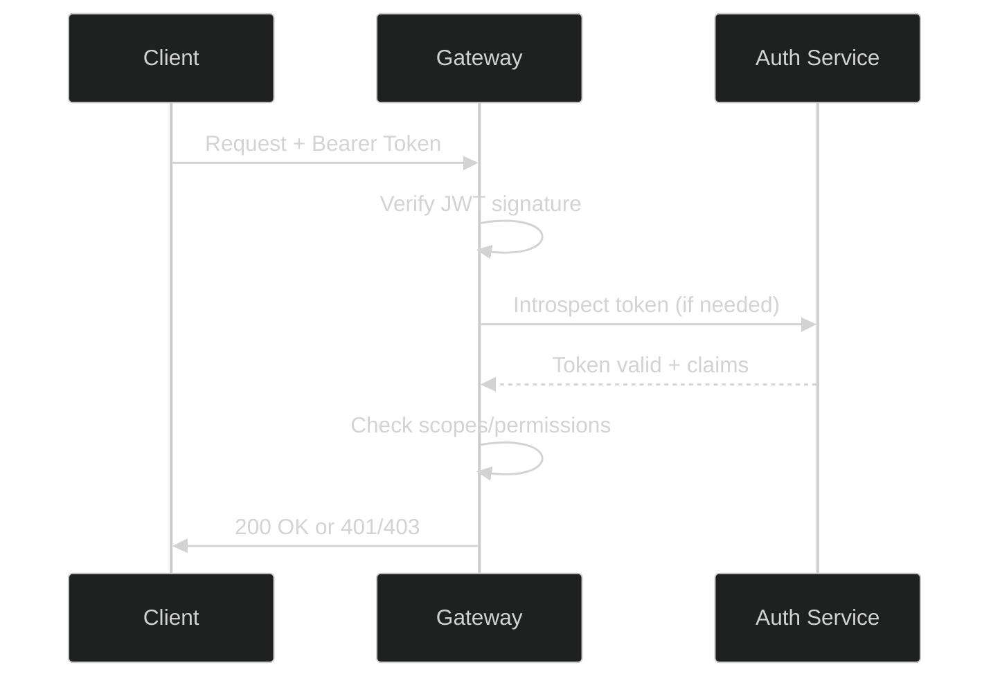
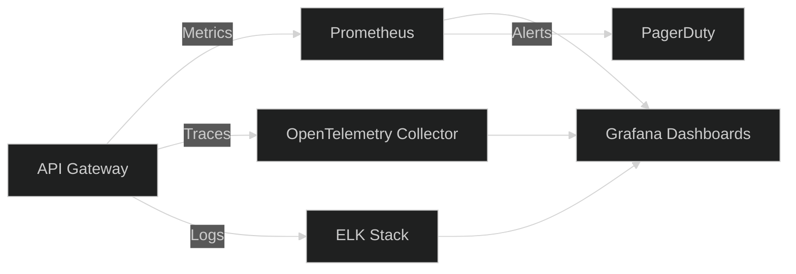

# API Gateway

## 1. Architecture

The API Gateway is the single entry point for all client requests. It handles cross-cutting concerns (auth, rate limiting, logging) before routing to backend microservices.

## 2. Routing Strategy

- **Path-based routing**: `/api/v1/users/*` → Users Service, `/api/v1/orders/*` → Orders Service
- **Header routing**: `X-API-Version` header selects service version
- **Weighted routing**: Canary deployments via traffic split (e.g., 95/5)
- **Fallback routing**: Circuit breaker redirects to fallback service on failure

## 3. Rate Limiting

- **Algorithm**: Token bucket per API key
- **Limits**: 1000 req/min default; 100 req/min for unauthenticated
- **Headers**: `X-RateLimit-Limit`, `X-RateLimit-Remaining`, `X-RateLimit-Reset`
- **Response**: HTTP 429 with `Retry-After` header when exceeded
- **Storage**: Redis-backed distributed counters for multi-instance consistency

## 4. Authentication

- **Method**: JWT (RS256) with short-lived access tokens (15 min) + refresh tokens (7 days)
- **Validation**: Gateway verifies signature, expiry, and issuer before routing
- **API Keys**: Service-to-service auth via API keys with HMAC signing
- **OAuth2**: Third-party integrations use authorization code flow

## 5. Monitoring

- **Metrics**: Request rate, latency (p50/p95/p99), error rate, saturation
- **Tracing**: OpenTelemetry with trace IDs propagated across services
- **Logging**: Structured JSON logs with correlation IDs
- **Alerting**: PagerDuty integration for SLO breaches (latency > 500ms p95, error rate > 1%)
- **Dashboards**: Grafana dashboards for real-time traffic and health

