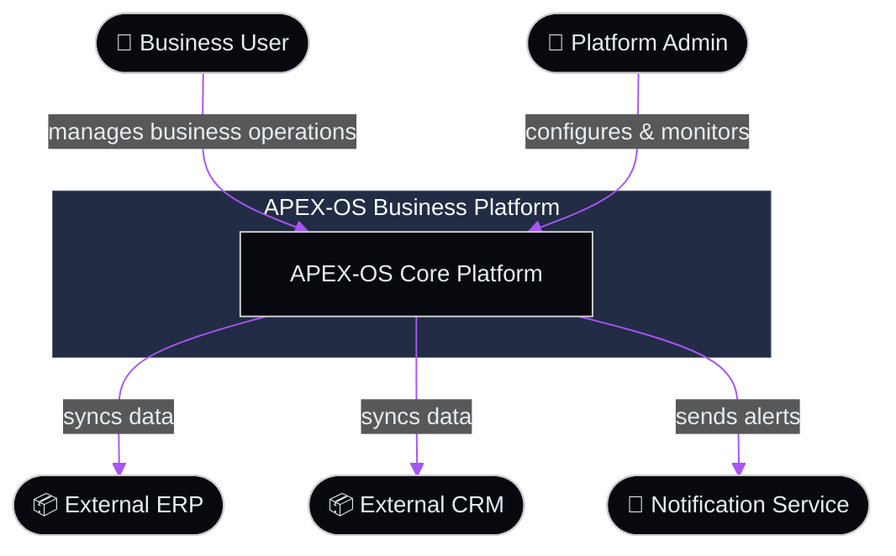
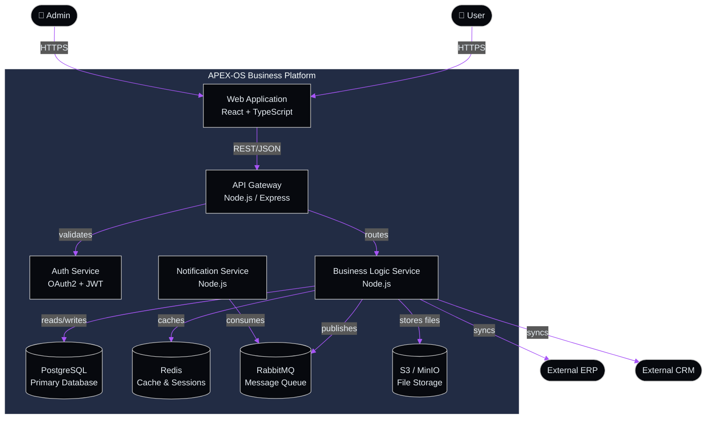
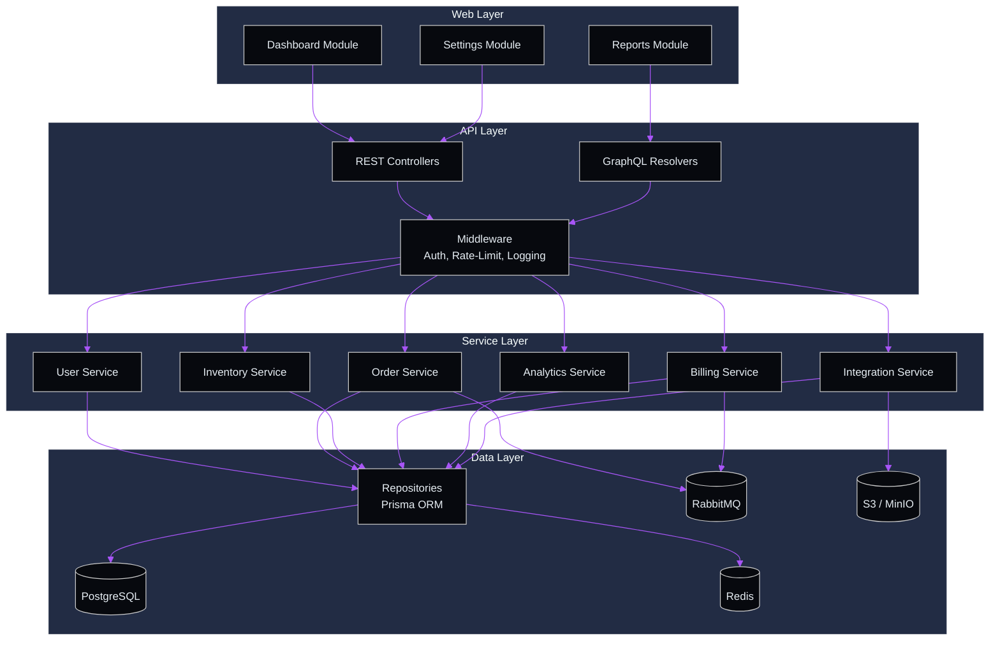
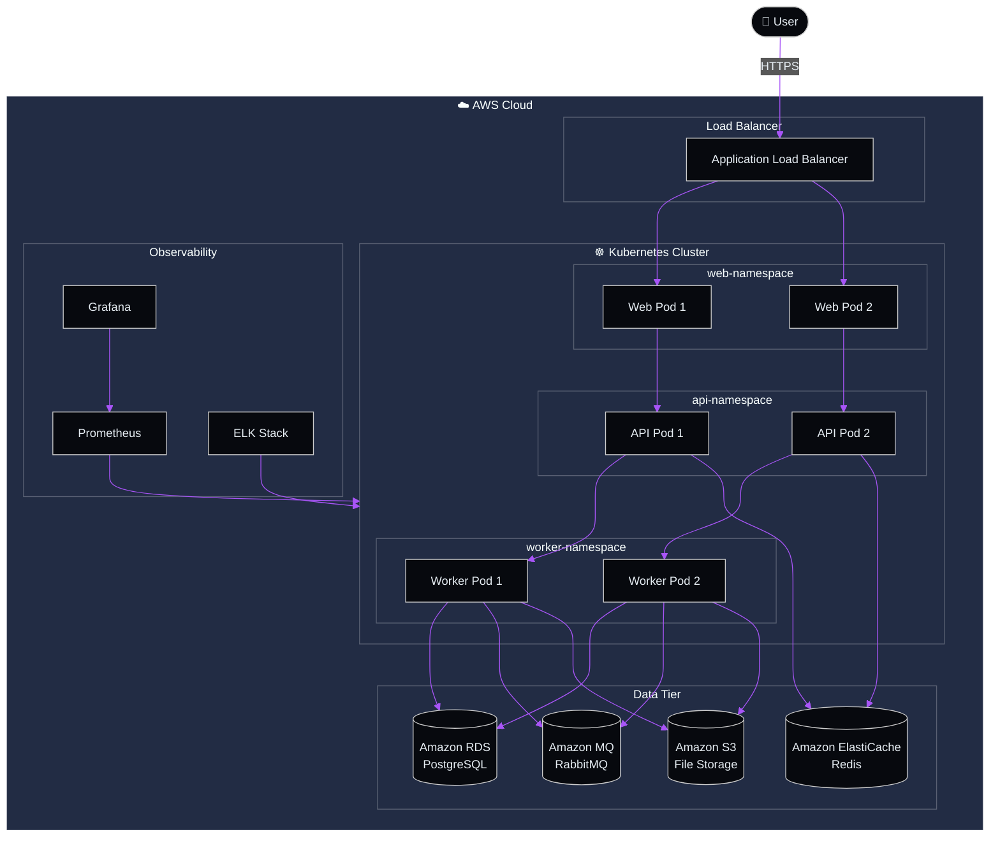
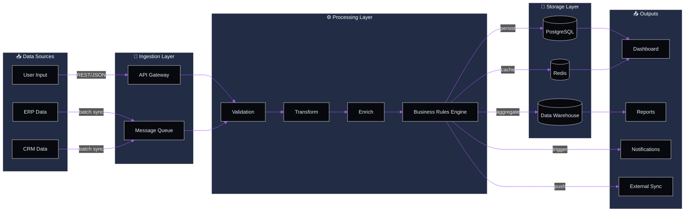

# APEX-OS Business Platform — Architecture Diagrams

## 1. System Context Diagram

```mermaid
%%{init: {'theme':'dark', 'themeVariables': {'primaryColor':'#06b6d4','primaryTextColor':'#ffffff','primaryBorderColor':'#06b6d4','lineColor':'#a855f7','secondaryColor':'#a855f7','tertiaryColor':'#10b981','background':'#07090e','mainBkg':'#07090e','secondBkg':'#0d1117','textColor':'#e6edf3','fontSize':'14px'}}}%%
graph TB
    User([👤 Business User])
    Admin([👤 Platform Admin])
    ExternalERP([📦 External ERP])
    ExternalCRM([📦 External CRM])
    NotificationSvc([📧 Notification Service])

    subgraph APEX["APEX-OS Business Platform"]
        Platform["APEX-OS Core Platform"]
    end

    User -->|"manages business operations"| Platform
    Admin -->|"configures & monitors"| Platform
    Platform -->|"syncs data"| ExternalERP
    Platform -->|"syncs data"| ExternalCRM
    Platform -->|"sends alerts"| NotificationSvc
```

## 2. Container Diagram

```mermaid
%%{init: {'theme':'dark', 'themeVariables': {'primaryColor':'#06b6d4','primaryTextColor':'#ffffff','primaryBorderColor':'#06b6d4','lineColor':'#a855f7','secondaryColor':'#a855f7','tertiaryColor':'#10b981','background':'#07090e','mainBkg':'#07090e','secondBkg':'#0d1117','textColor':'#e6edf3','fontSize':'14px'}}}%%
graph TB
    User([👤 User])
    Admin([👤 Admin])

    subgraph APEX["APEX-OS Business Platform"]
        WebApp["Web Application<br/>React + TypeScript"]
        API["API Gateway<br/>Node.js / Express"]
        Auth["Auth Service<br/>OAuth2 + JWT"]
        BusinessSvc["Business Logic Service<br/>Node.js"]
        NotificationSvc["Notification Service<br/>Node.js"]
        DB[("PostgreSQL<br/>Primary Database")]
        Cache[("Redis<br/>Cache & Sessions")]
        Queue[("RabbitMQ<br/>Message Queue")]
        Storage[("S3 / MinIO<br/>File Storage")]
    end

    ExternalERP([External ERP])
    ExternalCRM([External CRM])

    User -->|"HTTPS"| WebApp
    Admin -->|"HTTPS"| WebApp
    WebApp -->|"REST/JSON"| API
    API -->|"validates"| Auth
    API -->|"routes"| BusinessSvc
    BusinessSvc -->|"reads/writes"| DB
    BusinessSvc -->|"caches"| Cache
    BusinessSvc -->|"publishes"| Queue
    NotificationSvc -->|"consumes"| Queue
    BusinessSvc -->|"stores files"| Storage
    BusinessSvc -->|"syncs"| ExternalERP
    BusinessSvc -->|"syncs"| ExternalCRM
```

## 3. Component Diagram

```mermaid
%%{init: {'theme':'dark', 'themeVariables': {'primaryColor':'#06b6d4','primaryTextColor':'#ffffff','primaryBorderColor':'#06b6d4','lineColor':'#a855f7','secondaryColor':'#a855f7','tertiaryColor':'#10b981','background':'#07090e','mainBkg':'#07090e','secondBkg':'#0d1117','textColor':'#e6edf3','fontSize':'14px'}}}%%
graph TB
    subgraph WebLayer["Web Layer"]
        Dashboard["Dashboard Module"]
        Reports["Reports Module"]
        Settings["Settings Module"]
    end

    subgraph APILayer["API Layer"]
        REST["REST Controllers"]
        GraphQL["GraphQL Resolvers"]
        Middleware["Middleware<br/>Auth, Rate-Limit, Logging"]
    end

    subgraph ServiceLayer["Service Layer"]
        UserService["User Service"]
        OrderService["Order Service"]
        InventoryService["Inventory Service"]
        BillingService["Billing Service"]
        AnalyticsService["Analytics Service"]
        IntegrationService["Integration Service"]
    end

    subgraph DataLayer["Data Layer"]
        Repos["Repositories<br/>Prisma ORM"]
        DB[("PostgreSQL")]
        Cache[("Redis")]
        Queue[("RabbitMQ")]
        Storage[("S3 / MinIO")]
    end

    Dashboard --> REST
    Reports --> GraphQL
    Settings --> REST
    REST --> Middleware
    GraphQL --> Middleware
    Middleware --> UserService
    Middleware --> OrderService
    Middleware --> InventoryService
    Middleware --> BillingService
    Middleware --> AnalyticsService
    Middleware --> IntegrationService
    UserService --> Repos
    OrderService --> Repos
    InventoryService --> Repos
    BillingService --> Repos
    AnalyticsService --> Repos
    IntegrationService --> Repos
    Repos --> DB
    Repos --> Cache
    OrderService --> Queue
    BillingService --> Queue
    IntegrationService --> Storage
```

## 4. Deployment Diagram

```mermaid
%%{init: {'theme':'dark', 'themeVariables': {'primaryColor':'#06b6d4','primaryTextColor':'#ffffff','primaryBorderColor':'#06b6d4','lineColor':'#a855f7','secondaryColor':'#a855f7','tertiaryColor':'#10b981','background':'#07090e','mainBkg':'#07090e','secondBkg':'#0d1117','textColor':'#e6edf3','fontSize':'14px'}}}%%
graph TB
    subgraph Cloud["☁️ AWS Cloud"]
        subgraph LB["Load Balancer"]
            ALB["Application Load Balancer"]
        end

        subgraph K8s["☸️ Kubernetes Cluster"]
            subgraph WebNS["web-namespace"]
                WebPod1["Web Pod 1"]
                WebPod2["Web Pod 2"]
            end
            subgraph APINS["api-namespace"]
                APIPod1["API Pod 1"]
                APIPod2["API Pod 2"]
            end
            subgraph WorkerNS["worker-namespace"]
                WorkerPod1["Worker Pod 1"]
                WorkerPod2["Worker Pod 2"]
            end
        end

        subgraph Data["Data Tier"]
            RDS[("Amazon RDS<br/>PostgreSQL")]
            ElastiCache[("Amazon ElastiCache<br/>Redis")]
            MQ[("Amazon MQ<br/>RabbitMQ")]
            S3[("Amazon S3<br/>File Storage")]
        end

        subgraph Monitoring["Observability"]
            Prometheus["Prometheus"]
            Grafana["Grafana"]
            ELK["ELK Stack"]
        end
    end

    User([👤 User]) -->|"HTTPS"| ALB
    ALB --> WebPod1
    ALB --> WebPod2
    WebPod1 --> APIPod1
    WebPod2 --> APIPod2
    APIPod1 --> WorkerPod1
    APIPod2 --> WorkerPod2
    WorkerPod1 --> RDS
    WorkerPod2 --> RDS
    APIPod1 --> ElastiCache
    APIPod2 --> ElastiCache
    WorkerPod1 --> MQ
    WorkerPod2 --> MQ
    WorkerPod1 --> S3
    WorkerPod2 --> S3
    Prometheus --> K8s
    Grafana --> Prometheus
    ELK --> K8s
```

## 5. Data Flow Diagram

```mermaid
%%{init: {'theme':'dark', 'themeVariables': {'primaryColor':'#06b6d4','primaryTextColor':'#ffffff','primaryBorderColor':'#06b6d4','lineColor':'#a855f7','secondaryColor':'#a855f7','tertiaryColor':'#10b981','background':'#07090e','mainBkg':'#07090e','secondBkg':'#0d1117','textColor':'#e6edf3','fontSize':'14px'}}}%%
graph LR
    subgraph Sources["📥 Data Sources"]
        UserInput["User Input"]
        ERPData["ERP Data"]
        CRMData["CRM Data"]
    end

    subgraph Ingestion["🔄 Ingestion Layer"]
        API["API Gateway"]
        Queue["Message Queue"]
    end

    subgraph Processing["⚙️ Processing Layer"]
        Validation["Validation"]
        Transform["Transform"]
        Enrich["Enrich"]
        BusinessRules["Business Rules Engine"]
    end

    subgraph Storage["💾 Storage Layer"]
        DB[("PostgreSQL")]
        Cache[("Redis")]
        Warehouse[("Data Warehouse")]
    end

    subgraph Outputs["📤 Outputs"]
        Dashboard["Dashboard"]
        Reports["Reports"]
        Notifications["Notifications"]
        ExternalSync["External Sync"]
    end

    UserInput -->|"REST/JSON"| API
    ERPData -->|"batch sync"| Queue
    CRMData -->|"batch sync"| Queue
    API --> Validation
    Queue --> Validation
    Validation --> Transform
    Transform --> Enrich
    Enrich --> BusinessRules
    BusinessRules -->|"persist"| DB
    BusinessRules -->|"cache"| Cache
    BusinessRules -->|"aggregate"| Warehouse
    DB --> Dashboard
    Cache --> Dashboard
    Warehouse --> Reports
    BusinessRules -->|"trigger"| Notifications
    BusinessRules -->|"push"| ExternalSync
```
