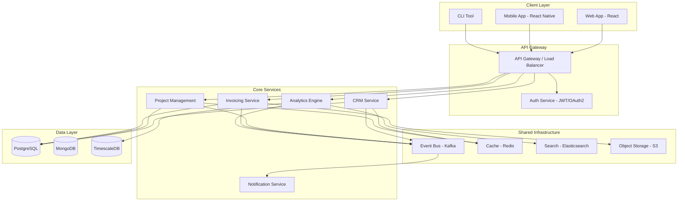
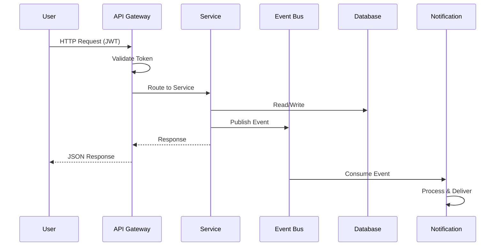
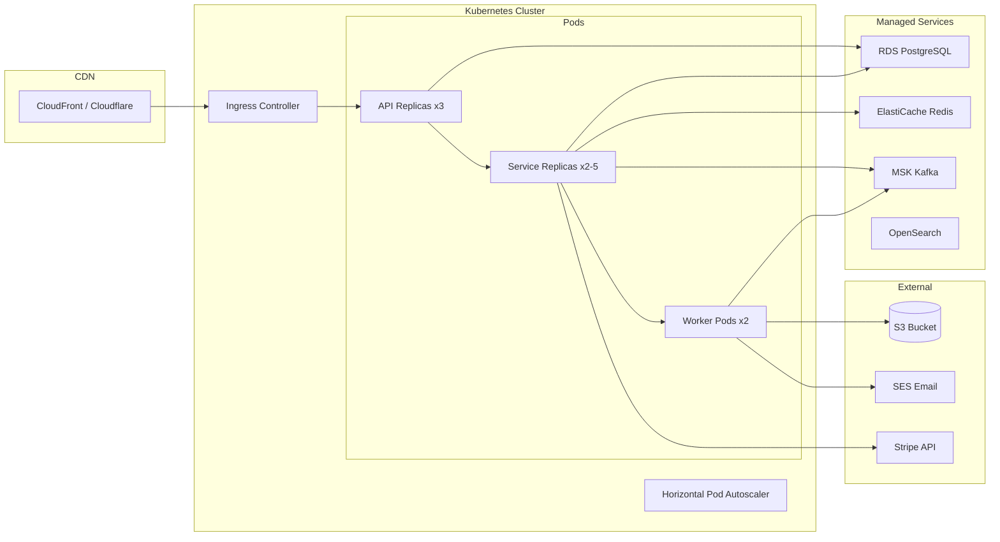

# APEX-OS Business Platform — Architecture

## 1. System Overview

APEX-OS is a modular business platform that unifies CRM, project management, invoicing, and analytics into a single cohesive system. It follows a service-oriented architecture with clear domain boundaries, event-driven communication, and a plugin-based extensibility model.

**Core principles:**
- Domain-driven design with bounded contexts
- Event-driven inter-service communication
- Horizontal scalability via stateless services
- Multi-tenant data isolation
- API-first design with GraphQL and REST

## 2. Component Diagram

## 3. Data Flow Diagram

**Event flow patterns:**
- **Command**: Synchronous request-response via API
- **Event**: Async publish-subscribe via Kafka
- **Query**: Direct read from read-optimized views

## 4. Deployment Diagram

## 5. Technology Stack

| Layer | Technology | Purpose |
|-------|-----------|---------|
| Frontend | React 18, TypeScript, Vite | Web application |
| Mobile | React Native, Expo | iOS/Android apps |
| API | GraphQL (Apollo), REST (Fastify) | Client communication |
| Services | Node.js (NestJS), Python (FastAPI) | Business logic |
| Auth | Passport.js, JWT, OAuth2 | Authentication |
| Event Bus | Apache Kafka (MSK) | Async messaging |
| Primary DB | PostgreSQL 15 (RDS) | Relational data |
| Document DB | MongoDB Atlas | Unstructured data |
| Time-series | TimescaleDB | Metrics & analytics |
| Cache | Redis (ElastiCache) | Session & query cache |
| Search | OpenSearch | Full-text search |
| Storage | S3 | Files & attachments |
| Infra | Terraform, EKS, Helm | IaC & orchestration |
| CI/CD | GitHub Actions | Build & deploy pipeline |
| Observability | Datadog, PagerDuty | Monitoring & alerting |

## 6. Design Decisions

### 6.1 Service-Oriented Architecture
**Decision:** Decompose by business domain rather than technical layer.
**Rationale:** Independent deployability, team autonomy, and technology flexibility per service.

### 6.2 Event-Driven Communication
**Decision:** Kafka as the backbone for inter-service events.
**Rationale:** Loose coupling, replay capability, and natural audit trail. Services remain independent and can evolve separately.

### 6.3 CQRS for Analytics
**Decision**: Separate read models for analytics queries.
**Rationale:** Prevents analytical workloads from impacting transactional performance. TimescaleDB provides optimized time-series queries.

### 6.4 Multi-Tenancy
**Decision:** Row-level security with tenant_id in PostgreSQL.
**Rationale:** Shared infrastructure cost efficiency while maintaining strict data isolation. All queries are scoped by tenant context.

### 6.5 API Gateway Pattern
**Decision:** Single entry point with centralized auth, rate limiting, and request routing.
**Rationale:** Simplified client integration, consistent security policy, and reduced service-to-service complexity.

### 6.6 Plugin Architecture
**Decision:** Services expose well-defined interfaces; plugins register via a central registry.
**Rationale:** Third-party extensibility without core codebase changes. Versioned contracts ensure backward compatibility.

## 7. Scalability Considerations

### 7.1 Horizontal Scaling
- All services are stateless; scale via Kubernetes HPA based on CPU/memory and custom metrics
- Database read replicas for read-heavy workloads
- Kafka consumer groups for parallel event processing

### 7.2 Database Scaling
- PostgreSQL: Read replicas, connection pooling (PgBouncer), table partitioning by tenant_id
- MongoDB: Sharded cluster with tenant-aware shard keys
- TimescaleDB: Hypertables with automatic chunking by time range

### 7.3 Caching Strategy
- L1: In-memory cache per service instance (hot data)
- L2: Redis distributed cache (shared state, sessions)
- L3: CDN caching for static assets and public APIs
- Cache invalidation via event-driven pub/sub

### 7.4 Rate Limiting & Backpressure
- Token bucket rate limiting at API Gateway per tenant
- Circuit breaker pattern (per-service) to prevent cascade failures
- Backpressure via Kafka consumer lag monitoring and auto-scaling

### 7.5 Performance Targets
| Metric | Target |
|--------|--------|
| API p99 latency | < 200ms |
| Event processing | < 500ms end-to-end |
| Availability | 99.95% uptime |
| RPO | < 5 minutes |
| RTO | < 30 minutes |

### 7.6 Disaster Recovery
- Multi-AZ deployment for all stateful services
- Cross-region read replica for PostgreSQL
- Automated backups with 35-day retention
- Quarterly disaster recovery drills

---

*Last updated: 2026-10-03*
