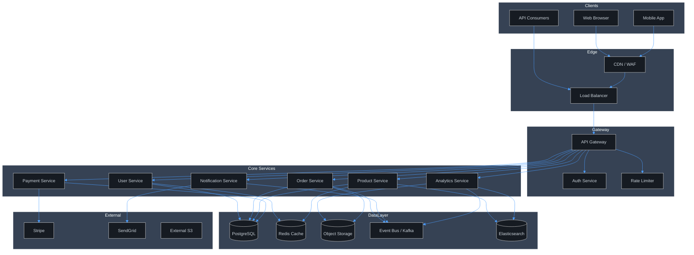
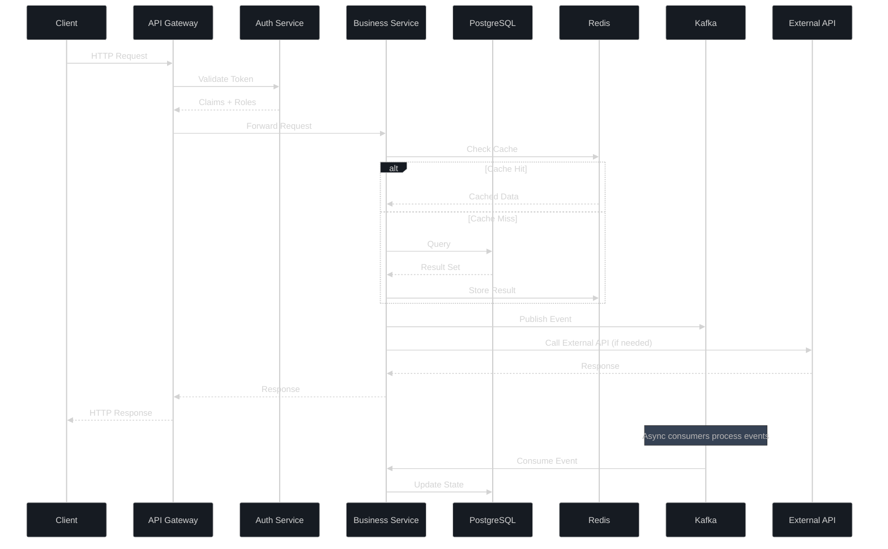
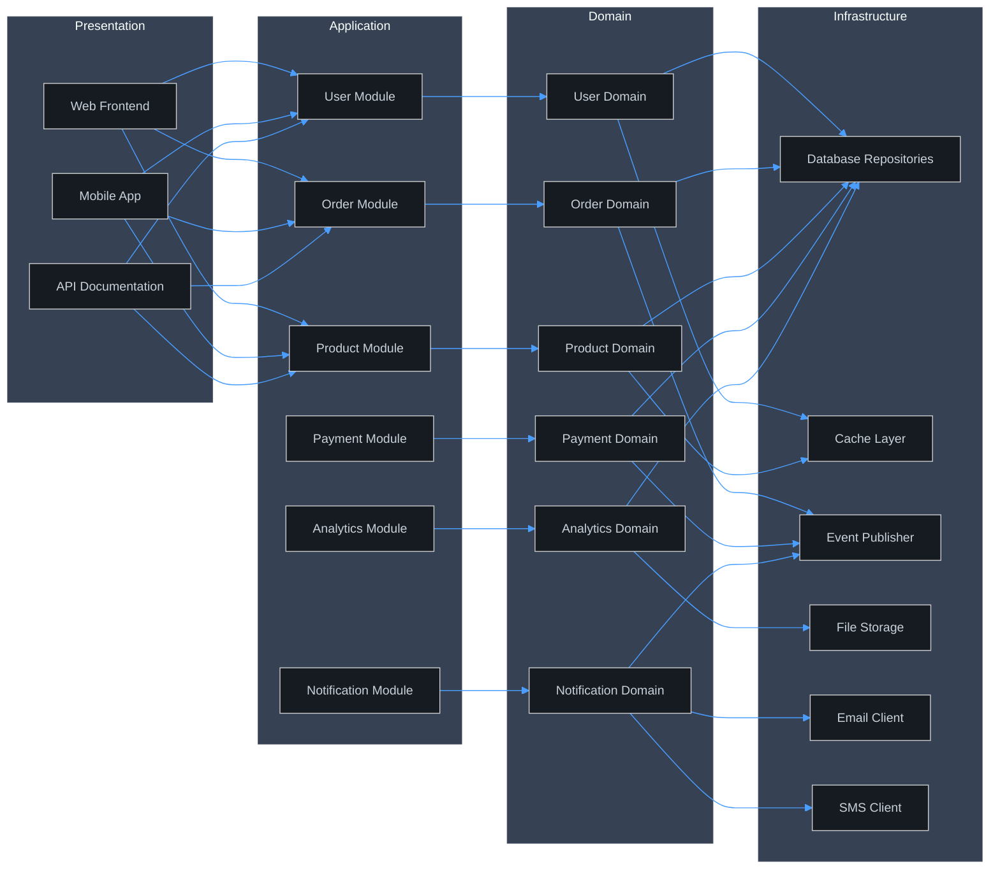
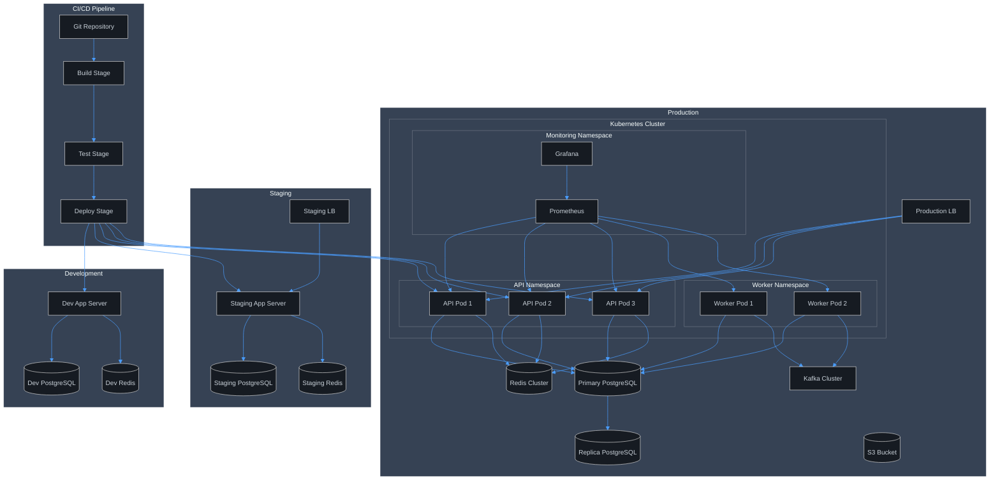
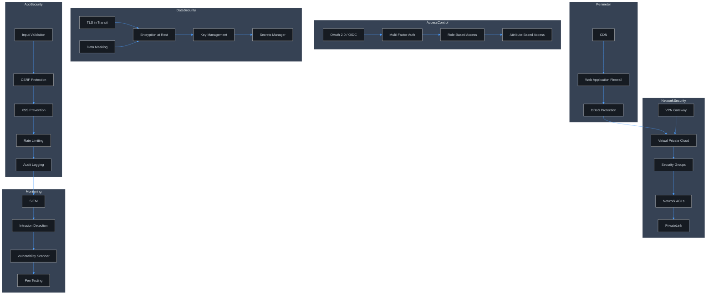

# APEX-OS Business Platform — Architecture

## 1. System Architecture

```mermaid
%%{init: {'theme':'dark', 'themeVariables': {'primaryColor':'#1e3a5f','primaryTextColor':'#e0e0e0','primaryBorderColor':'#4a9eff','lineColor':'#4a9eff','secondaryColor':'#2d2d2d','tertiaryColor':'#1a1a2e','background':'#0d1117','mainBkg':'#161b22','secondBkg':'#21262d','textColor':'#c9d1d9','fontSize':'14px'}}}%%
graph TB
    subgraph Clients
        Web[Web Browser]
        Mobile[Mobile App]
        API[API Consumers]
    end

    subgraph Edge
        CDN[CDN / WAF]
        LB[Load Balancer]
    end

    subgraph Gateway
        APIGW[API Gateway]
        Auth[Auth Service]
        RateLimit[Rate Limiter]
    end

    subgraph CoreServices[Core Services]
        UserSvc[User Service]
        OrderSvc[Order Service]
        ProductSvc[Product Service]
        PaymentSvc[Payment Service]
        NotifySvc[Notification Service]
        AnalyticsSvc[Analytics Service]
    end

    subgraph DataLayer
        PG[(PostgreSQL)]
        Redis[(Redis Cache)]
        S3[(Object Storage)]
        Kafka[Event Bus / Kafka]
        ES[(Elasticsearch)]
    end

    subgraph External
        Stripe[Stripe]
        SendGrid[SendGrid]
        S3Ext[External S3]
    end

    Web --> CDN
    Mobile --> CDN
    API --> LB
    CDN --> LB
    LB --> APIGW
    APIGW --> Auth
    APIGW --> RateLimit
    APIGW --> UserSvc
    APIGW --> OrderSvc
    APIGW --> ProductSvc
    APIGW --> PaymentSvc
    APIGW --> NotifySvc
    APIGW --> AnalyticsSvc

    UserSvc --> PG
    UserSvc --> Redis
    OrderSvc --> PG
    OrderSvc --> Kafka
    ProductSvc --> PG
    ProductSvc --> Redis
    ProductSvc --> ES
    PaymentSvc --> PG
    PaymentSvc --> Stripe
    NotifySvc --> Kafka
    NotifySvc --> SendGrid
    AnalyticsSvc --> Kafka
    AnalyticsSvc --> ES
    AnalyticsSvc --> S3
    OrderSvc --> S3
```

## 2. Data Flow

```mermaid
%%{init: {'theme':'dark', 'themeVariables': {'primaryColor':'#1e3a5f','primaryTextColor':'#e0e0e0','primaryBorderColor':'#4a9eff','lineColor':'#4a9eff','secondaryColor':'#2d2d2d','tertiaryColor':'#1a1a2e','background':'#0d1117','mainBkg':'#161b22','secondBkg':'#21262d','textColor':'#c9d1d9','fontSize':'14px'}}}%%
sequenceDiagram
    participant C as Client
    participant GW as API Gateway
    participant Auth as Auth Service
    participant Svc as Business Service
    participant DB as PostgreSQL
    participant Cache as Redis
    participant Bus as Kafka
    participant Ext as External API

    C->>GW: HTTP Request
    GW->>Auth: Validate Token
    Auth-->>GW: Claims + Roles
    GW->>Svc: Forward Request
    Svc->>Cache: Check Cache
    alt Cache Hit
        Cache-->>Svc: Cached Data
    else Cache Miss
        Svc->>DB: Query
        DB-->>Svc: Result Set
        Svc->>Cache: Store Result
    end
    Svc->>Bus: Publish Event
    Svc->>Ext: Call External API (if needed)
    Ext-->>Svc: Response
    Svc-->>GW: Response
    GW-->>C: HTTP Response

    Note over Bus: Async consumers process events
    Bus->>Svc: Consume Event
    Svc->>DB: Update State
```

## 3. Module Dependencies

```mermaid
%%{init: {'theme':'dark', 'themeVariables': {'primaryColor':'#1e3a5f','primaryTextColor':'#e0e0e0','primaryBorderColor':'#4a9eff','lineColor':'#4a9eff','secondaryColor':'#2d2d2d','tertiaryColor':'#1a1a2e','background':'#0d1117','mainBkg':'#161b22','secondBkg':'#21262d','textColor':'#c9d1d9','fontSize':'14px'}}}%%
graph LR
    subgraph Presentation
        WebApp[Web Frontend]
        MobileApp[Mobile App]
        APIDocs[API Documentation]
    end

    subgraph Application
        UserMod[User Module]
        OrderMod[Order Module]
        ProductMod[Product Module]
        PaymentMod[Payment Module]
        NotifyMod[Notification Module]
        AnalyticsMod[Analytics Module]
    end

    subgraph Domain
        UserDomain[User Domain]
        OrderDomain[Order Domain]
        ProductDomain[Product Domain]
        PaymentDomain[Payment Domain]
        NotifyDomain[Notification Domain]
        AnalyticsDomain[Analytics Domain]
    end

    subgraph Infrastructure
        DBRepo[Database Repositories]
        CacheRepo[Cache Layer]
        EventPub[Event Publisher]
        FileStore[File Storage]
        EmailClient[Email Client]
        SMSClient[SMS Client]
    end

    WebApp --> UserMod
    WebApp --> OrderMod
    WebApp --> ProductMod
    MobileApp --> UserMod
    MobileApp --> OrderMod
    MobileApp --> ProductMod
    APIDocs --> UserMod
    APIDocs --> OrderMod
    APIDocs --> ProductMod

    UserMod --> UserDomain
    OrderMod --> OrderDomain
    ProductMod --> ProductDomain
    PaymentMod --> PaymentDomain
    NotifyMod --> NotifyDomain
    AnalyticsMod --> AnalyticsDomain

    UserDomain --> DBRepo
    UserDomain --> CacheRepo
    OrderDomain --> DBRepo
    OrderDomain --> EventPub
    ProductDomain --> DBRepo
    ProductDomain --> CacheRepo
    PaymentDomain --> DBRepo
    PaymentDomain --> EventPub
    NotifyDomain --> EventPub
    NotifyDomain --> EmailClient
    NotifyDomain --> SMSClient
    AnalyticsDomain --> DBRepo
    AnalyticsDomain --> FileStore
```

## 4. Deployment Architecture

```mermaid
%%{init: {'theme':'dark', 'themeVariables': {'primaryColor':'#1e3a5f','primaryTextColor':'#e0e0e0','primaryBorderColor':'#4a9eff','lineColor':'#4a9eff','secondaryColor':'#2d2d2d','tertiaryColor':'#1a1a2e','background':'#0d1117','mainBkg':'#161b22','secondBkg':'#21262d','textColor':'#c9d1d9','fontSize':'14px'}}}%%
graph TB
    subgraph DevEnv[Development]
        DevDB[(Dev PostgreSQL)]
        DevRedis[(Dev Redis)]
        DevApp[Dev App Server]
    end

    subgraph StagingEnv[Staging]
        StageDB[(Staging PostgreSQL)]
        StageRedis[(Staging Redis)]
        StageApp[Staging App Server]
        StageLB[Staging LB]
    end

    subgraph ProdEnv[Production]
        ProdLB[Production LB]
        subgraph K8sCluster[Kubernetes Cluster]
            subgraph Namespace1[API Namespace]
                Pod1[API Pod 1]
                Pod2[API Pod 2]
                Pod3[API Pod 3]
            end
            subgraph Namespace2[Worker Namespace]
                Worker1[Worker Pod 1]
                Worker2[Worker Pod 2]
            end
            subgraph Namespace3[Monitoring Namespace]
                Prom[Prometheus]
                Graf[Grafana]
            end
        end
        ProdDB[(Primary PostgreSQL)]
        ProdDBRep[(Replica PostgreSQL)]
        ProdRedis[(Redis Cluster)]
        ProdS3[(S3 Bucket)]
        ProdKafka[Kafka Cluster]
    end

    subgraph CI_CD[CI/CD Pipeline]
        Git[Git Repository]
        Build[Build Stage]
        Test[Test Stage]
        Deploy[Deploy Stage]
    end

    Git --> Build
    Build --> Test
    Test --> Deploy
    Deploy --> DevApp
    Deploy --> StageApp
    Deploy --> Pod1
    Deploy --> Pod2
    Deploy --> Pod3

    DevApp --> DevDB
    DevApp --> DevRedis
    StageApp --> StageDB
    StageApp --> StageRedis
    StageLB --> StageApp

    ProdLB --> Pod1
    ProdLB --> Pod2
    ProdLB --> Pod3
    Pod1 --> ProdDB
    Pod1 --> ProdRedis
    Pod2 --> ProdDB
    Pod2 --> ProdRedis
    Pod3 --> ProdDB
    Pod3 --> ProdRedis
    Worker1 --> ProdDB
    Worker1 --> ProdKafka
    Worker2 --> ProdDB
    Worker2 --> ProdKafka
    ProdDB --> ProdDBRep
    Prom --> Pod1
    Prom --> Pod2
    Prom --> Pod3
    Prom --> Worker1
    Prom --> Worker2
    Graf --> Prom
```

## 5. Security Architecture

```mermaid
%%{init: {'theme':'dark', 'themeVariables': {'primaryColor':'#1e3a5f','primaryTextColor':'#e0e0e0','primaryBorderColor':'#4a9eff','lineColor':'#4a9eff','secondaryColor':'#2d2d2d','tertiaryColor':'#1a1a2e','background':'#0d1117','mainBkg':'#161b22','secondBkg':'#21262d','textColor':'#c9d1d9','fontSize':'14px'}}}%%
graph TB
    subgraph Perimeter
        WAF[Web Application Firewall]
        DDoS[DDoS Protection]
        CDN[CDN]
    end

    subgraph AccessControl
        OAuth[OAuth 2.0 / OIDC]
        MFA[Multi-Factor Auth]
        RBAC[Role-Based Access]
        ABAC[Attribute-Based Access]
    end

    subgraph NetworkSecurity
        VPC[Virtual Private Cloud]
        SG[Security Groups]
        NACL[Network ACLs]
        VPN[VPN Gateway]
        PrivateLink[PrivateLink]
    end

    subgraph DataSecurity
        Encryption[Encryption at Rest]
        TLS[TLS in Transit]
        KMS[Key Management]
        Secrets[Secrets Manager]
        Masking[Data Masking]
    end

    subgraph AppSecurity
        InputVal[Input Validation]
        CSRF[CSRF Protection]
        XSS[XSS Prevention]
        RateLimit[Rate Limiting]
        AuditLog[Audit Logging]
    end

    subgraph Monitoring
        SIEM[SIEM]
        IDS[Intrusion Detection]
        VulnScan[Vulnerability Scanner]
        PenTest[Pen Testing]
    end

    CDN --> WAF
    WAF --> DDoS
    DDoS --> VPC
    VPC --> SG
    SG --> NACL
    NACL --> PrivateLink
    VPN --> VPC

    OAuth --> MFA
    MFA --> RBAC
    RBAC --> ABAC

    Encryption --> KMS
    KMS --> Secrets
    TLS --> Encryption
    Masking --> Encryption

    InputVal --> CSRF
    CSRF --> XSS
    XSS --> RateLimit
    RateLimit --> AuditLog

    SIEM --> IDS
    IDS --> VulnScan
    VulnScan --> PenTest
    AuditLog --> SIEM
```
