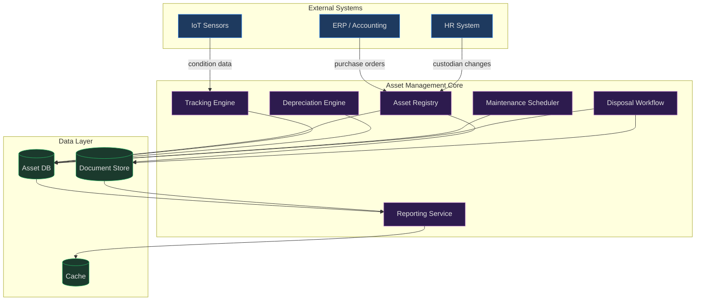
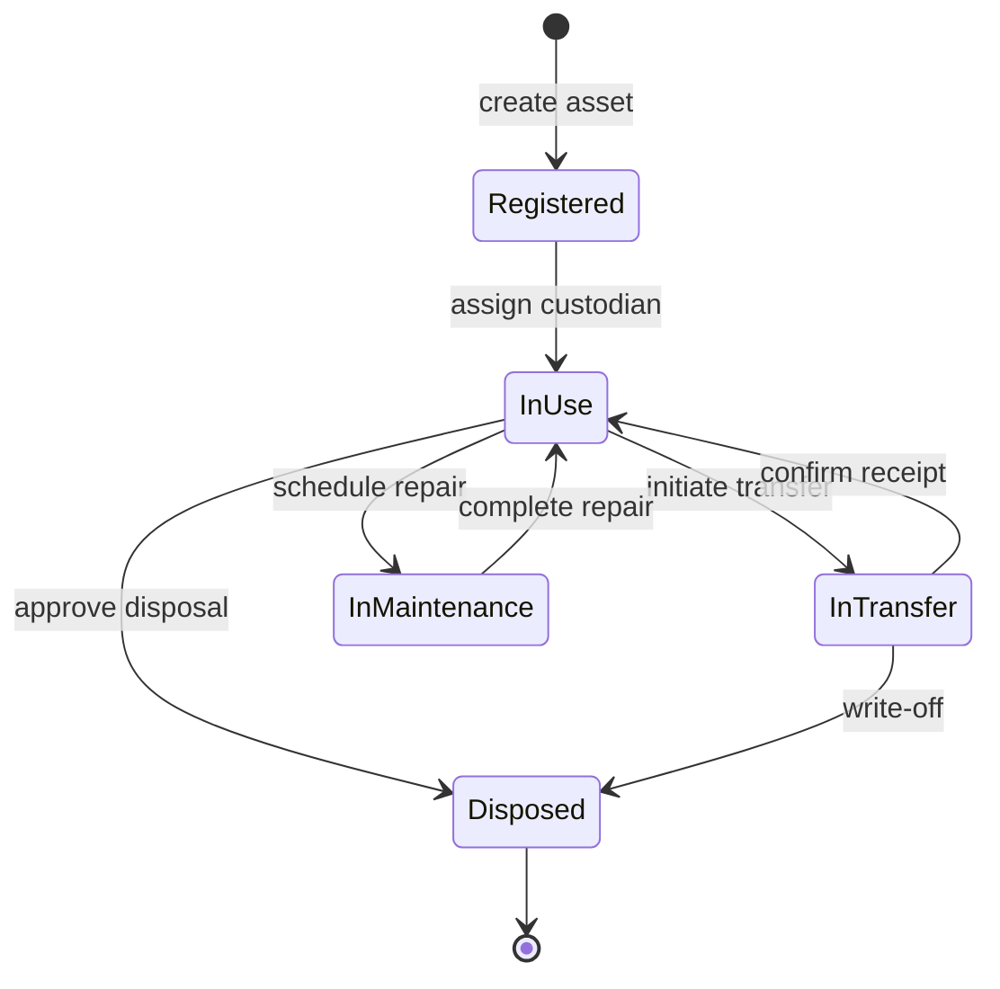
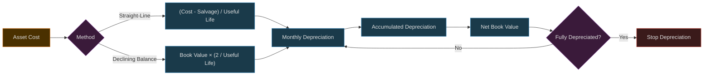
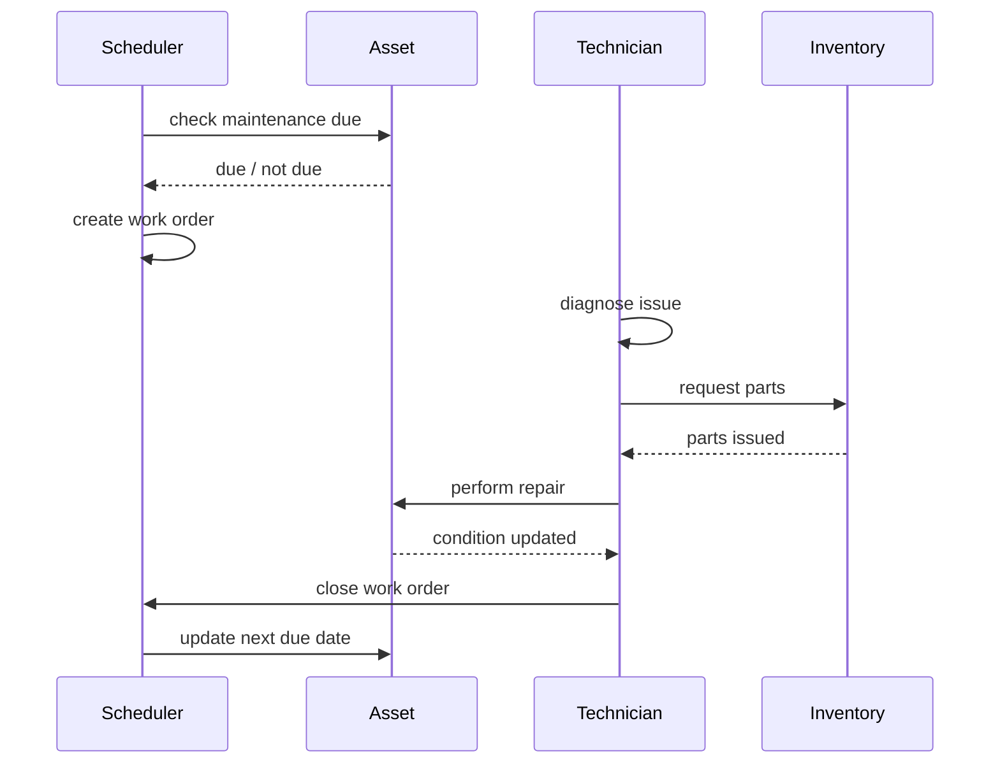

# Asset Management

## 1. Architecture



## 2. Asset Tracking

Every asset receives a unique identifier (UUID + human-readable tag). Location, custodian, and status are updated via events.



**Tracked attributes:** asset ID, category, serial number, purchase date, cost, location, custodian, status, condition score, warranty expiry, custom fields.

**Tracking methods:** barcode/RFID scan, GPS (vehicles/equipment), IoT sensors (condition monitoring), manual audit.

## 3. Depreciation

Straight-line and declining-balance methods supported per asset category.



**Key rules:**
- Depreciation starts the month after acquisition (or at acquisition if configured).
- Salvage value defaults to 0 unless set per category.
- Impairments trigger immediate write-down and recalculation.
- Reversals allowed within the same fiscal period.

## 4. Maintenance

Preventive and corrective maintenance workflows with scheduling and cost tracking.



**Maintenance types:**
- **Preventive:** time-based (every N days) or usage-based (every N hours/km).
- **Corrective:** triggered by breakdown report or IoT anomaly alert.
- **Predictive:** IoT sensor thresholds trigger proactive work orders.

**Tracked data:** work order ID, asset, technician, labor hours, parts used, cost, downtime hours, condition before/after.

## 5. Disposal

Assets move through approval, execution, and accounting write-off.

```mermaid
flowchart TD
    A[Initiate Disposal] --> B{Disposal Type}
    B -->|Sale| C[Create Sales Order]
    B -->|Scrap| D[Scrap Authorization]
    B -->|Donation| E[Donation Certificate]
    B -->|Transfer| F[Inter-company Transfer]
    C --> G[Receive Payment]
    D --> H[Remove from Service]
    E --> H
    F --> H
    G --> I[Write Off Asset]
    H --> I
    I --> J[Update GL]
    J --> K[Archive Records]
    K --> L[Close Disposal]

    classDef start fill:#1a3a1a,stroke:#27ae60,color:#e0e0e0
    classDef action fill:#1a2a3a,stroke:#2980b9,color:#e0e0e0
    classDef decision fill:#3a2a1a,stroke:#e67e22,color:#e0e0e0
    classDef end fill:#3a1a1a,stroke:#c0392b,color:#e0e0e0
    class A start
    class C,D,E,F,G,H action
    class B decision
    class I,J,K,L end
```

**Disposal checklist:**
- [ ] Asset removed from active registry
- [ ] Accumulated depreciation reconciled
- [ ] Gain/loss calculated (proceeds - net book value)
- [ ] GL entries posted
- [ ] Documents archived (certificate of disposal, sale receipt)
- [ ] Custodian notified
