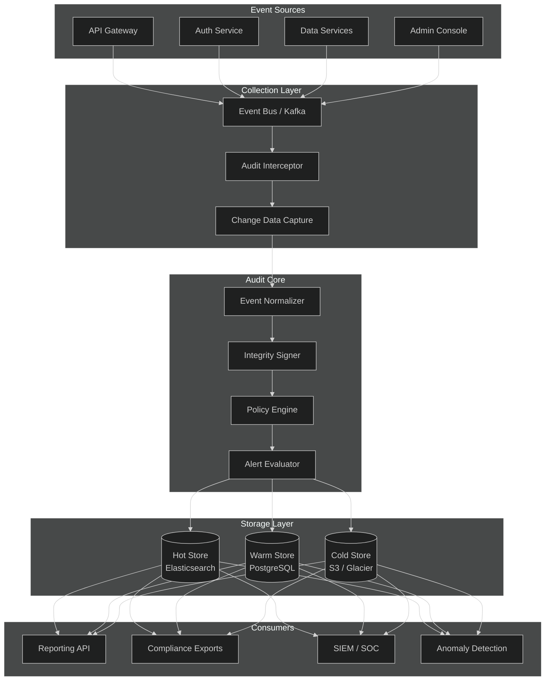
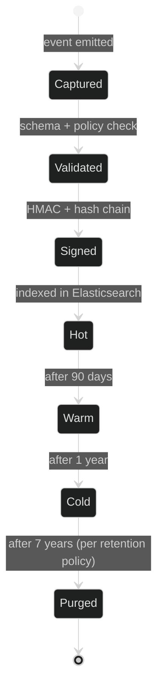
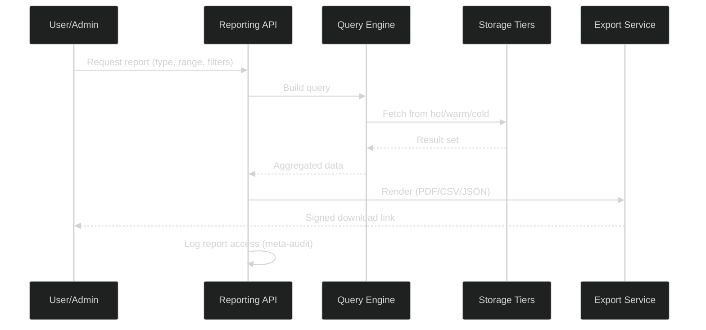
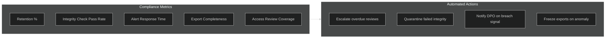

# APEX-OS Audit System

## 1. Audit Architecture



### Component Responsibilities

| Layer | Component | Responsibility |
|-------|-----------|----------------|
| Sources | API Gateway | Emits request/response metadata, caller identity |
| Sources | Auth Service | Emits login, logout, MFA, token events |
| Collectors | Event Bus | Durable, ordered transport (Kafka) |
| Collectors | Audit Interceptor | AOP-style capture in services |
| Core | Event Normalizer | Canonical schema (who/what/when/where/why) |
| Core | Integrity Signer | HMAC-SHA256 per event + hash chain |
| Core | Policy Engine | Real-time rule evaluation |
| Storage | Hot/Warm/Cold | Tiered retention (90d / 1y / 7y) |

## 2. Audit Trail

### Event Schema

Every audit event carries a canonical envelope:

```json
{
  "event_id": "uuid-v7",
  "timestamp": "2026-10-02T12:00:00.000Z",
  "sequence": 18446744073709551615,
  "actor": {
    "type": "user|service|system",
    "id": "usr_01H...",
    "ip": "203.0.113.10",
    "session": "sess_..."
  },
  "action": "document.update",
  "resource": {
    "type": "document",
    "id": "doc_01H...",
    "tenant": "tnt_acme"
  },
  "context": {
    "before": { "...": "redacted snapshot" },
    "after": { "...": "redacted snapshot" },
    "reason": "ticket-1234"
  },
  "integrity": {
    "prev_hash": "sha256:...",
    "event_hash": "sha256:...",
    "signature": "hmac:..."
  }
}
```

### Immutability Guarantees

- **Hash chain**: Each event includes `prev_hash` of the prior event; tampering breaks the chain.
- **WORM storage**: Cold tier uses S3 Object Lock (compliance mode).
- **Tenant isolation**: Events are partitioned by tenant; cross-tenant reads are denied at the storage layer.
- **Sequence numbers**: Monotonic per tenant; gaps trigger alerts.

### Lifecycle



## 3. Audit Logging

### Log Levels

| Level | Use Case | Example |
|-------|----------|---------|
| `CRITICAL` | Security-relevant, immediate alert | privilege escalation, mass export |
| `WARN` | Policy violation, no immediate risk | failed login threshold |
| `INFO` | Standard business action | document create/update/delete |
| `DEBUG` | Diagnostic, never stored long-term | internal state transitions |

### Capture Points

- **Authentication**: login success/failure, logout, MFA challenge, token refresh, session expiry.
- **Authorization**: role assignment, permission grant/deny, policy evaluation.
- **Data access**: read, create, update, delete, export, share — with before/after diffs.
- **Administrative**: config changes, user provisioning, tenant settings.
- **System**: service start/stop, config reload, certificate rotation.

### Redaction & Privacy

- PII fields are redacted per field-level policy before persistence.
- Secrets (tokens, passwords, keys) are never logged; only fingerprints (e.g., `sha256:abcd…`) are stored.
- Redaction rules are versioned and themselves audited.

### Reliability

- Events are buffered locally and retried with exponential backoff on transport failure.
- A dead-letter queue holds events that fail validation for manual review.
- At-least-once delivery; consumers dedupe by `event_id`.

## 4. Audit Reporting

### Standard Reports

| Report | Audience | Frequency | Source |
|--------|----------|-----------|--------|
| Access Review | Data owners | Weekly | Hot store |
| Failed Login Summary | Security | Daily | Hot store |
| Privileged Action Log | Compliance | Real-time | Hot store |
| Data Export History | DPO | Monthly | Warm store |
| Retention Compliance | Legal | Quarterly | Cold store |

### Report Generation Flow



### Query Capabilities

- Full-text search across actor, action, resource, and context fields.
- Filter by tenant, actor, action type, resource type, time range, and custom tags.
- Aggregations: count by actor, action, resource; time-series bucketing.
- Export formats: CSV, JSON, PDF (signed, watermarked).

### Meta-Auditing

Access to audit data is itself audited: who queried what, when, and which filters were applied.

## 5. Audit Compliance

### Regulatory Mapping

| Regulation | Requirement | Implementation |
|------------|-------------|----------------|
| **GDPR** | Art. 30 records of processing | Audit events map to processing activities |
| **GDPR** | Right to access / erasure | Subject access reports; erasure workflows logged |
| **SOC 2** | CC6.1 logical access | Auth events + policy engine |
| **SOC 2** | CC7.2 monitoring | Anomaly detection + alerting |
| **HIPAA** | §164.312(b) audit controls | Immutable trail + integrity verification |
| **ISO 27001** | A.12.4 logging & monitoring | Centralized logging + SIEM integration |
| **PCI DSS** | Req. 10.2 audit trails | Cardholder data access events |

### Compliance Controls

- **Retention**: Configurable per tenant; default 7 years for financial, 1 year for operational.
- **Integrity verification**: Scheduled hash-chain verification jobs; results logged.
- **Access control**: RBAC on audit data; separation of duties (auditors cannot modify audit config).
- **Breach detection**: Anomaly detection on access patterns; automated alerts to SOC.
- **Evidence packaging**: Signed, timestamped exports with chain-of-custody metadata.

### Compliance Dashboard



### Audit of the Audit System

- Configuration changes to the audit system are logged in a separate, append-only system audit log.
- Quarterly self-audits verify that the audit system itself meets policy.
- External auditors receive read-only, time-boxed access to the compliance dashboard.
