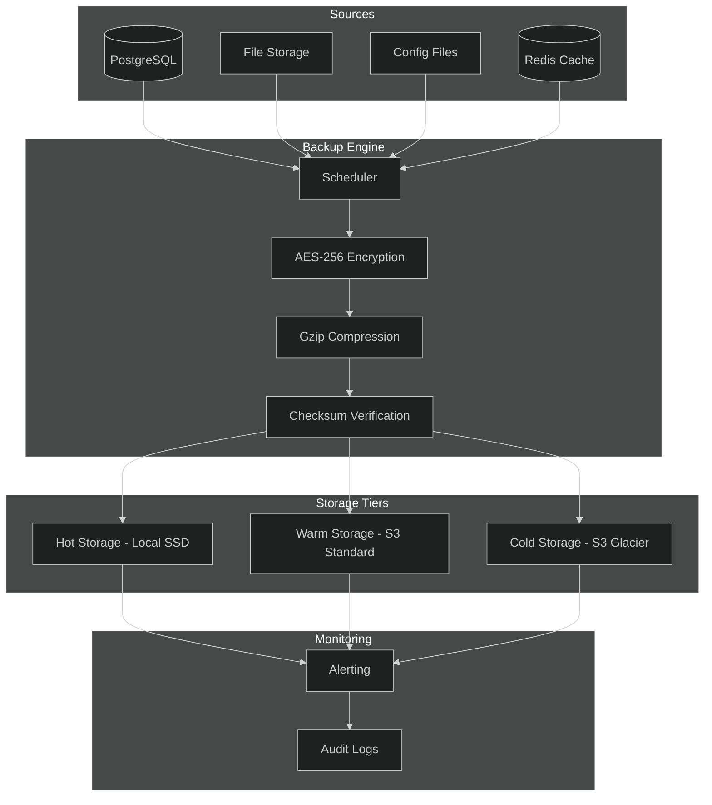
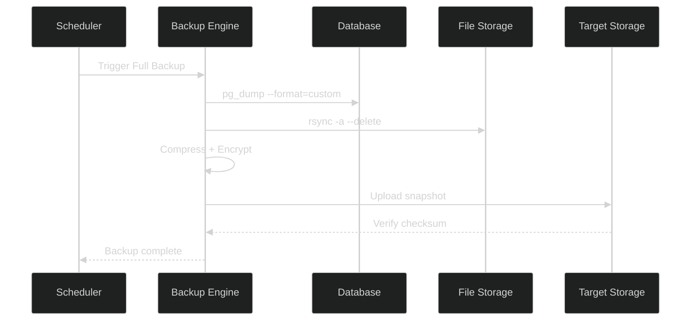
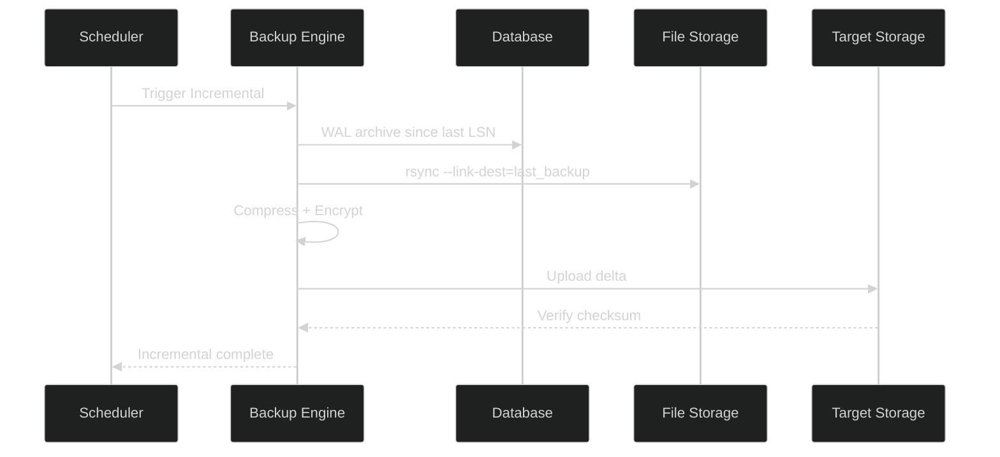
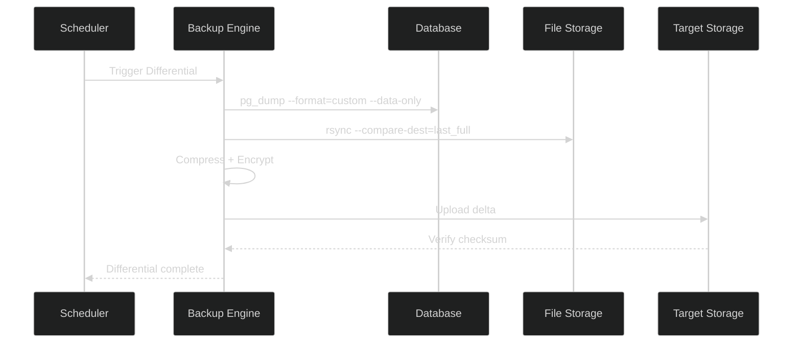
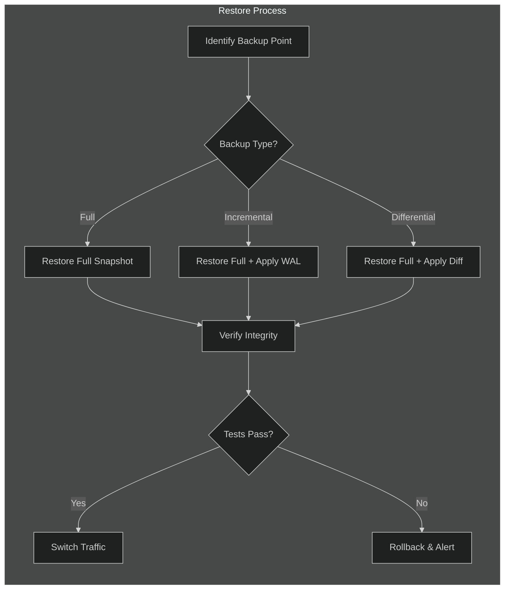

# APEX-OS Backup Architecture

## 1. Backup Architecture



## 2. Full Backup



**Schedule:** Weekly (Sunday 02:00 UTC)
**Retention:** 4 weeks
**Scope:** All databases, all files, all configs

## 3. Incremental Backup



**Schedule:** Every 6 hours
**Retention:** 7 days
**Scope:** Changes since last backup (any type)

## 4. Differential Backup



**Schedule:** Daily (02:00 UTC)
**Retention:** 14 days
**Scope:** Changes since last full backup

## 5. Restoration



### Restore Procedures

**Full Restore:**
```bash
# Stop services
apexctl stop --all

# Restore database
pg_restore --clean --if-exists --dbname=apex_os /backups/full/latest.dump

# Restore files
rsync -a --delete /backups/full/latest/files/ /var/lib/apex-os/

# Restore configs
cp /backups/full/latest/configs/* /etc/apex-os/

# Start services
apexctl start --all
```

**Point-in-Time Restore:**
```bash
# Restore base full backup
pg_restore --clean --if-exists --dbname=apex_os /backups/full/latest.dump

# Apply WAL archives up to target time
pg_waldump --timeline=1 --start=0/1000000 --end=0/2000000 | psql apex_os
```

### RTO / RPO Targets

| Metric | Target |
|--------|--------|
| RPO (Data Loss) | ≤ 15 minutes |
| RTO (Downtime) | ≤ 1 hour |
| Full Restore | ≤ 30 minutes |
| PIT Restore | ≤ 45 minutes |
