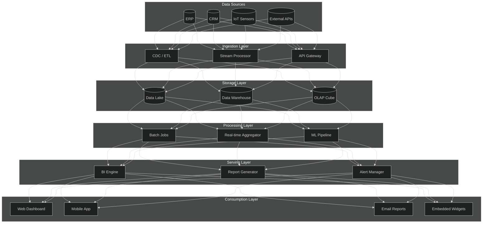

# APEX-OS Business Intelligence

## 1. BI Architecture

## 2. Dashboards

### Executive Dashboard
- Revenue vs. target (YTD)
- Gross margin trend
- Cash runway & burn rate
- Headcount & hiring pipeline
- Top 5 KPIs with sparklines

### Operations Dashboard
- Order fulfillment cycle time
- Inventory turnover
- Production OEE (Overall Equipment Effectiveness)
- Supply chain bottlenecks
- SLA compliance rate

### Sales Dashboard
- Pipeline coverage ratio
- Win/loss rate by segment
- Average deal size & sales cycle
- Quota attainment by rep
- Customer acquisition cost (CAC)

### Financial Dashboard
- P&L summary
- AR/AP aging
- Budget vs. actual variance
- Cash flow forecast
- Departmental spend breakdown

## 3. Reports

| Report | Frequency | Audience | Format |
|--------|-----------|----------|--------|
| Daily Operations Brief | Daily | Ops team | Email + PDF |
| Weekly Sales Performance | Weekly | Sales leadership | Interactive dashboard |
| Monthly Financial Close | Monthly | CFO / Finance | PDF + Excel |
| Quarterly Business Review | Quarterly | Executive team | Presentation |
| Ad-hoc Analysis | On-demand | All stakeholders | Self-service BI |

### Scheduled Reports
- **Monday 06:00** — Weekly pipeline report to sales leaders
- **1st of month** — Previous month P&L to finance
- **Daily 07:00** — Ops KPI snapshot to plant managers
- **Real-time** — Threshold breach alerts to on-call

## 4. KPIs

### Financial KPIs
| KPI | Formula | Target |
|-----|---------|--------|
| Gross Margin % | (Revenue − COGS) / Revenue | ≥ 40% |
| Operating Margin % | EBIT / Revenue | ≥ 15% |
| Cash Runway (months) | Cash / Monthly Burn | ≥ 12 months |
| Revenue Growth YoY | (Current − Prior) / Prior | ≥ 20% |
| CAC Payback (months) | CAC / (ARPU × Gross Margin) | ≤ 12 months |

### Operational KPIs
| KPI | Formula | Target |
|-----|---------|--------|
| Order Fulfillment Time | Ship date − Order date | ≤ 48 hours |
| Inventory Turnover | COGS / Avg Inventory | ≥ 6× / year |
| OEE | Availability × Performance × Quality | ≥ 85% |
| SLA Compliance | Met SLAs / Total SLAs | ≥ 98% |
| Defect Rate | Defects / Units produced | ≤ 0.5% |

### Sales & Marketing KPIs
| KPI | Formula | Target |
|-----|---------|--------|
| Pipeline Coverage | Pipeline value / Quota | ≥ 3× |
| Win Rate | Won deals / Total opportunities | ≥ 25% |
| Sales Cycle Length | Avg days from open to close | ≤ 45 days |
| NPS | % Promoters − % Detractors | ≥ 50 |
| Churn Rate | Lost customers / Total customers | ≤ 5% annually |

## 5. Predictive Analytics

### Demand Forecasting
- **Model:** Prophet / ARIMA ensemble
- **Inputs:** Historical sales, seasonality, promotions, macro indicators
- **Output:** 12-week rolling demand forecast by SKU
- **Accuracy target:** MAPE ≤ 15%

### Customer Churn Prediction
- **Model:** Gradient-boosted classifier (XGBoost)
- **Inputs:** Usage frequency, support tickets, payment delays, NPS
- **Output:** Churn probability score (0–1) per account
- **Action:** Trigger retention playbook at score ≥ 0.7

### Predictive Maintenance
- **Model:** LSTM on IoT sensor streams
- **Inputs:** Vibration, temperature, pressure, cycle counts
- **Output:** Remaining useful life (RUL) estimate per asset
- **Action:** Auto-create work order when RUL < threshold

### Revenue Forecasting
- **Model:** Monte Carlo simulation over pipeline
- **Inputs:** Deal stage, historical close rates, seasonality
- **Output:** P10 / P50 / P90 revenue scenarios
- **Cadence:** Refreshed weekly

### Anomaly Detection
- **Model:** Isolation Forest on transaction streams
- **Inputs:** Order amounts, refund rates, login patterns
- **Output:** Anomaly score + root-cause hints
- **Action:** Real-time alert to fraud/ops channel

---

*Last updated: 2026-10-02*
