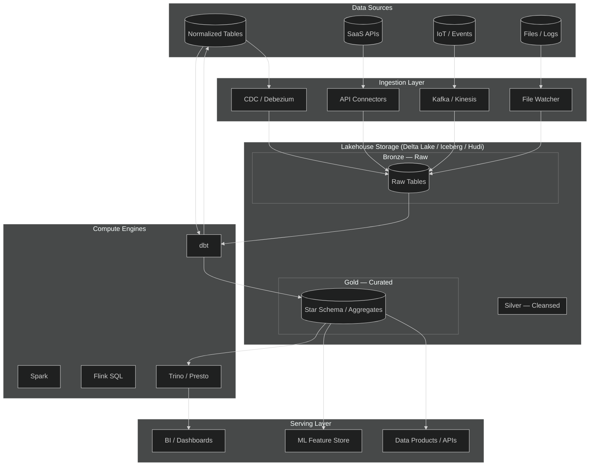
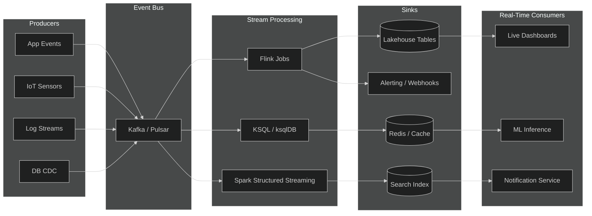
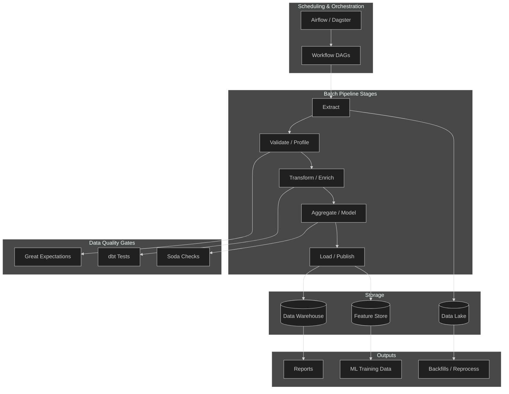
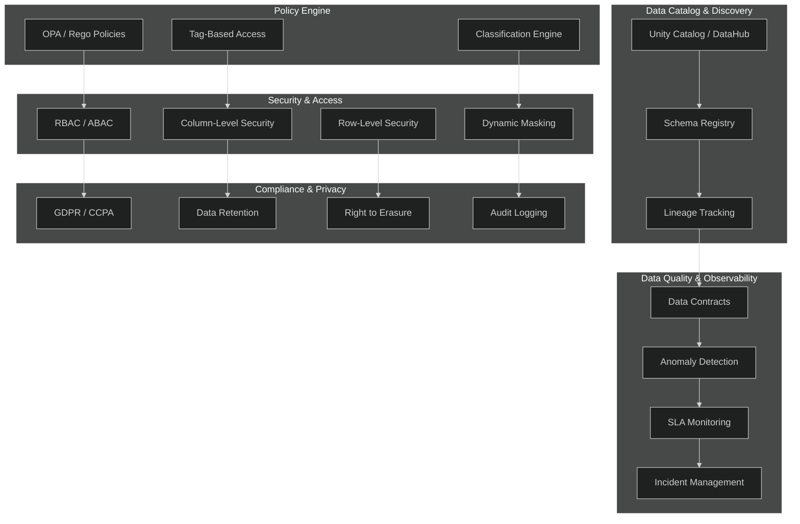
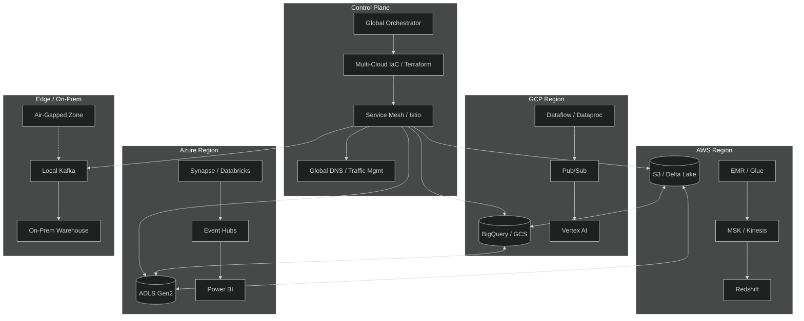

# APEX-OS Big Data Platform Architecture

## 1. Lakehouse Architecture

## 2. Streaming Architecture

## 3. Batch Processing

## 4. Data Governance

## 5. Multi-Cloud Deployment

---

## Technology Stack Summary

| Layer | Technology Choices |
|---|---|
| Storage Format | Apache Delta Lake / Apache Iceberg |
| Table Catalog | Unity Catalog / Apache Hive Metastore |
| Stream Processing | Apache Flink, Kafka Streams |
| Batch Processing | Apache Spark, dbt |
| Orchestration | Apache Airflow, Dagster |
| Data Warehouse | Snowflake, BigQuery, Redshift |
| BI & Serving | Trino, Apache Superset, Power BI |
| Governance | DataHub, Apache Atlas, OPA |
| IaC | Terraform, Pulumi |
| CI/CD | GitHub Actions, ArgoCD |
| Observability | Prometheus, Grafana, OpenTelemetry |
