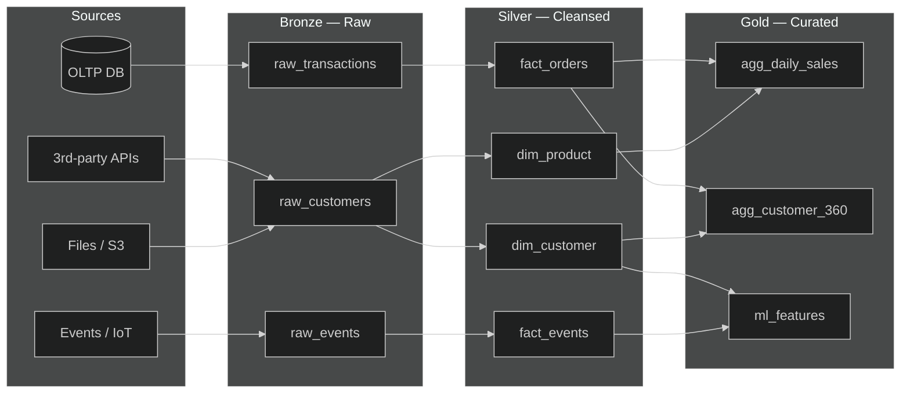
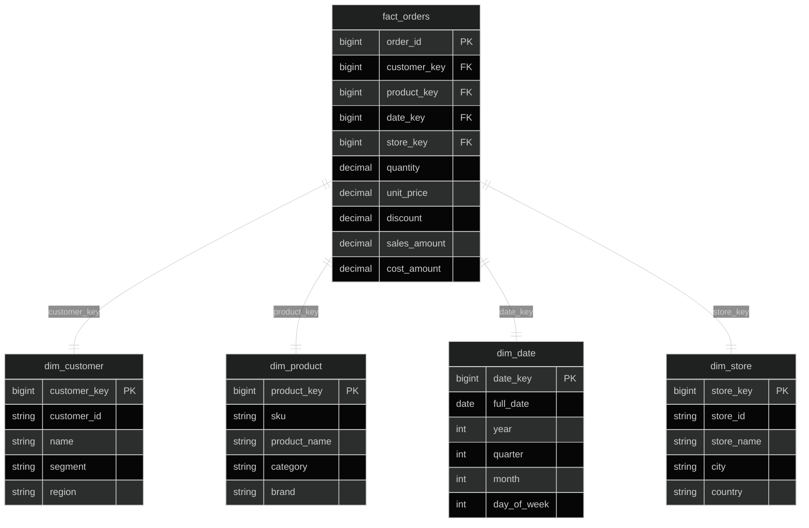
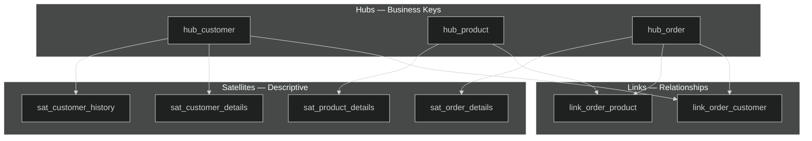
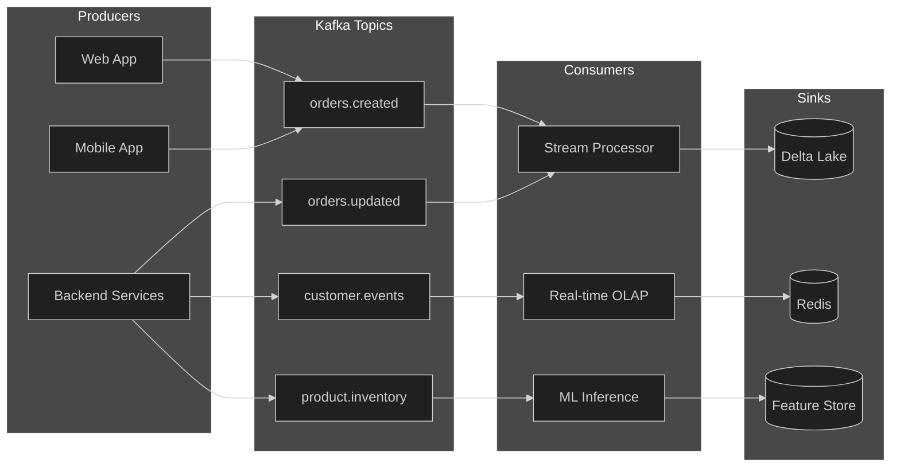
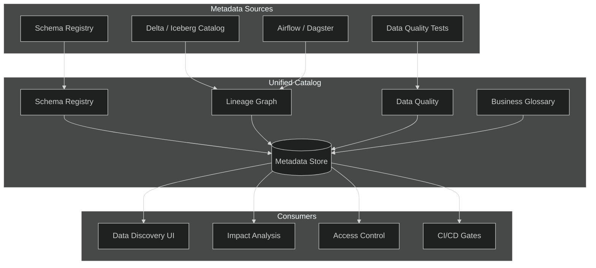

# Big Data Model — APEX-OS Business Platform

## 1. Lakehouse Schema Design

Medallion architecture (Bronze → Silver → Gold) on object storage with Delta Lake / Apache Iceberg.



**Table conventions**

| Layer | Format | Partition | Retention |
|-------|--------|-----------|-----------|
| Bronze | Parquet / JSON | `ingestion_date` | 90 days |
| Silver | Delta / Iceberg | `event_date` | 2 years |
| Gold | Delta / Iceberg | `report_date` | 7 years |

---

## 2. Star Schema Patterns

Optimized for BI queries — denormalized dimensions, additive facts.



**Design rules**
- Surrogate keys (`*_key`) — bigint, monotonically increasing.
- Degenerate dimensions (order_number, ticket_id) stay in the fact.
- Junk dimensions for low-cardinality flags.
- Conformed dimensions shared across fact tables.

---

## 3. Data Vault Patterns

Hub-Link-Satellite for auditability, parallel loading, and source-system independence.



**Satellite split rules**
- One satellite per source system.
- Split by rate of change (fast vs. slow attributes).
- Hash-diff for change detection; no updates, only inserts.

---

## 4. Streaming Data Schema

Kafka / Kinesis event envelopes with schema registry (Avro / Protobuf).



**Event envelope (Avro)**

```json
{
  "event_id": "uuid",
  "event_type": "orders.created",
  "occurred_at": "2026-10-02T10:00:00Z",
  "source": "web-checkout",
  "trace_id": "abc-123",
  "payload": { "order_id": 1001, "customer_id": 55, "total": 249.99 }
}
```

**Schema rules**
- Backward-compatible evolution (add optional fields only).
- Schema Registry enforces compatibility at publish time.
- Dead-letter queue for schema violations.

---

## 5. Metadata Management

Unified catalog covering schema, lineage, quality, and discovery.



**Key metadata artifacts**

| Artifact | Tool | Purpose |
|----------|------|---------|
| Schema definitions | Confluent Schema Registry | Versioned Avro/Protobuf |
| Table catalog | Unity Catalog / Hive Metastore | Table & partition discovery |
| Lineage | OpenLineage / DataHub | Column-level impact analysis |
| Quality rules | Soda / Great Expectations | Automated data tests |
| Glossary | DataHub / Collibra | Business term ownership |

**Governance hooks**
- Schema change → CI validation → auto-approve or manual gate.
- Lineage graph powers downstream impact alerts.
- Quality scores gate Gold-layer promotion.
