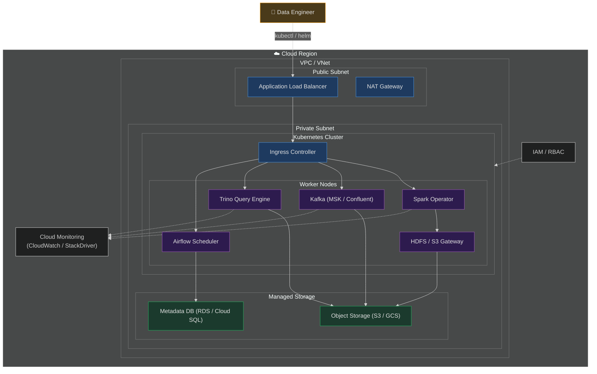
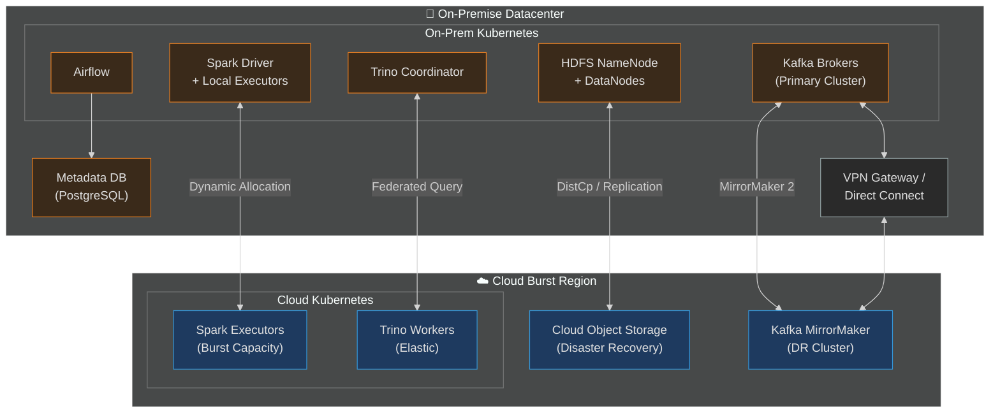
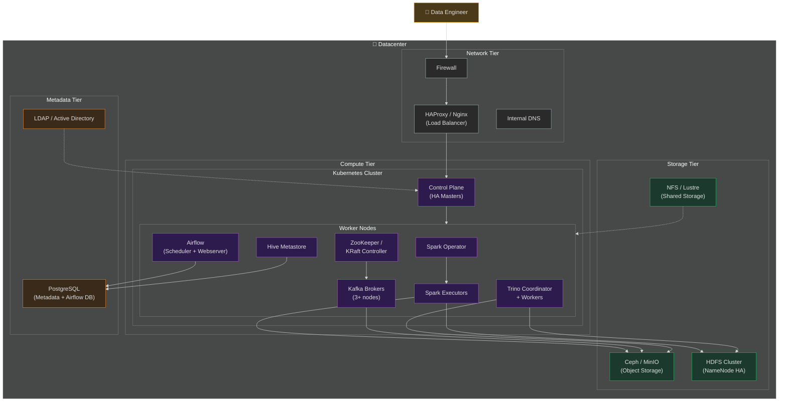
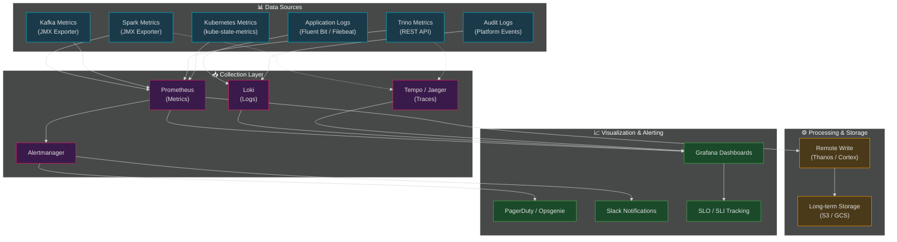

# Big Data Deployment Guide

Deployment architectures for the APEX-OS big data platform: cloud, hybrid, on-premise, CI/CD, and monitoring.
---

## 1. Cloud Deployment

Fully managed deployment on a public cloud provider (AWS / GCP / Azure).

**Key characteristics:** Elastic autoscaling for Spark/Trino · Managed Kafka · Object storage data lake · IAM RBAC · Multi-AZ HA

---

## 2. Hybrid Deployment

Combines on-premise infrastructure with cloud burst capacity.

**Key characteristics:** On-prem baseline + cloud burst · MirrorMaker 2 replication · HDFS distCp for DR · VPN/Direct Connect · Federated Trino queries

---

## 3. On-Premise Deployment

Fully air-gapped or self-hosted deployment within an organization's own datacenter.

**Key characteristics:** No cloud dependency · Ceph/MinIO object storage · HDFS NameNode HA · HAProxy/Nginx LB · LDAP/AD auth · PostgreSQL metadata · For regulated industries

---

## 4. CI/CD Pipeline

GitOps-based continuous integration and deployment pipeline.

```mermaid
%%{init: {'theme': 'dark'}}%%
flowchart LR
    subgraph Source["📝 Source Control"]
        GIT["Git Repository\n(GitHub / GitLab)"]
        MR["Merge Request\n+ Code Review"]
    end
    subgraph CI["🔨 Continuous Integration"]
        BUILD["Build & Package\n(Docker / Helm)"]
        TEST["Automated Tests\n(Unit + Integration)"]
        SCAN["Security Scan\n(SAST + Dependency)"]
        PUSH["Push Artifact\n(Registry / Chart Museum)"]
    end
    subgraph CD["🚀 Continuous Delivery"]
        ARGO["ArgoCD / Flux\n(GitOps Controller)"]
        subgraph Environments["Deployment Environments"]
            DEV_E["Dev Environment"]
            STAGING["Staging Environment"]
            PROD["Production Environment"]
        end
    end
    subgraph GitOps["📦 GitOps Repo"]
        MANIFESTS["Kustomize / Helm\nManifests"]
        CONFIG["ConfigMaps &\nSecrets (Sealed)"]
    end
    GIT --> MR
    MR --> BUILD
    BUILD --> TEST
    TEST --> SCAN
    SCAN --> PUSH
    PUSH -->|"Update Image Tag"| MANIFESTS
    MANIFESTS --> ARGO
    CONFIG --> ARGO
    ARGO --> DEV_E
    DEV_E -->|"Promote"| STAGING
    STAGING -->|"Manual Gate"| PROD
    classDef source fill:#1a3a4a,stroke:#00bcd4,color:#e0e0e0
    classDef ci fill:#3a1a4a,stroke:#e91e63,color:#e0e0e0
    classDef cd fill:#1a4a2a,stroke:#4caf50,color:#e0e0e0
    classDef gitops fill:#4a3a1a,stroke:#ff9800,color:#e0e0e0
    class GIT,MR source
    class BUILD,TEST,SCAN,PUSH ci
    class ARGO,DEV_E,STAGING,PROD cd
    class MANIFESTS,CONFIG gitops
```

**Key characteristics:** Git as source of truth · ArgoCD/Flux GitOps · Unit + integration + data quality tests · SAST + container scanning · Dev → Staging → Prod with manual gates · Sealed Secrets · Helm/Kustomize

---

## 5. Monitoring Setup

Full-stack observability with metrics, logs, and traces.

**Key characteristics:** Prometheus + JMX exporters · Fluent Bit → Loki · OpenTelemetry → Tempo/Jaeger · Thanos/Cortex long-term retention · Grafana dashboards · Alertmanager → PagerDuty/Slack · SLO/SLI tracking

---

## Quick Reference

| Aspect | Cloud | Hybrid | On-Premise |
|---|---|---|---|
| **Control** | Low (managed) | Medium | Full |
| **Scalability** | Elastic | Elastic burst | Fixed capacity |
| **Data Sovereignty** | Provider-dependent | Configurable | Full control |
| **Cost Model** | OpEx | Mixed | CapEx + OpEx |
| **Maintenance** | Minimal | Moderate | Significant |
| **Best For** | Startups, variable workloads | Enterprises with existing DC | Regulated industries |
