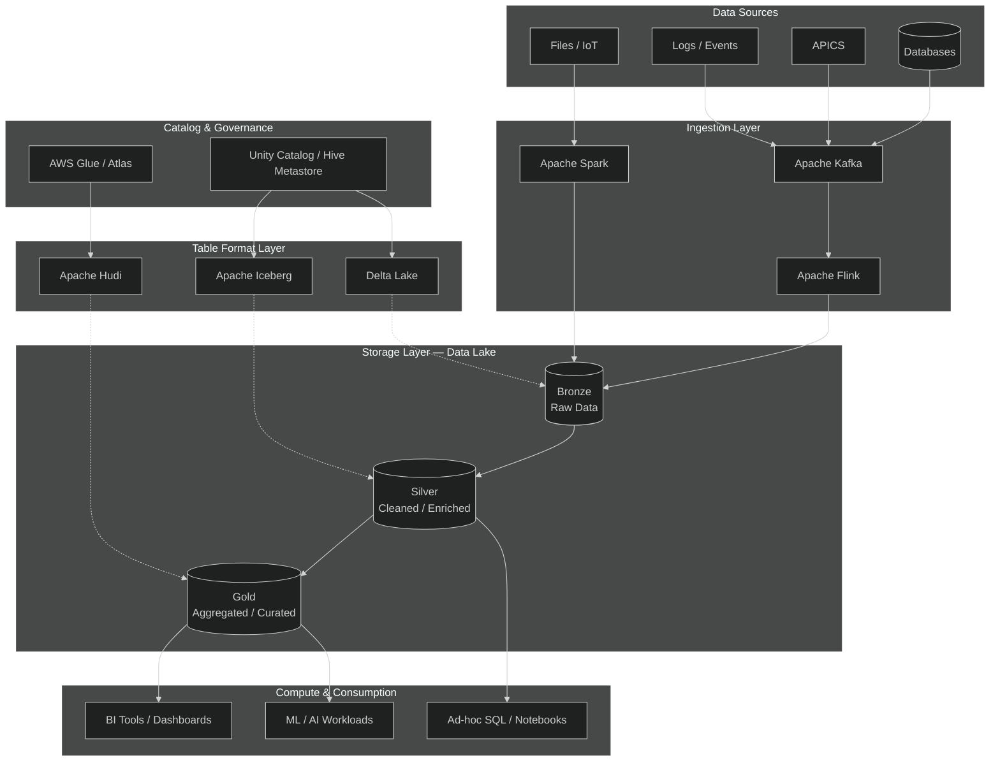
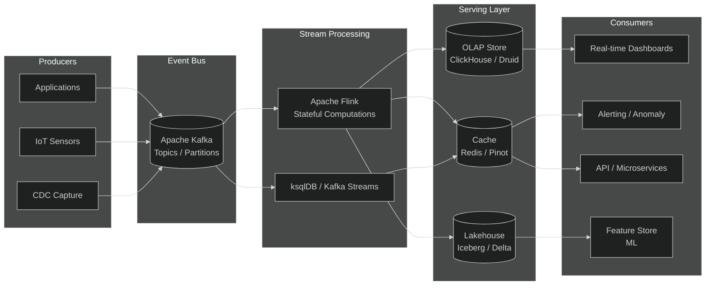

# Big Data Implementation Guide

## 1. Lakehouse Architecture

The lakehouse combines data lake scalability with warehouse reliability. Data flows through medallion layers (bronze → silver → gold) on open storage with a table format providing ACID transactions.

**Key principles:**
- **Medallion layers** separate raw, cleaned, and curated data for progressive refinement.
- **Open table formats** (Delta, Iceberg, Hudi) add ACID transactions, time travel, and schema enforcement on cheap object storage.
- **Decoupled storage and compute** lets multiple engines read the same data without copying.

---

## 2. Table Formats Comparison

| Feature | Delta Lake | Apache Iceberg | Apache Hudi |
|---|---|---|---|
| **Origin** | Databricks (2019) | Netflix (2018) | Uber (2016) |
| **Open source** | Linux Foundation (open) | Apache TLP (fully open) | Apache TLP (fully open) |
| **Engine lock-in** | Spark-first; multi-engine via REST | Engine-agnostic by design | Spark-first; Flink support |
| **ACID transactions** | Yes (optimistic concurrency) | Yes (snapshot isolation) | Yes (MVCC) |
| **Time travel** | Yes (version + timestamp) | Yes (snapshot ID + timestamp) | Yes (commit timeline) |
| **Schema evolution** | Add/rename/drop columns | Full evolution, partition evolution | Limited evolution |
| **Partition evolution** | Limited (v2.0+) | Full (hidden partitioning) | Limited |
| **Upserts / deletes** | Merge-on-read or copy-on-write | Merge-on-read (v2) | Copy-on-write or merge-on-read |
| **File pruning** | Data skipping, Z-ordering | Hidden partitioning, manifest lists | Indexing (bloom, HBase) |
| **Catalog integration** | Unity Catalog, Hive | REST catalog, Hive, Glue, Snowflake | Hive, Glue |
| **Best for** | Spark-centric lakehouses | Multi-engine, multi-cloud | Incremental upserts, CDC |

**Recommendation:** Choose **Iceberg** for multi-engine/multi-cloud portability; **Delta** for Databricks-centric Spark shops; **Hudi** for heavy CDC/upsert workloads.

---

## 3. Data Mesh Patterns

Data mesh decentralizes data ownership to domain teams, treating data as a product with self-serve infrastructure and federated governance.

### Four Pillars

1. **Domain ownership** — Teams closest to data source own its quality, schema, and SLAs.
2. **Data as a product** — Each domain publishes discoverable, addressable, trustworthy data products with clear contracts.
3. **Self-serve data platform** — A platform team provides tooling (ingestion, storage, catalog, orchestration) so domains don't build bespoke pipelines.
4. **Federated computational governance** — Cross-domain standards (naming, security, compliance) enforced through automated policy-as-code.

### Common Patterns

| Pattern | Description |
|---|---|
| **Domain-oriented decomposition** | Split monolith by business capability (orders, customers, inventory). |
| **Data product contract** | Schema + SLA + metadata published to a central catalog. |
| **Event-driven integration** | Domains exchange data via Kafka topics (domain events) rather than direct DB access. |
| **Batch + stream dual-write** | Same domain event feeds both real-time (Flink) and batch (Spark) pipelines. |
| **Federated catalog** | Central discovery layer aggregates metadata from all domain catalogs. |
| **Policy-as-code** | Governance rules (PII masking, retention) codified and auto-enforced at ingestion. |

### When to Adopt

- **Adopt** when a central data team is the bottleneck and domains have distinct data ownership.
- **Avoid** for small teams or single-domain products — the operational overhead outweighs benefits.

---

## 4. Streaming Architecture

Lambda and Kappa patterns handle real-time data. Modern lakehouses favor Kappa (single streaming path) with batch as a special case.

**Design choices:**
- **Kafka** as the event backbone: durable, replayable, decouples producers from consumers.
- **Flink** for stateful stream processing: event-time semantics, exactly-once, checkpointing.
- **Kappa pattern**: single streaming path; batch reprocessing achieved by replaying Kafka topics.
- **Lambda alternative**: parallel batch + speed layers merged at serving — higher complexity, use only when batch logic diverges significantly.

---

## 5. Batch vs Streaming Tradeoffs

| Dimension | Batch Processing | Streaming Processing |
|---|---|---|
| **Latency** | Minutes to hours | Milliseconds to seconds |
| **Throughput** | Very high (bulk scans) | High (continuous, incremental) |
| **Cost** | Lower per GB (scheduled, elastic) | Higher (always-on compute) |
| **Complexity** | Simpler (bounded input, no state) | Complex (state, watermarks, late data) |
| **Fault tolerance** | Re-run entire job | Checkpoint + replay from offset |
| **Data completeness** | Full dataset each run | Approximate until watermark passes |
| **Use cases** | Nightly ETL, reporting, model training | Real-time alerts, fraud detection, live dashboards |
| **Engines** | Spark, Hive, Presto batch | Flink, Kafka Streams, Spark Structured Streaming |

### Decision Framework

- **Use batch** when latency > 15 min is acceptable, data volumes are large, and cost efficiency matters.
- **Use streaming** when immediate action is required (fraud, ops monitoring) or downstream systems need incremental updates.
- **Hybrid (Lambda)**: run both; use streaming for real-time views and batch for accurate historical reconciliation.
- **Streaming-first (Kappa)**: unify on streaming; treat batch as replayed streams — reduces code duplication.

### Practical Guidelines

1. Start with batch; add streaming only when business latency requirements demand it.
2. Use **micro-batching** (Spark Structured Streaming) as a middle ground — near-real-time with simpler ops.
3. For exactly-once end-to-end: Kafka + Flink with transactional sinks.
4. Monitor consumer lag, checkpoint duration, and watermark delay as key streaming health metrics.
