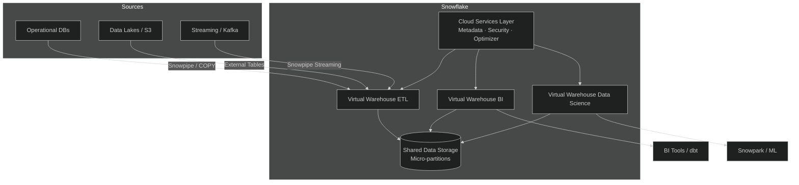
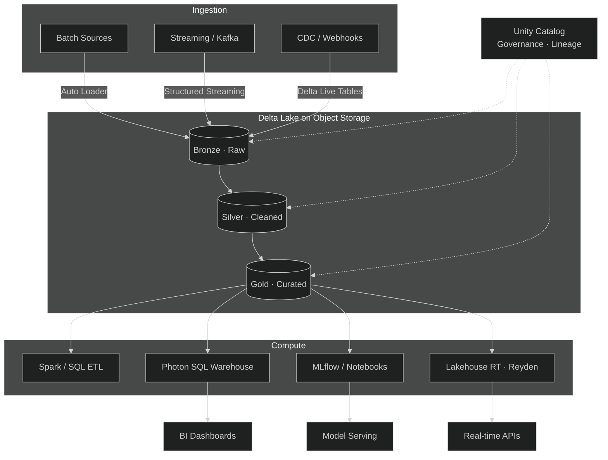
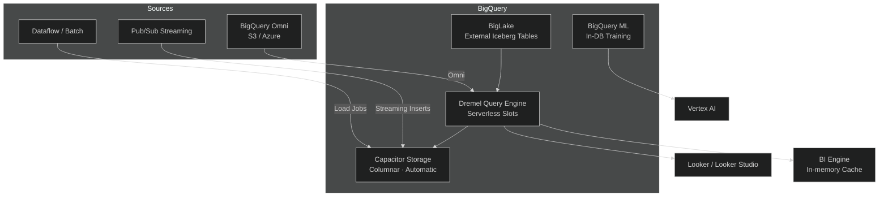
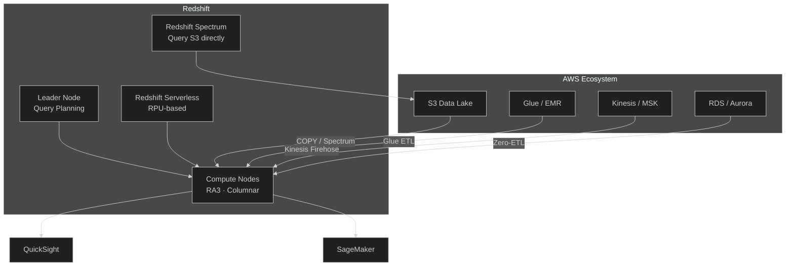

# Big Data Platform Research

> Comparative analysis of Snowflake, Databricks, BigQuery, and Redshift for APEX-OS Business Platform.

## 1. Platform Comparison

| Feature | Snowflake | Databricks | BigQuery | Redshift |
|---|---|---|---|---|
| **Architecture** | Multi-cluster shared-data (proprietary) | Open Lakehouse (Spark + Delta Lake) | Serverless columnar (Dremel/Capacitor) | MPP columnar (ParAccel) |
| **Storage Format** | Micro-partitioned columnar | Apache Parquet via Delta Lake (open) | Capacitor columnar | Columnar (proprietary) |
| **Storage Location** | Snowflake-managed | Customer-owned S3/ADLS/GCS | Google-managed | AWS-managed |
| **Compute Model** | Virtual Warehouses (elastic clusters) | Spark clusters / SQL Warehouses / Photon | Serverless slots (auto-scaled) | Provisioned clusters / Serverless RPUs |
| **Separation** | Full storage/compute separation | Full separation | Full separation | Partial (RA3 separates managed storage) |
| **Multi-cloud** | AWS, Azure, GCP | AWS, Azure, GCP | GCP (Omni for cross-cloud) | AWS only |
| **Pricing Unit** | Credits (~$2–4/credit) | DBUs (~$0.22–0.70/DBU) | $/TB scanned or slot-hour | Node-hour or RPU-hour |
| **Storage Cost** | ~$23/TB/mo | Cloud passthrough (S3/ADLS/GCS) | ~$20/TB/mo (active) | ~$24/TB/mo (managed) |
| **Serverless** | Yes (auto-suspend) | Yes (serverless SQL/compute) | Yes (fully serverless) | Yes (Redshift Serverless) |
| **Streaming** | Snowpipe (micro-batch) | Structured Streaming (micro-batch/continuous) | Native streaming inserts | Kinesis integration |
| **ML/AI** | Snowpark (Python/Scala/Java) | MLflow, Spark ML, notebooks | BigQuery ML | SageMaker integration |
| **Governance** | Tag policies, masking, row access | Unity Catalog (cross-cloud) | Column ACLs, Dataplex | IAM, Lake Formation |
| **Open Formats** | Iceberg tables (limited) | Delta Lake, Iceberg (UniForm) | BigLake, Iceberg via Omni | Limited |

## 2. Architecture Patterns

### 2.1 Snowflake — Multi-Cluster Shared-Data

### 2.2 Databricks — Lakehouse Medallion

### 2.3 BigQuery — Serverless Analytics

### 2.4 Redshift — AWS-Native MPP

## 3. Performance Benchmarks

> Sources: Fivetran/Brooklyn Data Co. (2025), GigaOm Sonar (Q3 2025), Bryteflow (Oct 2025), vendor disclosures. All figures are representative; workload-dependent.

| Benchmark | Snowflake | Databricks (Photon) | BigQuery | Redshift |
|---|---|---|---|---|
| **TPC-DS 1 TB (99 queries, median)** | 8.21s | 8.69s | ~12s (est.) | ~10s (est.) |
| **TPC-DS warm cache (avg)** | 2.84s | 3.24s | — | — |
| **TPC-DS cold start** | 9.6s | 3.5s | — | — |
| **ELT + Python UDFs (1 TB)** | 2,847s | 1,055s (2.7x faster) | — | — |
| **MERGE 50M rows (5% update)** | 38m 14s | 4m 12s (9.1x faster) | — | — |
| **ML training (5 TB XGBoost)** | $98.40 | $11.20 (8.8x cheaper) | — | — |
| **Ad-hoc query cost (1.5 TB)** | $0.0058/query | $0.0042/query (27.5% cheaper) | — | — |
| **Streaming ingestion (100K ev/s)** | Snowpipe (higher cost) | Structured Streaming (~2x cheaper) | Native inserts (lowest latency) | Kinesis (moderate) |
| **Real-time serving** | Interactive Tables (5s timeout) | Lakehouse//RT: <100ms, 12K QPS | BI Engine cache | Not applicable |

**Key Takeaways:**
- Warm-cache BI queries: Snowflake leads by 6–14% on latency.
- ELT, MERGE, ML, cold-start scans: Databricks leads by 2–9x on cost-adjusted throughput.
- BigQuery excels at ad-hoc exploration on large datasets with zero ops overhead.
- Redshift is competitive within AWS for predictable, high-volume batch workloads.

## 4. Cost Analysis

### 4.1 Pricing Models

| Platform | Billing Unit | Entry Rate | Mid-Tier | Top-Tier | Storage |
|---|---|---|---|---|---|
| **Snowflake** | Credit (per-second) | ~$2.00/credit (Standard) | ~$3.00/credit (Enterprise) | ~$4.00/credit (BC) | ~$23/TB/mo |
| **Databricks** | DBU (per-hour) | ~$0.22/DBU (Standard) | ~$0.50/DBU (Premium) | ~$0.70/DBU (Serverless) | Cloud passthrough |
| **BigQuery** | $/TB scanned or slot-hour | $4.69/TiB (on-demand) | $0.06/slot-hr (Enterprise) | $0.10/slot-hr (Ent Plus) | ~$20/TB/mo |
| **Redshift** | Node-hour or RPU-hour | $1.50/hr (Serverless 4 RPU) | $0.375/RPU-hr (on-demand) | $13.04/hr (ra3.16xlarge) | ~$24/TB/mo |

### 4.2 Cost Optimization Strategies

- **Snowflake:** Auto-suspend warehouses, use resource monitors, leverage result cache, choose right warehouse size.
- **Databricks:** Use spot instances for classic compute, serverless for predictable billing, auto-scaling SQL warehouses, OPTIMIZE + Z-ORDER to reduce scan volume.
- **BigQuery:** Partition and clustering to reduce bytes scanned, flat-rate slots for predictable workloads, BI Engine for dashboard acceleration.
- **Redshift:** Reserved instances for steady workloads, Spectrum for cold data on S3, workload management (WLM) queues, distribution/sort key tuning.

### 4.3 Total Cost of Ownership Considerations

| Factor | Snowflake | Databricks | BigQuery | Redshift |
|---|---|---|---|---|
| **Ops overhead** | Low | Medium–High | Lowest | Medium |
| **Engineering cost** | Low (SQL-first) | High (Spark expertise) | Low | Medium |
| **Egress costs** | Multi-cloud egress | Customer-owned storage | GCP egress | AWS egress |
| **Hidden costs** | Idle warehouses, replication | DBU + cloud compute (classic) | On-demand scan costs | Vacuum/ANALYZE maintenance |
| **Committed use** | Yes (capacity) | Yes (committed use) | Yes (slots) | Yes (reserved instances) |

## 5. Integration Requirements

### 5.1 Data Ingestion

| Source Type | Snowflake | Databricks | BigQuery | Redshift |
|---|---|---|---|---|
| **Batch files (S3/ADLS/GCS)** | COPY INTO, Snowpipe | Auto Loader, Spark read | bq load, Dataflow | COPY, Glue |
| **Streaming** | Snowpipe Streaming | Structured Streaming, DLT | Streaming inserts | Kinesis Firehose |
| **CDC** | Streams + Tasks | Delta Live Tables, Debezium | Datastream | Zero-ETL, DMS |
| **SaaS connectors** | Fivetran, Airbyte, dbt | Fivetran, Airbyte, dbt | Fivetran, Dataflow | Fivetran, Glue |

### 5.2 Transformation & Orchestration

| Capability | Snowflake | Databricks | BigQuery | Redshift |
|---|---|---|---|---|
| **SQL transformations** | dbt, SQL tasks | dbt, Spark SQL | dbt, SQL scripts | dbt, SQL |
| **Orchestration** | Airflow, Dagster, Prefect | Databricks Workflows, Airflow | Cloud Composer, Dataflow | Airflow, Step Functions |
| **Data quality** | Great Expectations, Soda | Delta Expectations, Soda | Dataflow, custom | Deequ, custom |

### 5.3 BI & Visualization

| Tool | Snowflake | Databricks | BigQuery | Redshift |
|---|---|---|---|---|
| **Native BI** | Snowsight | Databricks SQL Dashboards | Looker Studio | QuickSight |
| **Tableau** | Native connector | Native connector | Native connector | Native connector |
| **Power BI** | Connector | Connector | Connector | Connector |
| **Looker** | JDBC/ODBC | JDBC/ODBC | Native (best) | JDBC/ODBC |

### 5.4 ML/AI Integration

| Capability | Snowflake | Databricks | BigQuery | Redshift |
|---|---|---|---|---|
| **Experiment tracking** | Snowpark ML | MLflow (native) | Vertex AI | SageMaker |
| **Feature store** | Snowpark | Databricks Feature Store | Vertex AI Feature Store | SageMaker Feature Store |
| **Model serving** | Snowpark Container Services | MLflow Serving, Model Serving | Vertex AI Endpoints | SageMaker Endpoints |
| **Notebooks** | Snowsight Notebooks | Native (best-in-class) | Colab, Vertex AI Workbench | SageMaker Studio |

### 5.5 Governance & Security

| Feature | Snowflake | Databricks | BigQuery | Redshift |
|---|---|---|---|---|
| **Catalog** | Snowflake Horizon | Unity Catalog | Dataplex | AWS Glue Data Catalog |
| **Column-level security** | Masking policies | Unity Catalog | Column ACLs | Dynamic masking |
| **Row-level security** | Row access policies | Row filters | Row-level security | RLS policies |
| **Data lineage** | Object-level | Unity Catalog (end-to-end) | Dataplex | Limited |
| **Audit logging** | Account Usage | Unity Catalog audit | Cloud Logging | CloudTrail |
| **Cross-cloud governance** | Limited | Multi-cloud (best) | GCP only | AWS only |

---

## Recommendation for APEX-OS

| Scenario | Recommended Platform | Rationale |
|---|---|---|
| **Multi-cloud BI & analytics** | Snowflake | Best separation, workload isolation, SQL-first |
| **Unified data engineering + ML** | Databricks | Lakehouse, open formats, MLflow, Unity Catalog |
| **GCP-native, serverless, ad-hoc** | BigQuery | Zero ops, tight GCP integration, streaming |
| **AWS-native, predictable batch** | Redshift | Deep AWS integration, cost-effective at scale |
| **Real-time serving on open tables** | Databricks (Lakehouse//RT) | Sub-100ms on Delta/Iceberg, no data copies |

---

*Research compiled: October 2026. Pricing and features subject to change; verify with vendor documentation.*
