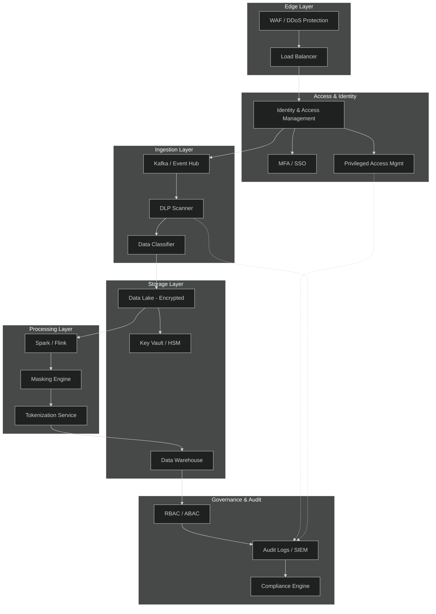

# Big Data Security

## 1. Security Architecture

## 2. Data Encryption Patterns

### 2.1 Encryption at Rest
- **AES-256** for data at rest (files, databases, backups)
- **Envelope encryption**: Data Encryption Key (DEK) per dataset, wrapped by Master Key (MEK) in HSM/KMS
- **Key hierarchy**: Root key → Master key → DEK → Data
- **Key rotation**: Automated rotation every 90 days; re-encryption on rotation

### 2.2 Encryption in Transit
- **TLS 1.3** for all service-to-service communication
- **mTLS** for zero-trust service mesh (Istio/Linkerd)
- **VPN/PrivateLink** for cross-cloud and on-prem connectivity

### 2.3 Encryption in Use
- **Confidential computing** (Intel SGX, AMD SEV) for sensitive processing
- **Homomorphic encryption** for privacy-preserving analytics (limited use cases)
- **Secure enclaves** for tokenization and masking operations

### 2.4 Key Management
| Pattern | Use Case | Tooling |
|--------|----------|---------|
| KMS-backed | Cloud-native key lifecycle | AWS KMS, GCP KMS, Azure Key Vault |
| HSM-backed | Regulatory / high-assurance keys | Thales, Ubiq, CloudHSM |
| Vault | Dynamic secrets, leasing, rotation | HashiCorp Vault |
| BYOK / HYOK | Customer-controlled keys | External HSM integration |

## 3. Access Control Strategies

### 3.1 Role-Based Access Control (RBAC)
- Define roles by job function (analyst, engineer, admin, auditor)
- Grant permissions to roles, assign roles to users/groups
- Enforce least privilege — default deny, explicit allow

### 3.2 Attribute-Based Access Control (ABAC)
- Policies based on user attributes, resource labels, environment
- Example: `allow read WHERE user.department == data.owner AND time.now < data.expiry`
- Enables fine-grained, context-aware decisions at scale

### 3.3 Row-Level & Column-Level Security
- **Row-level**: Filter rows by tenant, region, or classification (e.g., `WHERE tenant_id = current_tenant()`)
- **Column-level**: Restrict sensitive columns to authorized roles (e.g., SSN only visible to HR_ADMIN)
- Implemented natively in Snowflake, BigQuery, Databricks Unity Catalog

### 3.4 Zero Trust Principles
- Never trust, always verify — authenticate every request
- Micro-segmentation of data networks
- Continuous validation of device posture and user behavior
- Just-in-time (JIT) access for privileged operations

### 3.5 Privileged Access Management (PAM)
- Vaulted credentials for service accounts and admins
- Session recording for privileged queries
- Time-bound elevation with approval workflows
- Automatic credential rotation after each use

## 4. Data Masking Techniques

### 4.1 Static Data Masking (SDM)
- One-time transform at copy/ETL time; original never lands downstream
- Irreversible masking for dev/test environments
- Techniques: shuffling, substitution, nulling, date variance

### 4.2 Dynamic Data Masking (DDM)
- Real-time masking at query time based on caller role
- Source data remains intact; masking applied in result set
- Implemented via database policies (Snowflake `MASKING POLICY`, BigQuery policy tags)

### 4.3 Tokenization
- Replace sensitive value with surrogate token; mapping stored in vault
- Deterministic tokenization preserves join capability
- Format-preserving tokens maintain schema compatibility
- Primary use: PCI DSS scope reduction, customer service workflows

### 4.4 Format-Preserving Encryption (FPE)
- NIST SP 800-38G FF1/FF3-1 modes
- Ciphertext retains format (length, character set) of plaintext
- Reversible with key; suitable for legacy system integration

### 4.5 Pseudonymization vs Anonymization
| Technique | Reversible | GDPR Status | Use Case |
|-----------|-----------|-------------|----------|
| Pseudonymization (keyed hash) | Yes (with key) | Still personal data | Analytics joins |
| Anonymization (irreversible) | No | Outside GDPR scope | Public release, research |
| Synthetic data | N/A | Not personal data | ML training, testing |

### 4.6 Masking by Data Type
| Data Type | Technique | Example |
|-----------|-----------|---------|
| Email | Partial mask | `j***e@example.com` |
| SSN | FPE or tokenization | `***-**-1234` |
| Credit card | Tokenization (PCI) | `tok_visa_4242` |
| Name | Shuffling / substitution | `John → Robert` |
| Free text | Redact with classification | `[REDACTED: PII]` |
| Date | Date variance | `2024-01-15 → 2024-03-22` |

## 5. Compliance Framework

### 5.1 Regulatory Mapping
| Domain | Regulation | Key Requirements |
|--------|-----------|-----------------|
| Privacy (EU) | GDPR | Art. 32 encryption, Art. 33 72hr breach notice, DPIA, DPA |
| Healthcare (US) | HIPAA | 45 CFR 164.312 technical safeguards, BAA, ePHI access controls |
| Payments | PCI DSS v4.0 | Req 3 tokenization, Req 7 access control, Req 10 audit logging |
| Security | SOC 2 / ISO 27001 | CC6-CC9 trust criteria, ISMS, continuous monitoring |
| US State | CCPA / CPRA | Consumer rights, opt-out, data inventory |

### 5.2 Unified Control Framework
- Map once, comply many: single control library tagged to multiple frameworks
- Shared evidence artifacts (access reviews, encryption configs, audit logs)
- Automated evidence collection reduces audit prep by 50%+

### 5.3 Audit & Monitoring
- **Centralized logging**: All access to sensitive data logged to SIEM
- **Immutable audit trail**: Append-only, tamper-evident log storage
- **Anomaly detection**: ML-based UEBA for unusual access patterns
- **Access reviews**: Quarterly recertification of user permissions

### 5.4 Data Lifecycle Governance
1. **Discover**: Automated data catalog and classification (DLP scanning)
2. **Classify**: Label sensitivity (Public, Internal, Confidential, Restricted)
3. **Protect**: Apply encryption, masking, and access controls per classification
4. **Monitor**: Continuous compliance scanning and drift detection
5. **Retain/Destroy**: Policy-driven retention; secure deletion with cryptographic erasure

### 5.5 Incident Response
- **72-hour** breach notification clock (GDPR strictest; build to this)
- **60-day** HIPAA notification (satisfied by GDPR clock)
- Forensic evidence preservation from audit logs
- Automated containment: revoke access, rotate keys, isolate affected datasets

### 5.6 Vendor & Third-Party Risk
- Data Processing Agreements (DPAs) with all processors
- Business Associate Agreements (BAAs) for HIPAA-covered data
- Vendor security assessments and continuous monitoring
- Subprocessor notification and consent workflows
