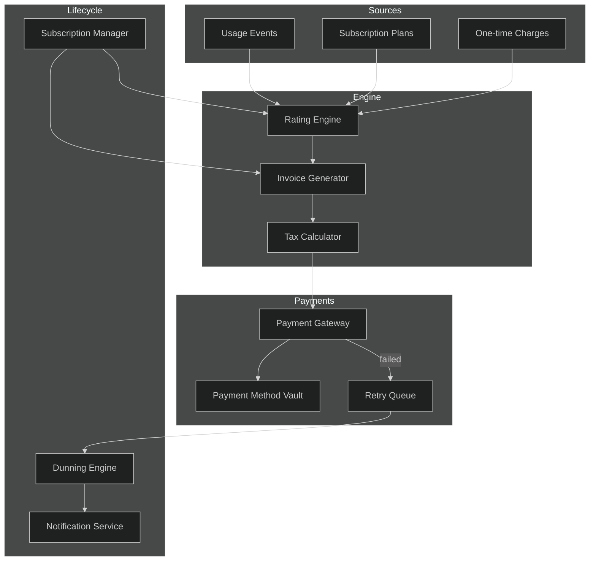
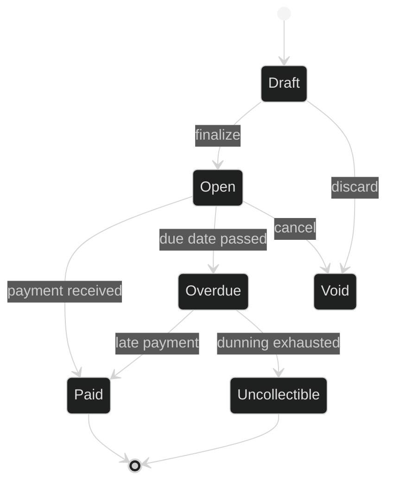
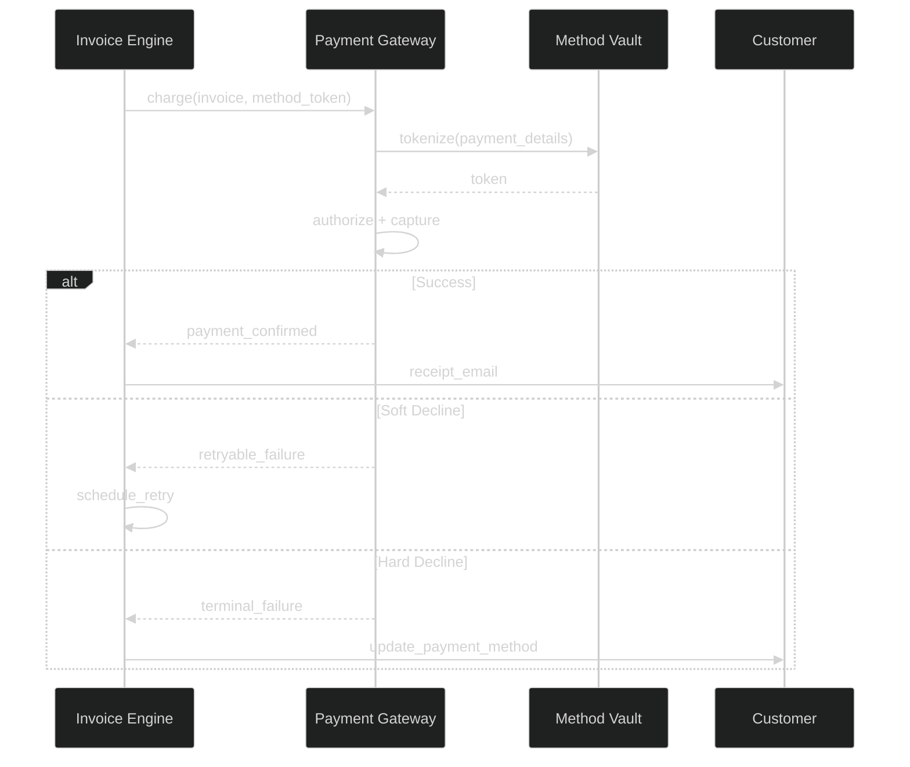
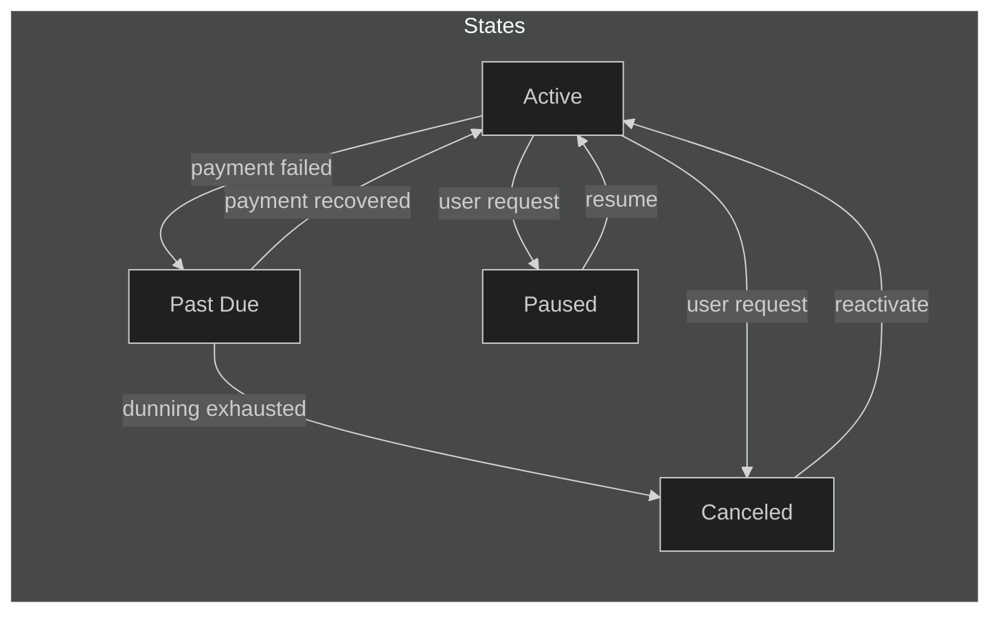
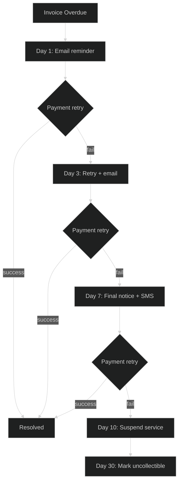

# APEX-OS Billing

## 1. Billing Architecture



### Core Entities

| Entity | Description |
|--------|-------------|
| `Customer` | Billing profile with tax region and currency |
| `Subscription` | Recurring plan with billing cycle and status |
| `Invoice` | Generated document with line items and totals |
| `Payment` | Transaction against an invoice |
| `DunningRule` | Retry schedule and escalation policy |

---

## 2. Invoice Management



### Invoice Lifecycle

- **Draft**: Line items being assembled; not yet visible to customer
- **Open**: Finalized and sent; awaiting payment
- **Paid**: Full payment received; PDF archived
- **Overdue**: Past due date; dunning sequence initiated
- **Uncollectible**: All retries failed; flagged for write-off

### Line Item Types

| Type | Example |
|------|---------|
| `recurring` | Monthly platform fee |
| `usage` | API calls, storage GB-hours |
| `one_time` | Setup fee, add-on purchase |
| `credit` | Proration, promotional credit |
| `tax` | VAT, sales tax |

---

## 3. Payment Processing



### Gateway Abstraction

All gateways implement a common interface:

```
authorize(amount, currency, method_token) -> AuthResult
capture(auth_id) -> CaptureResult
refund(payment_id, amount) -> RefundResult
void(auth_id) -> VoidResult
```

### Supported Gateways

| Gateway | Regions | Methods |
|---------|---------|---------|
| Stripe | Global | Cards, SEPA, ACH |
| Adyen | EU/APAC | Cards, iDEAL, Klarna |
| PayPal | Global | PayPal, Venmo |

---

## 4. Subscription Management



### Billing Cycles

- **Monthly**: Billed on the same day each month
- **Annual**: Billed upfront; prorated upgrades
- **Usage-based**: Metered billing with committed spend

### Proration

When a subscription changes mid-cycle:

1. Calculate unused time on old plan
2. Apply credit to new plan
3. Generate prorated invoice immediately
4. Reset billing anchor to change date

---

## 5. Dunning



### Dunning Rules

| Parameter | Default | Description |
|-----------|---------|-------------|
| `max_retries` | 4 | Total retry attempts |
| `retry_interval` | 3 days | Days between retries |
| `escalation_channels` | email → sms → call | Notification ladder |
| `suspension_threshold` | 10 days | Days before service pause |
| `writeoff_threshold` | 30 days | Days before bad debt |

### Dunning Configuration

```yaml
dunning_policies:
  standard:
    retries: 4
    interval_days: 3
    channels: [email, sms]
    suspend_after_days: 10
    writeoff_after_days: 30
  enterprise:
    retries: 6
    interval_days: 5
    channels: [email, sms, call]
    suspend_after_days: 21
    writeoff_after_days: 60
```

### Recovery Flow

1. Customer updates payment method
2. System retries outstanding invoices (oldest first)
3. On success: reactivate subscription, send confirmation
4. On failure: resume dunning from last step
