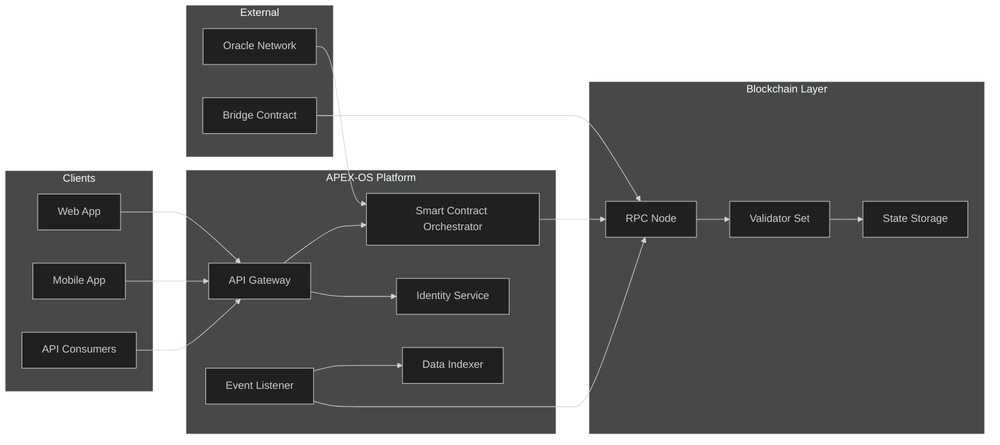
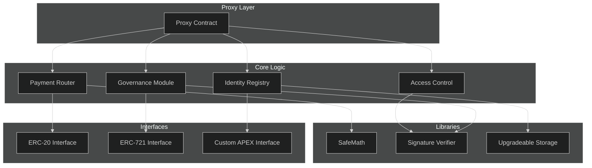
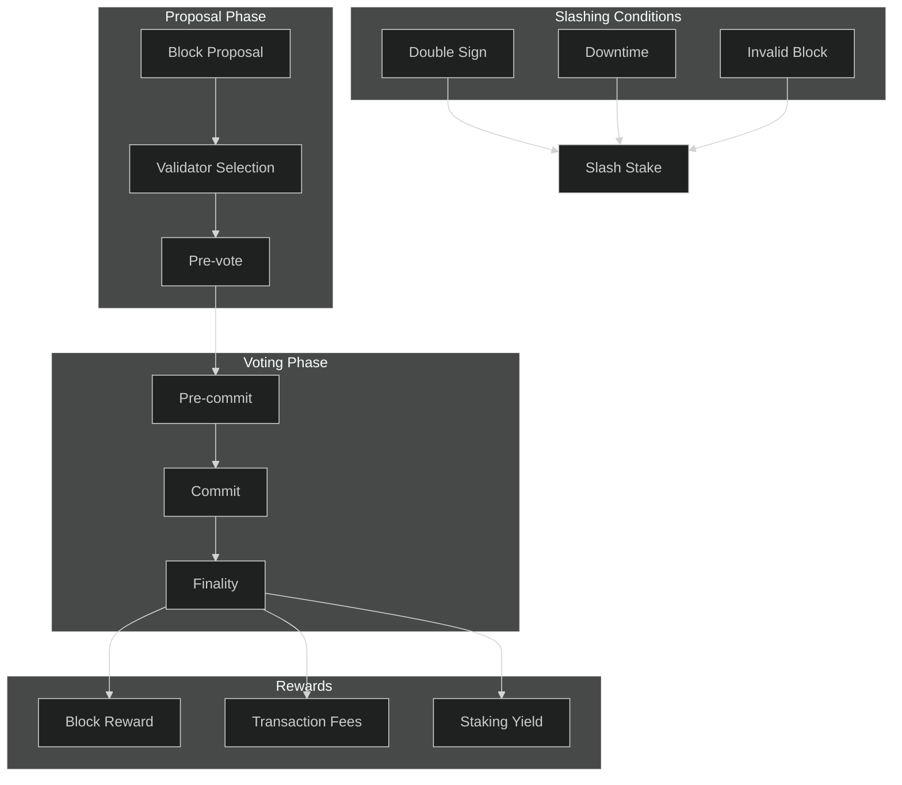
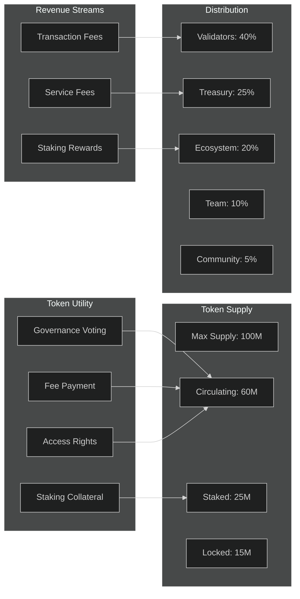

# APEX-OS Blockchain Architecture

## 1. Blockchain Integration

```mermaid
%%{init: {'theme': 'dark'}}%%
flowchart LR
    subgraph Clients
        A[Web App]
        B[Mobile App]
        C[API Consumers]
    end

    subgraph APEX-OS Platform
        D[API Gateway]
        E[Identity Service]
        F[Smart Contract Orchestrator]
        G[Event Listener]
        H[Data Indexer]
    end

    subgraph Blockchain Layer
        I[RPC Node]
        J[Validator Set]
        K[State Storage]
    end

    subgraph External
        L[Oracle Network]
        M[Bridge Contract]
    end

    A --> D
    B --> D
    C --> D
    D --> E
    D --> F
    F --> I
    G --> I
    I --> J
    J --> K
    G --> H
    L --> F
    M --> I
```

## 2. Smart Contract Architecture

```mermaid
%%{init: {'theme': 'dark'}}%%
flowchart TD
    subgraph Proxy Layer
        P[Proxy Contract]
    end

    subgraph Core Logic
        L1[Identity Registry]
        L2[Access Control]
        L3[Payment Router]
        L4[Governance Module]
    end

    subgraph Libraries
        Lib1[SafeMath]
        Lib2[Signature Verifier]
        Lib3[Upgradeable Storage]
    end

    subgraph Interfaces
        I1[ERC-20 Interface]
        I2[ERC-721 Interface]
        I3[Custom APEX Interface]
    end

    P --> L1
    P --> L2
    P --> L3
    P --> L4
    L1 --> Lib3
    L2 --> Lib2
    L3 --> Lib1
    L4 --> Lib2
    L1 --> I3
    L3 --> I1
    L4 --> I2
```

## 3. Consensus Mechanism

```mermaid
%%{init: {'theme': 'dark'}}%%
flowchart TD
    subgraph Proposal Phase
        A1[Block Proposal] --> A2[Validator Selection]
        A2 --> A3[Pre-vote]
    end

    subgraph Voting Phase
        B1[Pre-commit] --> B2[Commit]
        B2 --> B3[Finality]
    end

    subgraph Slashing Conditions
        C1[Double Sign]
        C2[Downtime]
        C3[Invalid Block]
    end

    subgraph Rewards
        R1[Block Reward]
        R2[Transaction Fees]
        R3[Staking Yield]
    end

    A3 --> B1
    B3 --> R1
    B3 --> R2
    B3 --> R3
    C1 --> S[Slash Stake]
    C2 --> S
    C3 --> S
```

## 4. Token Economics

```mermaid
%%{init: {'theme': 'dark'}}%%
flowchart LR
    subgraph Token Supply
        T1[Max Supply: 100M]
        T2[Circulating: 60M]
        T3[Staked: 25M]
        T4[Locked: 15M]
    end

    subgraph Revenue Streams
        R1[Transaction Fees]
        R2[Service Fees]
        R3[Staking Rewards]
    end

    subgraph Distribution
        D1[Validators: 40%]
        D2[Treasury: 25%]
        D3[Ecosystem: 20%]
        D4[Team: 10%]
        D5[Community: 5%]
    end

    subgraph Token Utility
        U1[Governance Voting]
        U2[Fee Payment]
        U3[Staking Collateral]
        U4[Access Rights]
    end

    R1 --> D1
    R2 --> D2
    R3 --> D3
    U1 --> T2
    U2 --> T2
    U3 --> T3
    U4 --> T2
```

## 5. Security Considerations

```mermaid
%%{init: {'theme': 'dark'}}%%
flowchart TD
    subgraph Smart Contract Security
        S1[Reentrancy Guards]
        S2[Integer Overflow Checks]
        S3[Access Control]
        S4[Input Validation]
    end

    subgraph Network Security
        N1[DDoS Protection]
        N2[Node Authentication]
        N3[Encrypted P2P]
        N4[Rate Limiting]
    end

    subgraph Operational Security
        O1[Key Management]
        O2[Multi-sig Wallets]
        O3[Audit Logging]
        O4[Incident Response]
    end

    subgraph Governance Security
        G1[Timelock Contracts]
        G2[Emergency Pause]
        G3[Upgrade Mechanisms]
        G4[Proposal Thresholds]
    end

    S1 --> V[Security Audit]
    S2 --> V
    S3 --> V
    S4 --> V
    N1 --> V
    N2 --> V
    N3 --> V
    N4 --> V
    O1 --> V
    O2 --> V
    O3 --> V
    O4 --> V
    G1 --> V
    G2 --> V
    G3 --> V
    G4 --> V
```
