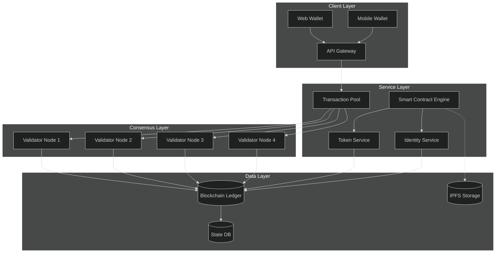
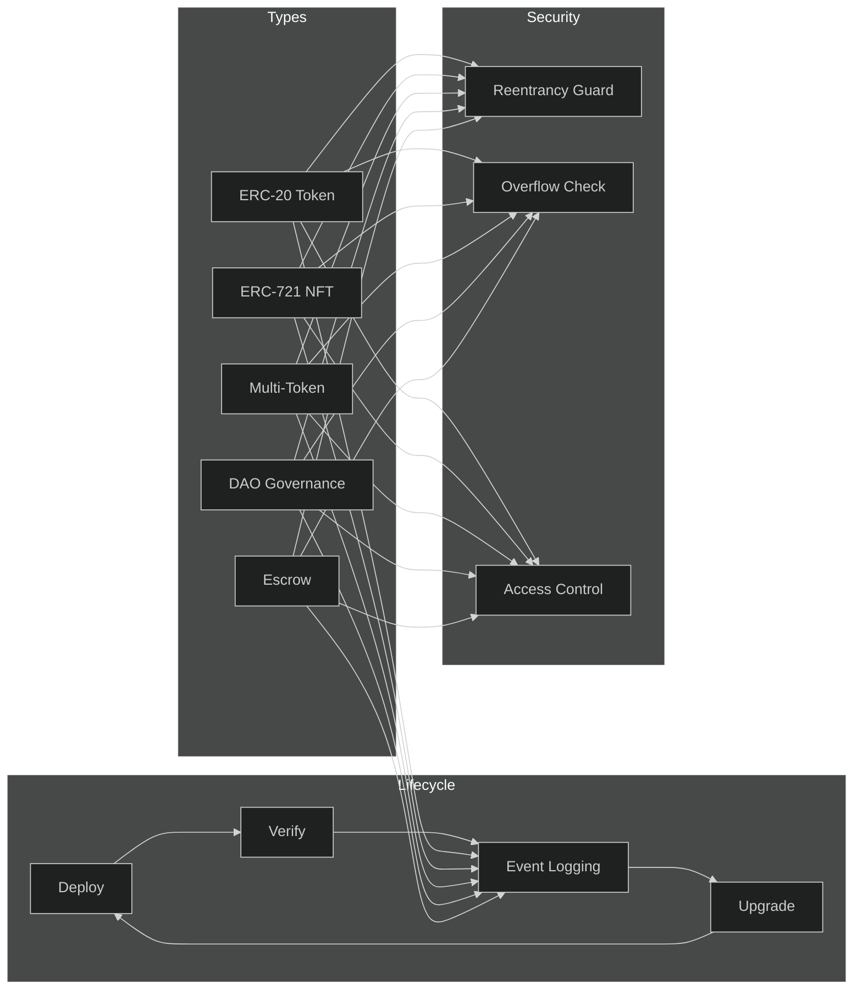
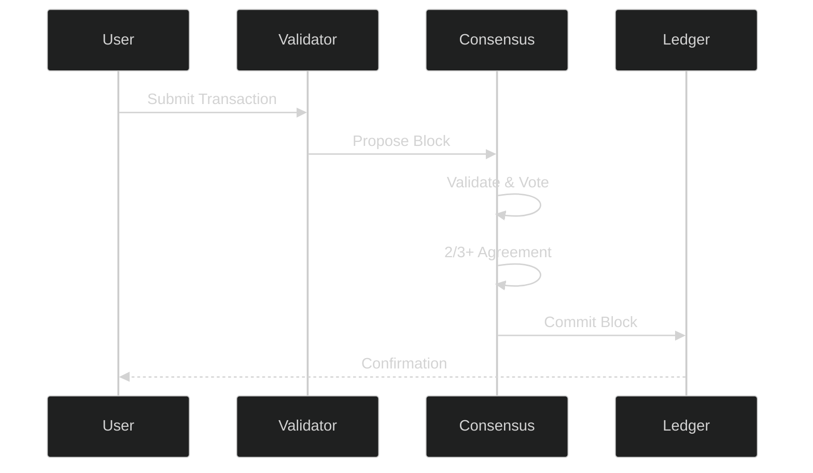
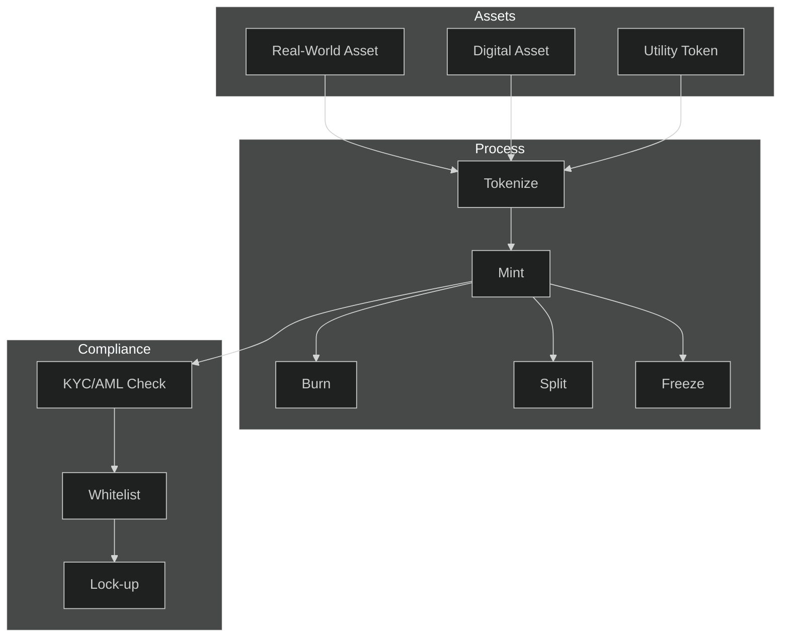
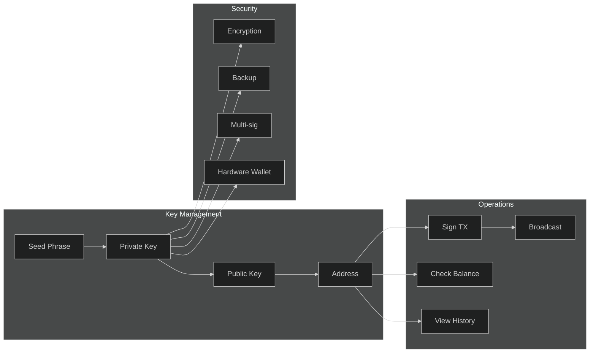

# APEX-OS Blockchain Layer

## 1. Architecture

## 2. Smart Contracts

## 3. Consensus

**Mechanism:** Tendermint BFT — instant finality, 1-3s block time, ≤1/3 Byzantine tolerance.

## 4. Tokenization

## 5. Wallet

---

**Stack:** Cosmos SDK · Tendermint · CosmWasm · IBC Protocol
