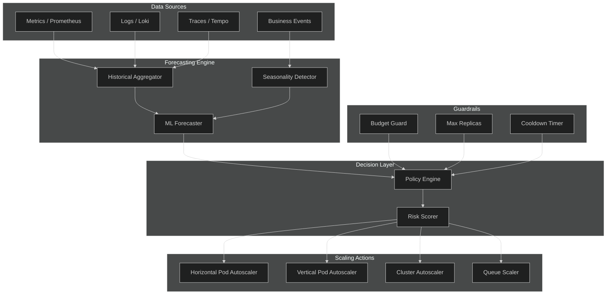
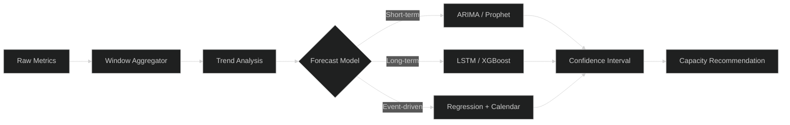
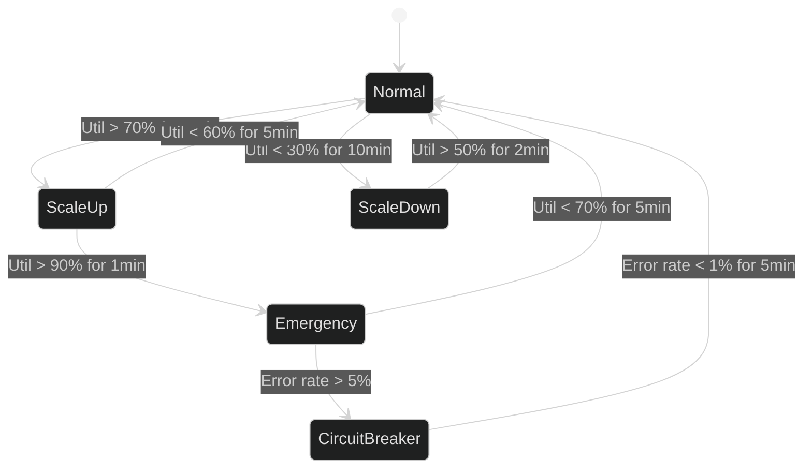
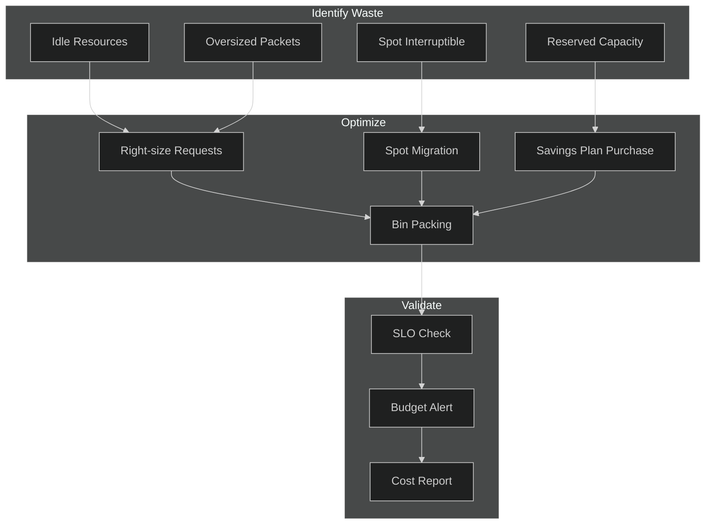
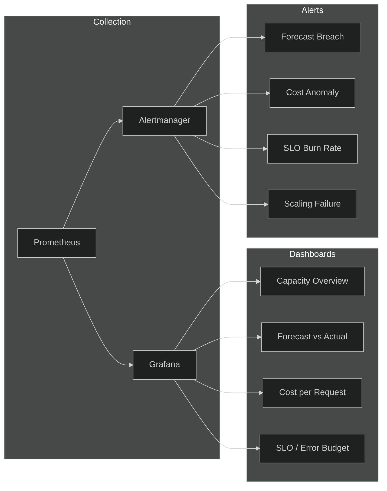

# Capacity Planning

## 1. Architecture

## 2. Resource Forecasting

**Forecasting inputs:**
- Historical utilization (CPU, memory, I/O, network)
- Business seasonality (hourly, daily, weekly, monthly)
- Growth trends (linear, exponential, step)
- Planned events (launches, campaigns, holidays)

**Output:** Projected resource demand with 80%/95%/99% confidence bands.

## 3. Scaling Strategy

**Scaling tiers:**

| Tier | Trigger | Action | Cooldown |
|------|---------|--------|----------|
| Reactive | CPU/Mem threshold | HPA ±1 replica | 60s |
| Predictive | Forecast > 80% | Pre-scale +2 replicas | 300s |
| Scheduled | Known event | Pre-scale to target | Event-based |
| Emergency | Saturation | Max replicas + alert | 30s |

## 4. Cost Optimization

**Levers:**
- Right-size resource requests vs. actual usage
- Bin-packing to maximize node utilization
- Spot/preemptible instances for stateless workloads
- Reserved instances for predictable baseline
- Auto-shutdown of non-production environments

## 5. Monitoring

**Key metrics:**
- `capacity_forecast_utilization_ratio` — predicted vs. actual
- `cost_per_1k_requests` — unit economics
- `scaling_latency_seconds` — time to scale
- `resource_headroom_percent` — available capacity
- `slo_burn_rate` — error budget consumption

**Alert routing:** PagerDuty for SLO burn, Slack for forecast/cost warnings.
