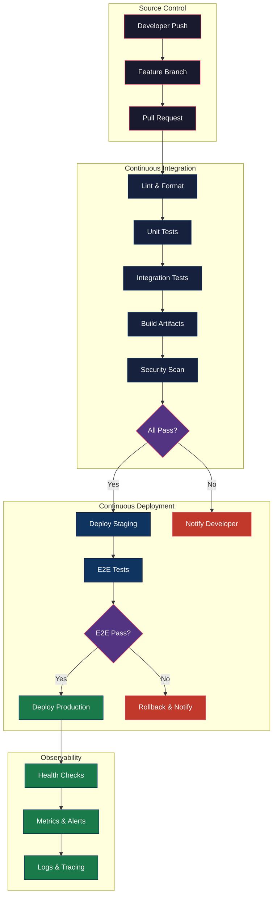
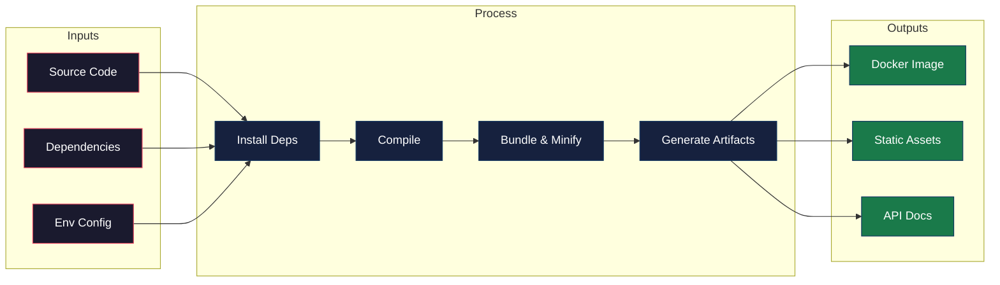
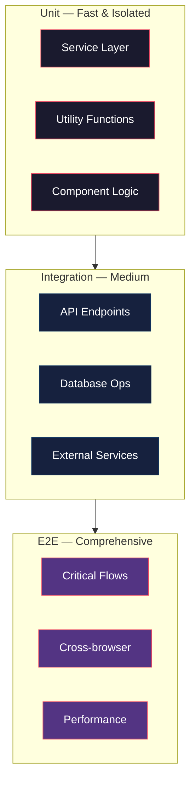
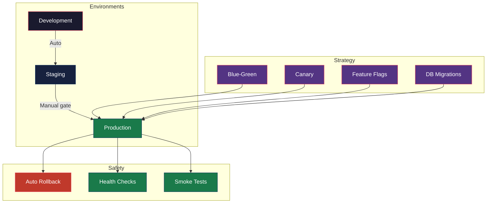
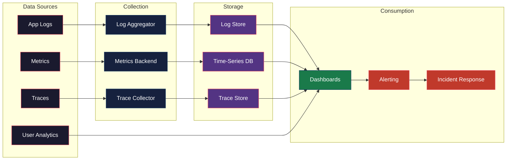

# CI/CD Pipeline

## Overview

CI/CD strategy for APEX-OS Business Platform covering build, test, deployment, and monitoring.
---

## 1. CI/CD Pipeline

### Pipeline Stages

| Stage | Trigger | Duration Target | Failure Action |
|-------|---------|-----------------|----------------|
| Lint & Format | Every push | < 2 min | Block PR |
| Unit Tests | Every push | < 5 min | Block PR |
| Integration Tests | Every PR | < 10 min | Block PR |
| Build | Every PR | < 5 min | Block PR |
| Security Scan | Every PR | < 3 min | Block + Alert |
| Staging Deploy | Merge to main | < 5 min | Auto-rollback |
| E2E Tests | Post staging | < 15 min | Block production |
| Production Deploy | Manual approval | < 10 min | Auto-rollback |

---

## 2. Build Strategy

### Build Principles

- **Reproducible**: Lock all dependency versions; use lockfiles
- **Multi-stage Docker**: Separate build and runtime layers
- **Layer caching**: Leverage Docker layer caching for speed
- **Immutable artifacts**: Each build produces a uniquely tagged artifact
- **Parallel execution**: Run independent steps concurrently

### Build Artifacts

| Artifact | Registry | Retention |
|----------|----------|-----------|
| Docker Images | Container Registry | 30 days |
| NPM Packages | Private Registry | Indefinite |
| Static Assets | CDN | Versioned |
| API Docs | Internal Wiki | Per release |

---

## 3. Test Strategy

### Coverage Targets

| Layer | Target | Scope |
|-------|--------|-------|
| Unit | 80%+ | Business logic, utilities |
| Integration | 70%+ | API contracts, data layer |
| E2E | Critical paths | Auth, checkout, core flows |

### Test Execution Policy

- **Pre-commit**: Lint + type check (local)
- **PR**: Unit + integration tests
- **Merge to main**: Full suite + security scan
- **Staging**: E2E + smoke tests
- **Production**: Synthetic monitoring (continuous)

---

## 4. Deployment Strategy

### Deployment Practices

- **Blue-Green**: Two identical environments; atomic traffic switch
- **Canary**: 5% → 25% → 50% → 100% with automated analysis
- **Feature flags**: Decouple deployment from release
- **Migrations**: Backward-compatible migrations before app deploy
- **Rollback**: Automated on health check failure or error spike

### Environment Config

| Setting | Dev | Staging | Prod |
|---------|-----|---------|------|
| Replicas | 1 | 2 | 3+ |
| Auto-scaling | No | No | Yes |
| Debug logging | Yes | Limited | No |
| Feature flags | All on | Staging set | Prod set |

---

## 5. Monitoring

### Key Metrics

| Category | Metrics | Alert Threshold |
|----------|---------|-----------------|
| Availability | Uptime, error rate | < 99.9% uptime |
| Performance | P50/P95/P99 latency | P99 > 500ms |
| Saturation | CPU, memory, disk | > 80% sustained |
| Business | Active users, transactions | Anomaly detection |

### Alert Severity

| Level | Response | Escalation |
|-------|----------|------------|
| P1 Critical | 5 min | Page on-call immediately |
| P2 High | 15 min | Page if unresolved |
| P3 Medium | 1 hour | Slack notification |
| P4 Low | Next day | Ticket creation |

### Dashboards

- **Executive**: Uptime, revenue impact, active users
- **Operational**: Error rates, latency, resource utilization
- **Development**: Build status, deployment frequency, lead time
- **SLO Tracking**: Error budget burn rate, SLI compliance
