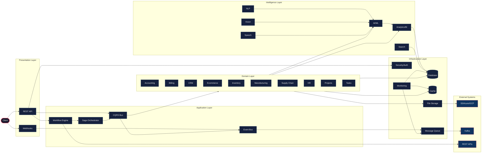

# APEX-OS Business Platform — Code Wiki

Auto-generated reference documentation for the APEX-OS Business Platform codebase.

## 1. Module Index

**62 top-level packages, 414 total modules**

- **ab_testing** — Ab Testing (6 submodules: auto_optimization, experiment, models, reporting, statistics, traffic_splitter)
- **accounting** — Accounting (8 submodules: currency, engine, ledger, models, reconciliation, recurring, reporting, tax)
- **ai** — Ai (5 submodules: memory, orchestrator, planner, reflection, tools)
- **alerting** — Alerting (6 submodules: escalation, history, models, routing, rules, suppression)
- **analytics** — Analytics (6 submodules: anomaly, cohort, engine, forecasting, funnel, report_builder)
- **api** — Api (12 submodules: app, middleware, middleware.auth, middleware.rate_limit, models, routes, routes.accounting, routes.analytics...)
- **assets** — Assets (6 submodules: depreciation, disposal, maintenance, models, tracker, valuation)
- **audit** — Audit (7 submodules: compliance, logger, models, retention, search, store, trail)
- **backup** — Backup (7 submodules: differential_backup, full_backup, incremental_backup, manager, restoration, types, verification)
- **bi** — Bi (5 submodules: benchmarking, executive, kpi, predictive, visualization)
- **billing** — Billing (6 submodules: dunning, invoice, models, payment, subscription, usage)
- **blockchain** — Blockchain (5 submodules: consensus, contracts, tokens, transactions, wallet)
- **cache** — Cache (5 submodules: invalidation, memory_cache, redis_cache, statistics, warming)
- **capacity_planning** — Capacity Planning (5 submodules: alerts, cost_optimization, forecasting, modeling, scaling)
- **compliance** — Compliance (6 submodules: audit, models, policies, reporting, risk, tracking)
- **contracts** — Contracts (6 submodules: approval, compliance, creation, models, renewal, templates)
- **core** — Core (2 submodules: config, event_bus)
- **cost_management** — Cost Management (6 submodules: allocation, budget, forecasting, models, optimization, tracking)
- **cqrs** — Cqrs (13 submodules: base, bus, command_handlers, commands, event_handlers, event_store, events, exceptions...)
- **crm** — Crm (7 submodules: deduplication, email_campaigns, engine, forecasting, lead_scoring, models, segmentation)
- **data_exchange** — Data Exchange (5 submodules: csv_handler, excel_handler, exceptions, json_handler, models)
- **data_warehouse** — Data Warehouse (5 submodules: catalog, etl, governance, modeling, quality)
- **database** — Database (7 submodules: migrations, migrations.env, migrations.versions.0001_initial_schema, models, pool, query_builder, transactions)
- **disaster_recovery** — Disaster Recovery (5 submodules: dr_planning, failover, monitoring, replication, testing)
- **distributed_lock** — Distributed Lock (6 submodules: base, database_lock, deadlock_detector, lock_renewal, monitoring, redis_lock)
- **documents** — Documents (6 submodules: models, search, sharing, storage, upload, versioning)
- **ecommerce** — Ecommerce (6 submodules: cart, catalog, checkout, models, orders, payment)
- **event_sourcing** — Event Sourcing (5 submodules: event_replay, event_store, projection, snapshot, versioning)
- **feature_flags** — Feature Flags (6 submodules: analytics, dependencies, manager, models, rollout, targeting)
- **file_storage** — File Storage (7 submodules: azure, base, gcp, local, manager, s3, versioning)
- **gamification** — Gamification (5 submodules: badges, challenges, leaderboards, points, rewards)
- **hr** — Hr (5 submodules: employees, leave, payroll, performance, recruitment)
- **integration** — Integration (7 submodules: data_transformer, gateway, kafka_connector, redis_rate_limiter, rest_client, webhook_receiver, workflow)
- **integration_hub** — Integration Hub (5 submodules: api_orchestration, data_mapping, error_handling, event_routing, monitoring)
- **inventory** — Inventory (7 submodules: catalog, engine, models, purchase, sales, stock, valuation)
- **iot** — Iot (5 submodules: alert_manager, analytics, data_ingestion, device_control, device_manager)
- **knowledge** — Knowledge (6 submodules: document_search, expert_finder, knowledge_base, knowledge_graph, models, recommendations)
- **logging** — Logging (5 submodules: aggregation, analytics, retention, search, structured)
- **main** — Main module
- **manufacturing** — Manufacturing (5 submodules: bom, maintenance, production_planning, quality_control, shop_floor)
- **marketing** — Marketing (6 submodules: ab_testing, analytics, email_campaigns, lead_nurturing, models, roi)
- **message_queue** — Message Queue (7 submodules: batching, dead_letter, delayed_queue, manager, models, monitoring, priority_queue)
- **metrics** — Metrics (5 submodules: aggregation, counter, gauge, histogram, timer)
- **ml** — Ml (5 submodules: ab_testing, feature_store, monitoring, serving, training)
- **monitoring** — Monitoring (5 submodules: alerting, dashboards, logging_agg, metrics, tracing)
- **multitenancy** — Multitenancy (7 submodules: audit, billing, isolation, models, monitoring, provisioning, security)
- **nlp** — Nlp (5 submodules: entities, generation, sentiment, text_analysis, translation)
- **notifications** — Notifications (4 submodules: channels, manager, models, templates)
- **personalization** — Personalization (5 submodules: ab_testing, analytics, behavior, profiles, rules)
- **projects** — Projects (2 submodules: engine, models)
- **recommendations** — Recommendations (6 submodules: ab_testing, collaborative_filtering, content_based, engine, hybrid, real_time)
- **reporting** — Reporting (5 submodules: builder, distributor, exporter, scheduler, templates)
- **saga** — Saga (5 submodules: compensation, orchestrator, retry, state_machine, timeout)
- **search** — Search (7 submodules: analytics, autocomplete, faceted, full_text, index, models, suggestions)
- **security** — Security (7 submodules: audit, auth, encryption, jwt_manager, rate_limiter, rbac, vault)
- **speech** — Speech (6 submodules: base, emotion, speaker, stt, tts, voice_cloning)
- **supplychain** — Supplychain (5 submodules: demand_forecasting, logistics, purchase_orders, suppliers, warehouse)
- **support** — Support (5 submodules: knowledge_base, live_chat, satisfaction, sla, tickets)
- **tasks** — Tasks (7 submodules: assignment, creation, manager, models, notifications, scheduling, tracking)
- **tracing** — Tracing (5 submodules: analytics, distributed_tracing, sampling, span, visualization)
- **vision** — Vision (5 submodules: face_recognition, image_generation, image_recognition, object_detection, ocr)
- **workflow** — Workflow (1 submodules: engine)

## 2. Class Index

**1153 total classes** — showing top 10 by method count

| Class | Methods | Module |
|-------|---------|--------|
| `ProjectEngine` | 45 | `projects.engine` |
| `IntegrationMonitor` | 32 | `integration_hub.monitoring` |
| `BudgetManager` | 30 | `cost_management.budget` |
| `Span` | 28 | `tracing.span` |
| `CostTracker` | 27 | `cost_management.tracking` |
| `QueryBuilder` | 25 | `database.query_builder` |
| `StorageManager` | 25 | `file_storage.manager` |
| `WarehouseManager` | 25 | `supplychain.warehouse` |
| `DataCatalog` | 21 | `data_warehouse.catalog` |
| `ChallengeManager` | 21 | `gamification.challenges` |

## 3. Function Index

**138 public functions** — showing top 30 by module

| Function | Signature | Module |
|----------|-----------|--------|
| `_precision_for` | `_precision_for(currency)` | `accounting.currency` |
| `_quantize` | `_quantize(amount, currency)` | `accounting.currency` |
| `_add_months` | `_add_months(d, months)` | `accounting.recurring` |
| `_mad` | `_mad(values, median)` | `analytics.anomaly` |
| `_mean_std` | `_mean_std(values)` | `analytics.anomaly` |
| `_median` | `_median(values)` | `analytics.anomaly` |
| `_quantile` | `_quantile(sorted_values, q)` | `analytics.anomaly` |
| `_validate_series` | `_validate_series(series)` | `analytics.anomaly` |
| `detect_iqr` | `detect_iqr(series, factor)` | `analytics.anomaly` |
| `detect_modified_zscore` | `detect_modified_zscore(series, threshold)` | `analytics.anomaly` |
| `detect_rolling_zscore` | `detect_rolling_zscore(series, window, threshold, min_periods)` | `analytics.anomaly` |
| `detect_zscore` | `detect_zscore(series, threshold)` | `analytics.anomaly` |
| `_period_index` | `_period_index(key, granularity)` | `analytics.cohort` |
| `_period_key` | `_period_key(dt, granularity)` | `analytics.cohort` |
| `_shift_period` | `_shift_period(key, granularity, delta)` | `analytics.cohort` |
| `_ema_forecast` | `_ema_forecast(values, steps, alpha, z)` | `analytics.forecasting` |
| `_linear_forecast` | `_linear_forecast(values, steps, z)` | `analytics.forecasting` |
| `_naive_forecast` | `_naive_forecast(values, steps, z)` | `analytics.forecasting` |
| `_residual_std` | `_residual_std(history, fitted)` | `analytics.forecasting` |
| `_sma_forecast` | `_sma_forecast(values, steps, window, z)` | `analytics.forecasting` |
| `_validate_series` | `_validate_series(series)` | `analytics.forecasting` |
| `exponential_smoothing` | `exponential_smoothing(series, alpha)` | `analytics.forecasting` |
| `forecast` | `forecast(series, steps, method, alpha, window, confidence)` | `analytics.forecasting` |
| `forecast_from_metrics` | `forecast_from_metrics(metrics, steps)` | `analytics.forecasting` |
| `linear_trend` | `linear_trend(series)` | `analytics.forecasting` |
| `moving_average` | `moving_average(series, window)` | `analytics.forecasting` |
| `funnel_from_events` | `funnel_from_events(name, steps, events)` | `analytics.funnel` |
| `aggregate` | `aggregate(series, func)` | `analytics.report_builder` |
| `create_api_app` | `create_api_app(config)` | `api.app` |
| `_account_to_response` | `_account_to_response(account)` | `api.routes.accounting` |

## 4. Dependency Graph

```mermaid
flowchart TD
    classDef core fill:#1a1a2e,stroke:#e94560,stroke-width:2px,color:#eee
    classDef infra fill:#16213e,stroke:#0f3460,stroke-width:1px,color:#eee
    classDef domain fill:#1a1a2e,stroke:#533483,stroke-width:1px,color:#eee
    classDef external fill:#0f3460,stroke:#e94560,stroke-width:1px,color:#eee

    subgraph Core["Core Infrastructure"]
        direction TB
        Config["core.config"]:::core
        EventBus["core.event_bus"]:::core
        Database["database"]:::infra
        Cache["cache"]:::infra
        Security["security"]:::infra
        API["api"]:::infra
    end

    subgraph CrossCutting["Cross-Cutting Concerns"]
        direction TB
        Logging["logging"]:::infra
        Monitoring["monitoring"]:::infra
        Tracing["tracing"]:::infra
        Metrics["metrics"]:::infra
        Multitenancy["multitenancy"]:::infra
    end

    subgraph DataLayer["Data Layer"]
        direction TB
        CQRS["cqrs"]:::infra
        EventSourcing["event_sourcing"]:::infra
        DataWarehouse["data_warehouse"]:::domain
        DataExchange["data_exchange"]:::domain
        FileStorage["file_storage"]:::infra
    end

    subgraph Integration["Integration Layer"]
        direction TB
        MsgQueue["message_queue"]:::infra
        IntegrationHub["integration_hub"]:::infra
        Integration["integration"]:::infra
        Saga["saga"]:::infra
        Workflow["workflow"]:::domain
    end

    subgraph Business["Business Domains"]
        direction TB
        Accounting["accounting"]:::domain
        Billing["billing"]:::domain
        CRM["crm"]:::domain
        Ecommerce["ecommerce"]:::domain
        Inventory["inventory"]:::domain
        Manufacturing["manufacturing"]:::domain
        SupplyChain["supplychain"]:::domain
        HR["hr"]:::domain
        Projects["projects"]:::domain
        Tasks["tasks"]:::domain
    end

    subgraph Intelligence["Intelligence Layer"]
        direction TB
        AI["ai"]:::domain
        ML["ml"]:::domain
        Analytics["analytics"]:::domain
        BI["bi"]:::domain
        NLP["nlp"]:::domain
        Vision["vision"]:::domain
        Speech["speech"]:::domain
        Search["search"]:::domain
        Recommendations["recommendations"]:::domain
        Personalization["personalization"]:::domain
    end

    subgraph Support["Support & Ops"]
        direction TB
        Auth["security.auth"]:::infra
        RBAC["security.rbac"]:::infra
        Audit["audit"]:::infra
        Compliance["compliance"]:::domain
        Alerting["alerting"]:::infra
        Notifications["notifications"]:::infra
        Backup["backup"]:::infra
        DR["disaster_recovery"]:::infra
        DistributedLock["distributed_lock"]:::infra
    end

    API --> Config
    API --> EventBus
    API --> Security
    API --> RBAC
    API --> Auth
    EventBus --> CQRS
    EventBus --> EventSourcing
    EventBus --> MsgQueue
    CQRS --> Database
    CQRS --> Cache
    EventSourcing --> Database
    Saga --> EventBus
    Saga --> MsgQueue
    Workflow --> EventBus
    IntegrationHub --> MsgQueue
    IntegrationHub --> Integration
    Integration --> REST["REST Client"]:::external
    Integration --> Kafka["Kafka"]:::external
    Accounting --> Database
    Billing --> Database
    CRM --> Database
    Ecommerce --> Database
    Inventory --> Database
    Manufacturing --> Database
    SupplyChain --> Database
    HR --> Database
    Projects --> Database
    Tasks --> Database
    AI --> ML
    AI --> Analytics
    ML --> FeatureStore["Feature Store"]:::domain
    Analytics --> DataWarehouse
    BI --> DataWarehouse
    Search --> Index["Search Index"]:::external
    Recommendations --> ML
    Personalization --> ML
    Personalization --> Analytics
    Multitenancy --> Database
    Multitenancy --> Security
    Audit --> Database
    Compliance --> Audit
    Alerting --> Notifications
    Monitoring --> Metrics
    Monitoring --> Tracing
    Logging --> Monitoring
    Backup --> Database
    DR --> Database
    DR --> Backup
    DistributedLock --> Cache
    DistributedLock --> Database
    FileStorage --> S3["S3/Azure/GCP"]:::external
    DataExchange --> FileStorage
    DataWarehouse --> Database
    ABTesting["ab_testing"]:::domain
    ABTesting --> Analytics
    FeatureFlags["feature_flags"]:::domain
    FeatureFlags --> ABTesting
    Gamification["gamification"]:::domain
    Documents["documents"]:::domain
    Documents --> FileStorage
    Knowledge["knowledge"]:::domain
    Knowledge --> Search
    Support["support"]:::domain
    Support --> Knowledge
    Support --> Notifications
    Contracts["contracts"]:::domain
    Assets["assets"]:::domain
    CostMgmt["cost_management"]:::domain
    CostMgmt --> Analytics
    Capacity["capacity_planning"]:::domain
    Capacity --> Analytics
    IoT["iot"]:::domain
    IoT --> MsgQueue
    IoT --> Analytics
    Blockchain["blockchain"]:::domain
    Reporting["reporting"]:::domain
    Reporting --> Analytics
    Marketing["marketing"]:::domain
    Marketing --> CRM
    Marketing --> ABTesting
    Main["main"]:::core
    Main --> API
    Main --> Config
    Main --> Database
```

## 5. Architecture Overview


