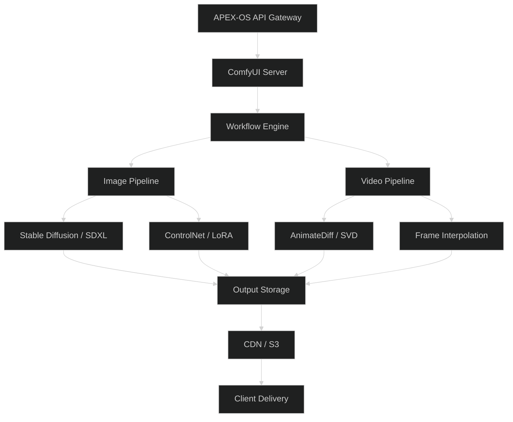
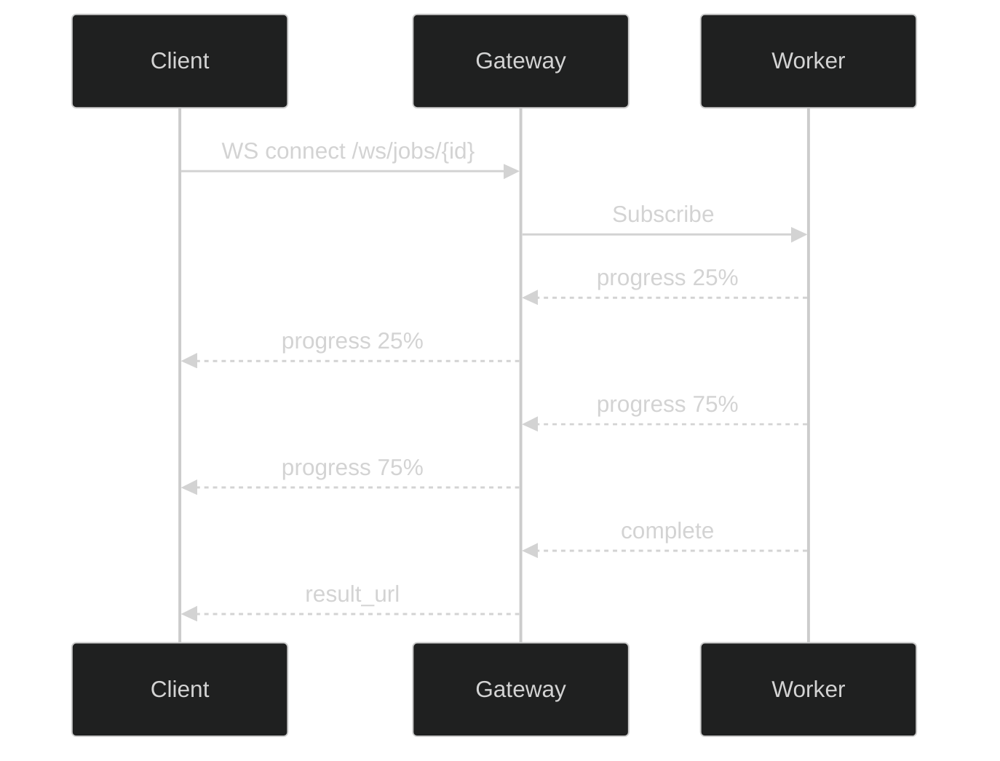

# ComfyUI Integration

## 1. Architecture



## 2. Workflow Templates

| Template | Use Case | Nodes |
|----------|----------|-------|
| `img_base` | Standard image gen | LoadCheckpoint → CLIPTextEncode → KSampler → VAEDecode → SaveImage |
| `img_upscale` | 4x upscaling | LoadImage → UpscaleModel → SaveImage |
| `img_inpaint` | Masked editing | LoadImage → VAEEncodeInpaint → KSampler → VAEDecode |
| `img2img` | Style transfer | LoadImage → VAEEncode → KSampler → VAEDecode |
| `vid_text2vid` | Text-to-video | LoadCheckpoint → CLIPTextEncode → KSampler → VAEDecode → SaveAnimation |
| `vid_img2vid` | Image-to-video | LoadImage → VAEEncode → AnimateDiff → KSampler → SaveAnimation |

## 3. Image Generation Pipeline


**Key parameters:**
- `steps`: 20–50 (default 30)
- `cfg`: 5–9 (default 7)
- `sampler`: `dpmpp_2m`, `euler_a`, `ddim`
- `scheduler`: `karras`, `normal`, `exponential`
- `seed`: integer or `-1` for random

## 4. Video Generation Pipeline


**Key parameters:**
- `frame_count`: 16–48 (default 24)
- `fps`: 8–24 (default 12)
- `motion_scale`: 0.5–2.0 (default 1.0)
- `interpolation`: `rife`, `film`, `none`

## 5. API Integration

### Endpoints

| Method | Path | Description |
|--------|------|-------------|
| `POST` | `/api/v1/img/generate` | Submit image job |
| `POST` | `/api/v1/img/upscale` | Submit upscale job |
| `POST` | `/api/v1/vid/generate` | Submit video job |
| `GET` | `/api/v1/job/{id}` | Poll job status |
| `GET` | `/api/v1/job/{id}/result` | Fetch result URL |
| `DELETE` | `/api/v1/job/{id}` | Cancel job |

### Request Example

```json
{
  "template": "img_base",
  "prompt": "a futuristic city at sunset, cyberpunk",
  "negative_prompt": "blurry, low quality",
  "width": 1024,
  "height": 1024,
  "steps": 30,
  "cfg": 7.0,
  "sampler": "dpmpp_2m",
  "seed": -1,
  "callback_url": "https://client.example.com/webhook"
}
```

### Response Example

```json
{
  "job_id": "job_abc123",
  "status": "queued",
  "estimated_time": 12,
  "result_url": null
}
```

### WebSocket Events



### Error Handling

| Code | Meaning | Action |
|------|---------|--------|
| `400` | Invalid params | Fix request |
| `429` | Rate limited | Backoff + retry |
| `503` | GPU unavailable | Queue or retry |
| `500` | Internal error | Alert + retry |

### Authentication

All requests require `Authorization: Bearer <token>` header. Tokens are issued by the APEX-OS auth service and scoped to `comfyui:generate`, `comfyui:read`, or `comfyui:admin`.
