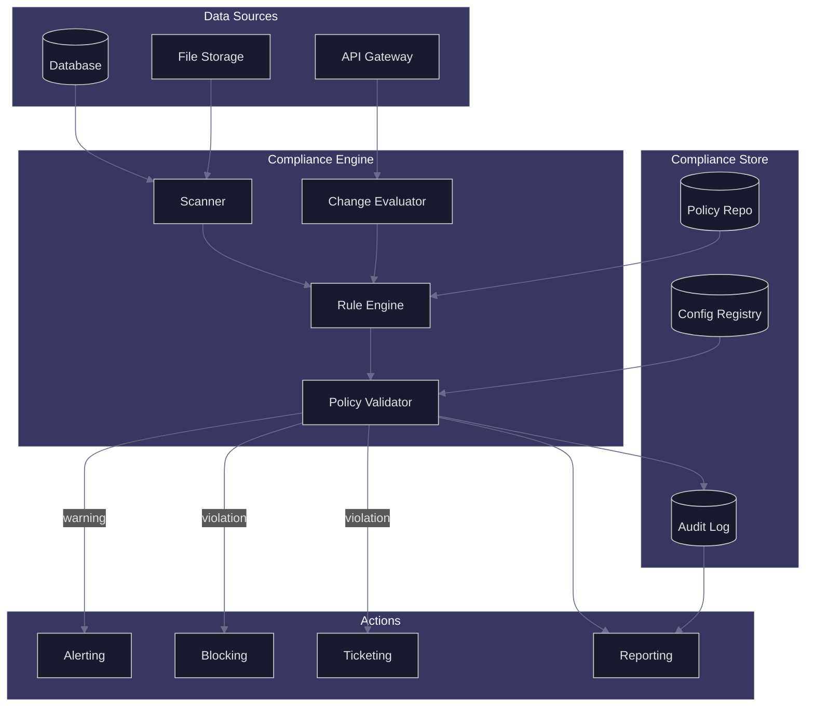

# APEX-OS Compliance

## 1. Compliance Architecture



## 2. Compliance Framework

| Layer | Scope | Standard |
|-------|-------|----------|
| Data | PII, encryption, retention | GDPR, CCPA |
| Access | RBAC, MFA, least privilege | SOC 2, ISO 27001 |
| Code | SAST, dependency scan, secrets | OWASP, CIS |
| Infra | Network, hardening, logging | CIS Benchmarks |
| Ops | Change mgmt, incident response | ITIL, NIST |

**Policy-as-Code**: All compliance rules are versioned in the policy repository and evaluated against every deployment, commit, and configuration change.

## 3. Automated Checks

| Check | Trigger | Tool | Severity |
|-------|---------|------|----------|
| Secret scanning | Pre-commit | Gitleaks | Critical |
| SAST | CI pipeline | Semgrep | High |
| Dependency CVE | Daily | Trivy | High |
| IaC misconfig | PR merge | Checkov | Medium |
| Drift detection | Hourly | Terraform plan | Medium |
| Access review | Quarterly | Custom | High |
| Encryption audit | Weekly | Custom | Critical |
| Log integrity | Continuous | Custom | High |

**Enforcement Modes**:
- `audit` — log only, no blocking
- `warn` — alert on violation
- `enforce` — block merge/deploy

## 4. Audit Trail

Every compliance-relevant event is appended to an immutable audit log:

```
[timestamp] [actor] [action] [resource] [result] [policy_id] [hash]
```

- **Storage**: Append-only, cryptographically chained (SHA-256)
- **Retention**: 7 years (configurable per regulation)
- **Access**: Read-only for auditors, no delete permission
- **Integrity**: Daily hash verification, quarterly external attestation

## 5. Reporting

| Report | Frequency | Audience | Content |
|--------|-----------|----------|---------|
| Compliance posture | Real-time | Engineering | Pass/fail per policy, trend |
| Violation digest | Daily | Team leads | New violations, SLA status |
| Audit summary | Monthly | Management | Risk score, remediation rate |
| Regulatory evidence | Quarterly | Auditors | Full trail, attestations |
| Annual review | Yearly | Executives | Maturity score, gaps |

**Dashboards**: Grafana panels for real-time posture; scheduled PDF exports for auditors.

**Escalation**: Critical violations page on-call; unresolved > 24h escalates to security team; > 72h escalates to CISO.
