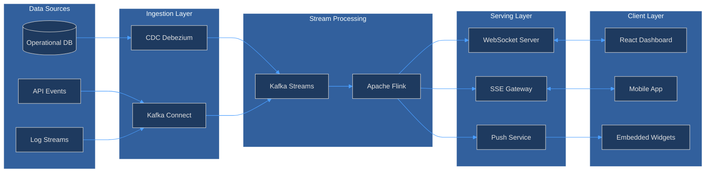
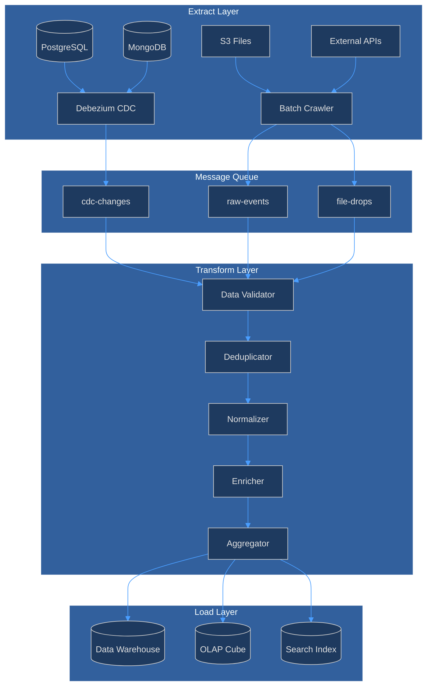
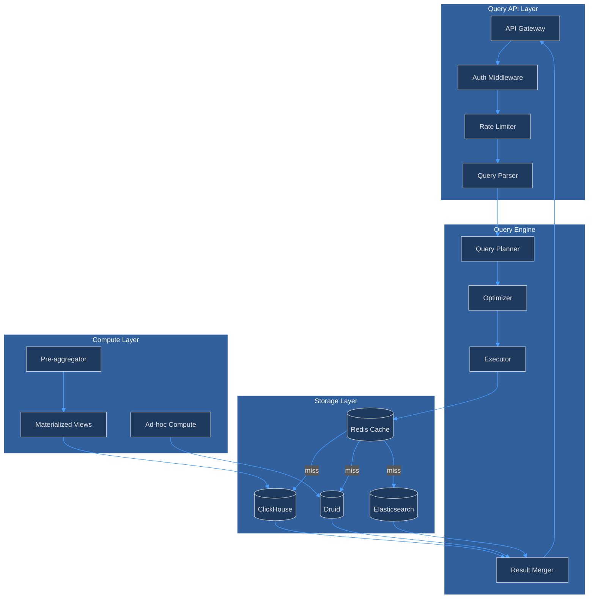
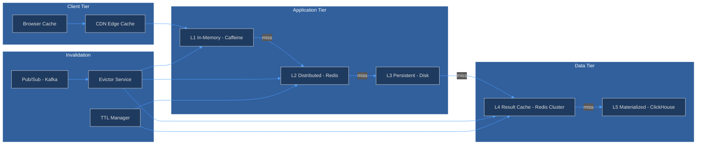
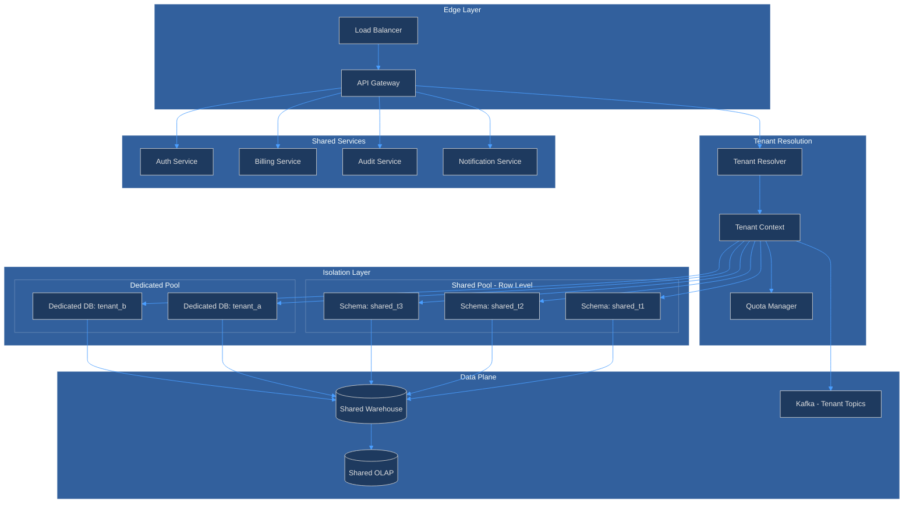

# Continuous BI Platform Architecture

## 1. Real-Time Dashboard Architecture

## 2. Streaming ETL Architecture

## 3. Query Engine Architecture

## 4. Caching Architecture

## 5. Multi-Tenant Architecture

