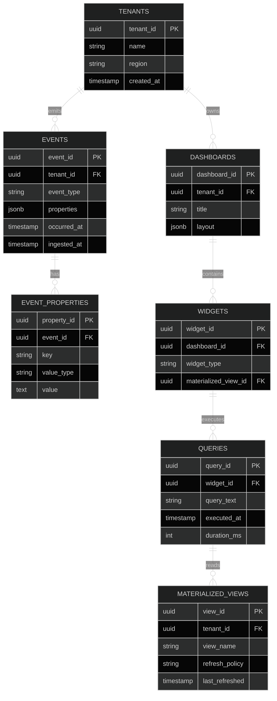
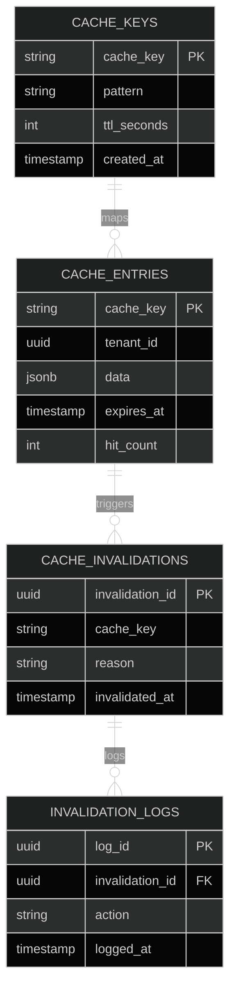

# Continuous BI Data Model

## 1. Real-Time Analytics Schema

```mermaid
%%{init: {'theme':'dark'}}%%
erDiagram
    TENANTS ||--o{ EVENTS : emits
    TENANTS ||--o{ DASHBOARDS : owns
    EVENTS ||--o{ EVENT_PROPERTIES : has
    DASHBOARDS ||--o{ WIDGETS : contains
    WIDGETS ||--o{ QUERIES : executes
    QUERIES ||--o{ MATERIALIZED_VIEWS : reads

    TENANTS {
        uuid tenant_id PK
        string name
        string region
        timestamp created_at
    }
    EVENTS {
        uuid event_id PK
        uuid tenant_id FK
        string event_type
        jsonb properties
        timestamp occurred_at
        timestamp ingested_at
    }
    EVENT_PROPERTIES {
        uuid property_id PK
        uuid event_id FK
        string key
        string value_type
        text value
    }
    DASHBOARDS {
        uuid dashboard_id PK
        uuid tenant_id FK
        string title
        jsonb layout
    }
    WIDGETS {
        uuid widget_id PK
        uuid dashboard_id FK
        string widget_type
        uuid materialized_view_id FK
    }
    QUERIES {
        uuid query_id PK
        uuid widget_id FK
        string query_text
        timestamp executed_at
        int duration_ms
    }
    MATERIALIZED_VIEWS {
        uuid view_id PK
        uuid tenant_id FK
        string view_name
        string refresh_policy
        timestamp last_refreshed
    }
```

## 2. Materialized View Patterns

```mermaid
%%{init: {'theme':'dark'}}%%
flowchart LR
    subgraph Ingestion
        K[Kafka Stream]
        P[Stream Processor]
    end
    subgraph Storage
        PG[(PostgreSQL)]
        MV[(Materialized Views)]
        OLAP[(ClickHouse)]
    end
    subgraph Serving
        API[BI API]
        CACHE[(Redis Cache)]
    end

    K --> P --> PG
    PG -->|scheduled refresh| MV
    MV -->|sync| OLAP
    OLAP --> API
    API --> CACHE
    CACHE --> API

    style K fill:#1a1a2e,stroke:#e94560
    style P fill:#1a1a2e,stroke:#e94560
    style PG fill:#16213e,stroke:#0f3460
    style MV fill:#16213e,stroke:#0f3460
    style OLAP fill:#16213e,stroke:#0f3460
    style API fill:#533483,stroke:#e94560
    style CACHE fill:#533483,stroke:#e94560
```

## 3. Aggregation Pipeline Schema

```mermaid
%%{init: {'theme':'dark'}}%%
flowchart TD
    subgraph Sources
        S1[Raw Events]
        S2[User Actions]
        S3[Transactions]
    end
    subgraph Staging
        STG[Staging Tables]
    end
    subgraph Aggregation
        A1[Hourly Rollups]
        A2[Daily Rollups]
        A3[Weekly Rollups]
        A4[Monthly Rollups]
    end
    subgraph Serving Layer
        R[Reporting Tables]
        D[Data Marts]
    end

    S1 --> STG
    S2 --> STG
    S3 --> STG
    STG --> A1
    STG --> A2
    A1 --> A3
    A2 --> A4
    A3 --> R
    A4 --> R
    R --> D

    style S1 fill:#1a1a2e,stroke:#e94560
    style S2 fill:#1a1a2e,stroke:#e94560
    style S3 fill:#1a1a2e,stroke:#e94560
    style STG fill:#16213e,stroke:#0f3460
    style A1 fill:#533483,stroke:#e94560
    style A2 fill:#533483,stroke:#e94560
    style A3 fill:#533483,stroke:#e94560
    style A4 fill:#533483,stroke:#e94560
    style R fill:#0f3460,stroke:#e94560
    style D fill:#0f3460,stroke:#e94560
```

## 4. Cache Schema

```mermaid
%%{init: {'theme':'dark'}}%%
erDiagram
    CACHE_KEYS ||--o{ CACHE_ENTRIES : maps
    CACHE_ENTRIES ||--o{ CACHE_INVALIDATIONS : triggers
    CACHE_INVALIDATIONS ||--o{ INVALIDATION_LOGS : logs

    CACHE_KEYS {
        string cache_key PK
        string pattern
        int ttl_seconds
        timestamp created_at
    }
    CACHE_ENTRIES {
        string cache_key PK
        uuid tenant_id
        jsonb data
        timestamp expires_at
        int hit_count
    }
    CACHE_INVALIDATIONS {
        uuid invalidation_id PK
        string cache_key
        string reason
        timestamp invalidated_at
    }
    INVALIDATION_LOGS {
        uuid log_id PK
        uuid invalidation_id FK
        string action
        timestamp logged_at
    }
```

## 5. Multi-Tenant Data Isolation

```mermaid
%%{init: {'theme':'dark'}}%%
flowchart TD
    subgraph Request Layer
        GW[API Gateway]
        AUTH[Auth Middleware]
    end
    subgraph Isolation
        RLS[Row-Level Security]
        SCHEMA[Schema-per-Tenant]
        PARTITION[Partition-by-Tenant]
    end
    subgraph Data
        DB[(Shared Database)]
        T1[Tenant A Data]
        T2[Tenant B Data]
        T3[Tenant C Data]
    end

    GW --> AUTH
    AUTH -->|inject tenant context| RLS
    AUTH -->|route| SCHEMA
    AUTH -->|filter| PARTITION
    RLS --> DB
    SCHEMA --> DB
    PARTITION --> DB
    DB --> T1
    DB --> T2
    DB --> T3

    style GW fill:#1a1a2e,stroke:#e94560
    style AUTH fill:#1a1a2e,stroke:#e94560
    style RLS fill:#16213e,stroke:#0f3460
    style SCHEMA fill:#16213e,stroke:#0f3460
    style PARTITION fill:#16213e,stroke:#0f3460
    style DB fill:#533483,stroke:#e94560
    style T1 fill:#0f3460,stroke:#e94560
    style T2 fill:#0f3460,stroke:#e94560
    style T3 fill:#0f3460,stroke:#e94560
```
