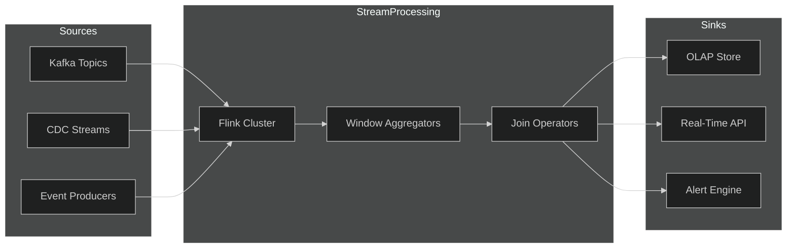
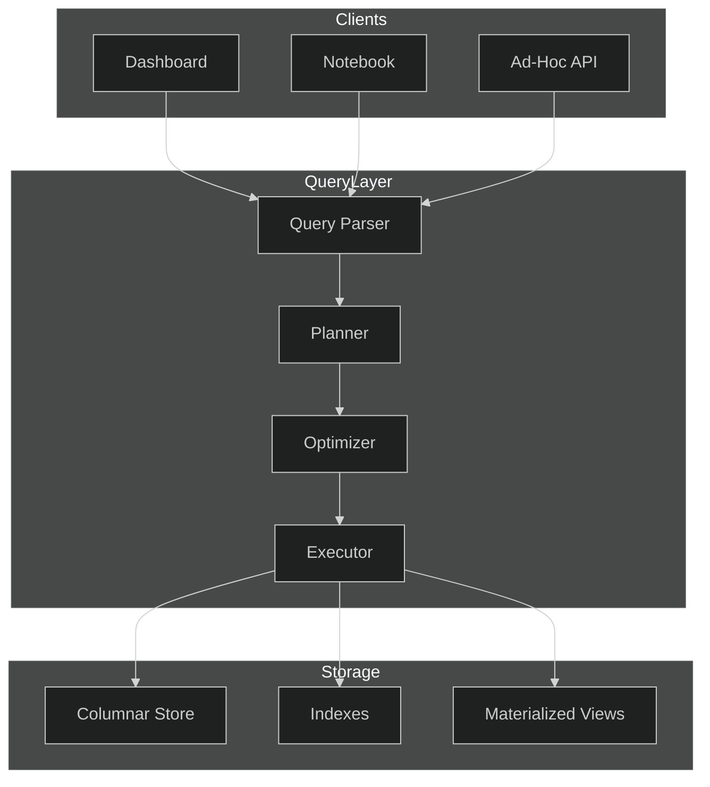
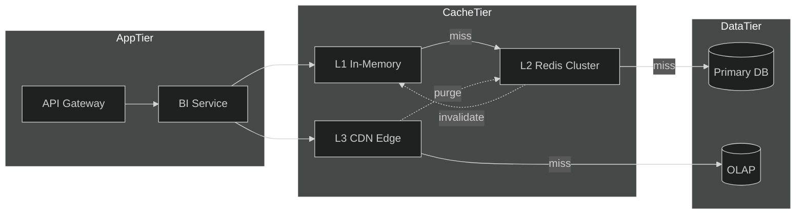
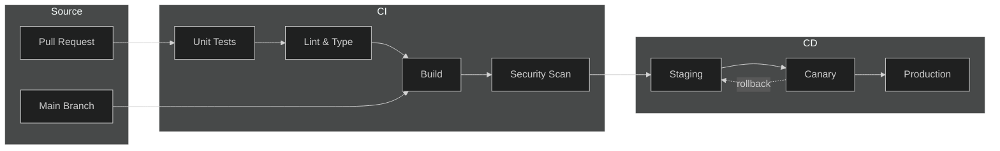
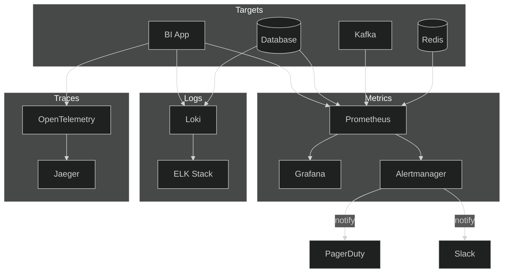

# Continuous BI Deployment

## 1. Real-Time Processing Deployment

```mermaid
%%{init: {'theme': 'dark'}}%%
flowchart LR
    subgraph Sources
        K[Kafka Topics]
        S[CDC Streams]
        E[Event Producers]
    end
    subgraph StreamProcessing
        F[Flink Cluster]
        W[Window Aggregators]
        J[Join Operators]
    end
    subgraph Sinks
        OLAP[OLAP Store]
        RT[Real-Time API]
        AL[Alert Engine]
    end
    K --> F
    S --> F
    E --> F
    F --> W
    W --> J
    J --> OLAP
    J --> RT
    J --> AL
```

## 2. Query Engine Deployment

```mermaid
%%{init: {'theme': 'dark'}}%%
flowchart TB
    subgraph Clients
        D[Dashboard]
        N[Notebook]
        A[Ad-Hoc API]
    end
    subgraph QueryLayer
        QP[Query Parser]
        PL[Planner]
        EX[Executor]
        OPT[Optimizer]
    end
    subgraph Storage
        C[Columnar Store]
        I[Indexes]
        M[Materialized Views]
    end
    D --> QP
    N --> QP
    A --> QP
    QP --> PL
    PL --> OPT
    OPT --> EX
    EX --> C
    EX --> I
    EX --> M
```

## 3. Cache Layer Deployment

```mermaid
%%{init: {'theme': 'dark'}}%%
flowchart LR
    subgraph AppTier
        API[API Gateway]
        SVC[BI Service]
    end
    subgraph CacheTier
        L1[L1 In-Memory]
        L2[L2 Redis Cluster]
        L3[L3 CDN Edge]
    end
    subgraph DataTier
        DB[(Primary DB)]
        OLAP[(OLAP)]
    end
    API --> SVC
    SVC --> L1
    L1 -->|miss| L2
    L2 -->|miss| DB
    SVC --> L3
    L3 -->|miss| OLAP
    L2 -.->|invalidate| L1
    L3 -.->|purge| L2
```

## 4. CI/CD Pipeline

```mermaid
%%{init: {'theme': 'dark'}}%%
flowchart LR
    subgraph Source
        PR[Pull Request]
        BR[Main Branch]
    end
    subgraph CI
        T[Unit Tests]
        LT[Lint & Type]
        B[Build]
        SC[Security Scan]
    end
    subgraph CD
        STG[Staging]
        CAN[Canary]
        PROD[Production]
    end
    PR --> T
    T --> LT
    LT --> B
    B --> SC
    SC --> STG
    BR --> B
    STG --> CAN
    CAN --> PROD
    CAN -.->|rollback| STG
```

## 5. Monitoring Setup

```mermaid
%%{init: {'theme': 'dark'}}%%
flowchart TB
    subgraph Metrics
        P[Prometheus]
        G[Grafana]
        AM[Alertmanager]
    end
    subgraph Logs
        L[Loki]
        ELK[ELK Stack]
    end
    subgraph Traces
        J[Jaeger]
        OT[OpenTelemetry]
    end
    subgraph Targets
        APP[BI App]
        DB[(Database)]
        KAF[Kafka]
        CACHE[(Redis)]
    end
    APP --> P
    DB --> P
    KAF --> P
    CACHE --> P
    P --> G
    P --> AM
    APP --> L
    DB --> L
    L --> ELK
    APP --> OT
    OT --> J
    AM -->|notify| Pager[PagerDuty]
    AM -->|notify| Slack[Slack]
```
