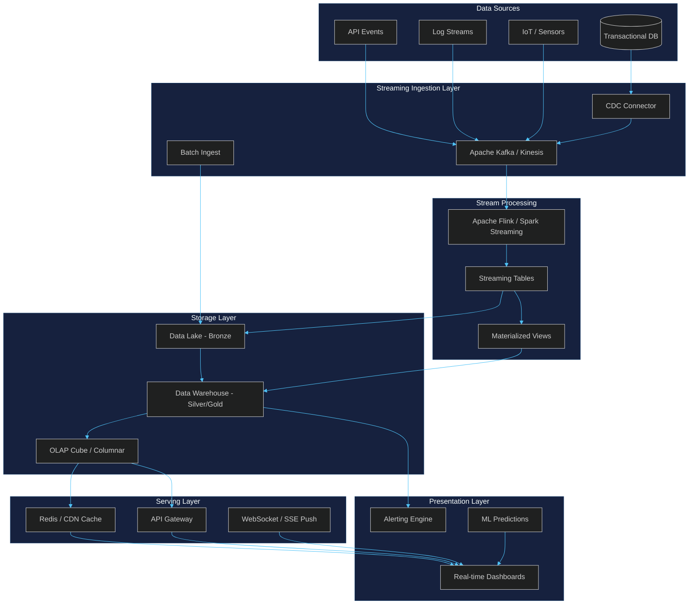
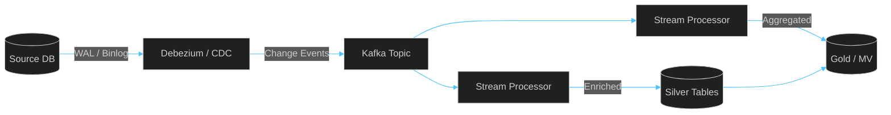
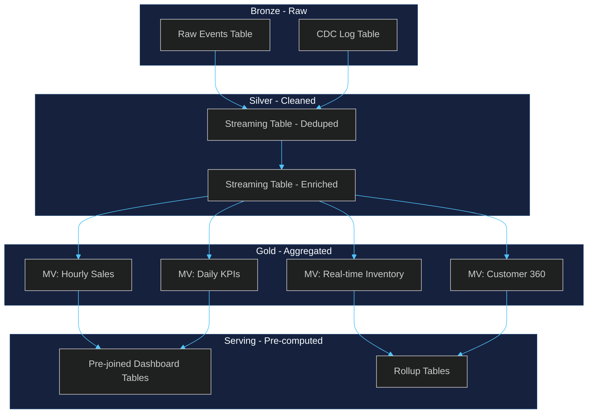
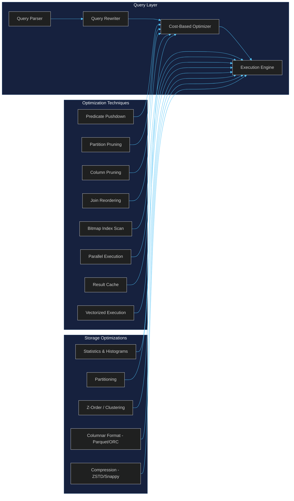
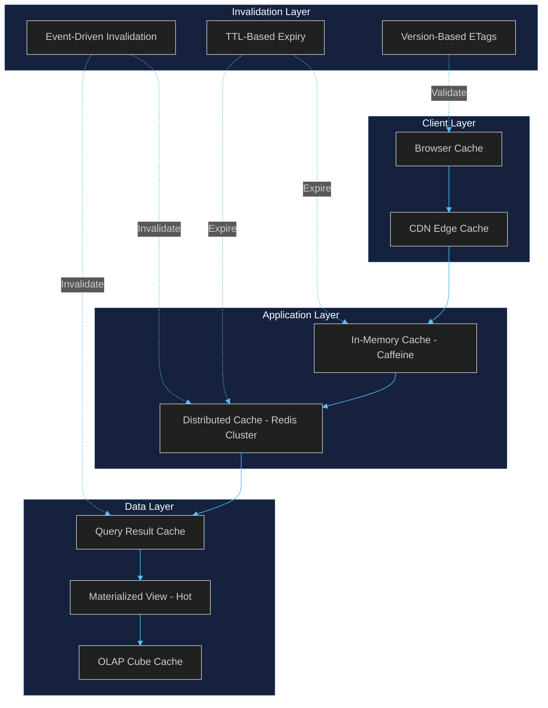
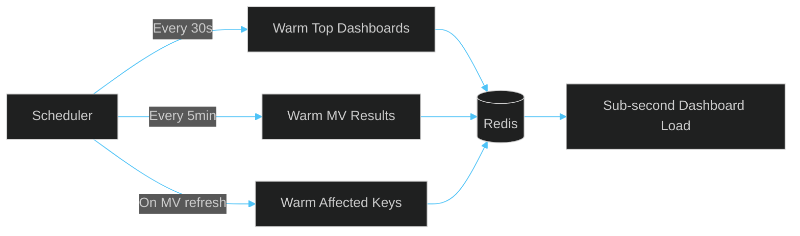

# Continuous BI Implementation

Real-time business intelligence architecture covering streaming ingestion, materialized views, query optimization, and caching for sub-second dashboard experiences.

---

## 1. Real-Time Dashboard Architecture



**Key principles:**
- **Lambda + Kappa hybrid**: Batch for historical depth, streaming for real-time freshness
- **CQRS separation**: Write-optimized ingestion path, read-optimized serving path
- **Event-driven updates**: Push model via WebSocket/SSE eliminates polling overhead
- **Tiered storage**: Hot (Redis) → Warm (OLAP) → Cold (Data Lake)

---

## 2. Streaming ETL Patterns

### 2.1 Change Data Capture (CDC) Pipeline



### 2.2 Core Patterns

| Pattern | Use Case | Latency | Implementation |
|---------|----------|---------|----------------|
| **CDC Replication** | DB → Lake sync | < 5s | Debezium + Kafka |
| **Windowed Aggregation** | Real-time KPIs | 1-30s | Flink tumbling/sliding windows |
| **Stream-Table Join** | Enrich events with dims | < 2s | Flink lookup joins |
| **Exactly-Once Sink** | Financial data | < 10s | Idempotent writes + 2PC |
| **Dead Letter Queue** | Error handling | Async | Kafka DLT + replay |
| **Schema Evolution** | Changing sources | N/A | Schema Registry (Avro/Protobuf) |

### 2.3 Idempotent Sink Pattern

```python
# Pseudocode: Idempotent upsert into materialized view
def process_event(event):
    key = event["id"]
    watermark = event["timestamp"]
    
    # Skip out-of-order events
    if watermark <= last_processed_watermark[key]:
        return  # Deduplicate
    
    # Upsert with merge semantics
    target.merge(
        source=event,
        on=key,
        when_matched="update",
        when_not_matched="insert"
    )
    
    # Update watermark
    last_processed_watermark[key] = watermark
```

### 2.4 Backpressure & Recovery

- **Kafka consumer lag monitoring**: Alert at > 10k messages
- **Watermark-based windowing**: Handle late-arriving data gracefully
- **Checkpointing**: Flink savepoints for stateful recovery
- **Graceful degradation**: Fall back to last-known-good on upstream failure

---

## 3. Materialized View Strategies

### 3.1 MV Architecture Tiers



### 3.2 Refresh Strategies

| Strategy | Freshness | Cost | Best For |
|----------|-----------|------|----------|
| **Continuous (Streaming)** | Sub-second | High | Real-time dashboards |
| **Incremental (Scheduled)** | 1-5 min | Medium | Near-real-time BI |
| **Full Rebuild** | Hourly/Daily | Low | Historical snapshots |
| **On-Demand** | Manual | Low | Ad-hoc analysis |

### 3.3 MV Definition Patterns

```sql
-- Real-time KPI materialized view (incremental refresh)
CREATE MATERIALIZED VIEW mv_realtime_sales
REFRESH EVERY 30 SECONDS
AS SELECT
    date_trunc('minute', event_ts) AS minute_bucket,
    region,
    product_category,
    COUNT(*) AS order_count,
    SUM(amount) AS total_revenue,
    AVG(amount) AS avg_order_value,
    COUNT(DISTINCT customer_id) AS unique_customers
FROM streaming_orders
WHERE event_ts >= now() - INTERVAL '24 HOURS'
GROUP BY 1, 2, 3;

-- Hierarchical rollup for dashboard drill-down
CREATE MATERIALIZED VIEW mv_sales_hierarchy
REFRESH EVERY 5 MINUTES
AS SELECT
    year, quarter, month, week, day,
    region, city, store,
    SUM(revenue) AS revenue,
    SUM(units) AS units_sold
FROM silver_orders
GROUP BY GROUPING SETS (
    (year, quarter, month, week, day),
    (year, quarter, month, week),
    (year, quarter, month),
    (year, quarter),
    (year),
    (year, quarter, month, day, region),
    (year, quarter, month, day, region, city),
    (year, quarter, month, day, region, city, store)
);
```

### 3.4 MV Selection Heuristics

- **Query frequency × base query cost** = priority score
- MVs pay off when: `refresh_cost < (query_cost × query_frequency)`
- Target: 80% of dashboard queries served by MVs
- Monitor MV staleness: `last_refresh_time` vs `max_acceptable_lag`

---

## 4. Query Optimization Techniques

### 4.1 Query Performance Stack



### 4.2 Key Techniques

| Technique | Impact | Implementation |
|-----------|--------|----------------|
| **Predicate Pushdown** | 10-100x | Filter at storage layer before scan |
| **Partition Pruning** | 5-50x | Query only relevant date/region partitions |
| **Column Pruning** | 3-10x | Read only needed columns (columnar) |
| **Z-Order Clustering** | 2-5x | Co-locate related data for min/max pruning |
| **Bitmap Indexes** | 10-100x | Low-cardinality filter acceleration |
| **Approximate Aggregates** | 100-1000x | HyperLogLog, t-digest for distinct/percentile |
| **Query Result Cache** | ∞ (cache hit) | Redis/Memcached for repeated queries |
| **Prepared Statements** | 1.2-2x | Avoid re-parse/re-plan overhead |
| **Parallel Scan** | Linear scaling | Multi-threaded partition reads |
| **Vectorized Execution** | 2-5x | Batch processing with SIMD |

### 4.3 Dashboard-Specific Optimizations

```sql
-- Pre-aggregated dashboard query (uses MV, not base tables)
-- Instead of scanning 500M rows:
SELECT * FROM mv_realtime_sales
WHERE minute_bucket >= now() - INTERVAL '1 HOUR'
  AND region = $1;

-- Approximate distinct count (HyperLogLog)
SELECT
    date_trunc('hour', ts) AS h,
    approx_count_distinct(customer_id) AS unique_customers
FROM events
GROUP BY 1;

-- Percentile via t-digest (approximate, 100x faster)
SELECT
    approx_percentile(response_time, 0.95) AS p95,
    approx_percentile(response_time, 0.99) AS p99
FROM api_logs
WHERE ts >= now() - INTERVAL '5 minutes';
```

### 4.4 Query Plan Analysis Checklist

1. **Full table scan?** → Add partition filter or index
2. **Nested loop join on large tables?** → Force hash/merge join
3. **Sort spilling to disk?** → Increase `work_mem` or pre-sort in MV
4. **Sequential scan on columnar?** → Check column pruning
5. **High planning time?** → Use prepared statements / plan caching

---

## 5. Caching Strategies

### 5.5 Multi-Layer Cache Architecture



### 5.2 Cache Tier Details

| Tier | Technology | TTL | Hit Target | Use Case |
|------|-----------|-----|------------|----------|
| **L1 - Browser** | ETag / LocalStorage | Versioned | 60% | Static dashboard config |
| **L2 - CDN** | CloudFront / Cloudflare | 1-60s | 40% | Shared dashboard snapshots |
| **L3 - In-Memory** | Caffeine / Guava | 10-60s | 80% | Per-user session data |
| **L4 - Distributed** | Redis Cluster | 30s-5min | 90% | Cross-user query results |
| **L5 - OLAP Cache** | Druid / Pinot | 5-15min | 95% | Pre-aggregated segments |

### 5.3 Cache Invalidation Patterns

```python
# Event-driven cache invalidation
class CacheInvalidator:
    def on_new_data(self, event):
        """Invalidate affected cache keys when new data arrives."""
        affected_dashboards = self.reverse_index[event.table]
        for dash_id in affected_dashboards:
            # Invalidate specific dashboard cache
            cache.delete(f"dash:{dash_id}:data")
            cache.delete(f"dash:{dash_id}:meta")
            # Publish invalidation event for distributed caches
            pubsub.publish(f"invalidate:{dash_id}", event.timestamp)

    def on_mv_refresh(self, mv_name):
        """Invalidate when materialized view refreshes."""
        cache.delete_pattern(f"mv:{mv_name}:*")
        # Warm cache with fresh data
        self.warm_cache(mv_name)

# Cache-aside with write-through for critical KPIs
def get_kpi(dashboard_id, kpi_name):
    key = f"kpi:{dashboard_id}:{kpi_name}"
    value = cache.get(key)
    if value is None:
        # Cache miss - compute from MV (fast)
        value = mv_query(kpi_name)
        cache.set(key, value, ttl=30)  # Short TTL for freshness
    return value
```

### 5.4 Cache Warming Strategy



### 5.5 Cache Consistency Guarantees

| Strategy | Consistency | Staleness | Complexity |
|----------|-------------|-----------|------------|
| **TTL Expiry** | Eventual | TTL duration | Low |
| **Write-Through** | Strong | None | Medium |
| **Event Invalidation** | Near-strong | < 1s | Medium |
| **Version-Based** | Strong | None | High |
| **Cache-Aside + TTL** | Eventual | TTL duration | Low |

**Recommendation**: TTL for most dashboards (30s), event-driven invalidation for real-time KPIs, version-based for financial data.

---

## Summary

| Layer | Target Latency | Key Technology |
|-------|---------------|----------------|
| Ingestion | < 5s | Kafka + CDC |
| Stream Processing | < 2s | Flink / Spark Streaming |
| Materialized Views | 30s-5min refresh | Incremental MV |
| Query Serving | < 100ms | MV + Columnar + Cache |
| Dashboard Render | < 1s | WebSocket push + L1-L4 cache |

**Success metrics:**
- Dashboard p95 load time: < 1s
- Data freshness: < 30s for real-time KPIs
- Cache hit rate: > 85%
- MV coverage: > 80% of dashboard queries
