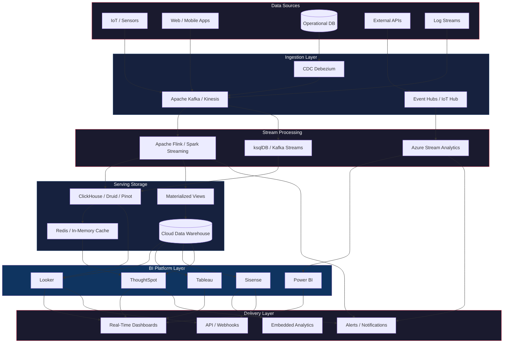
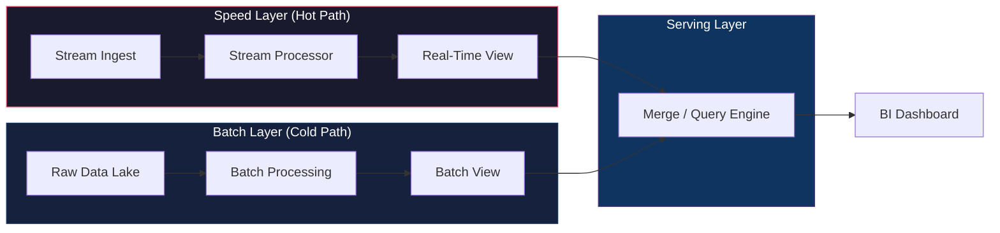
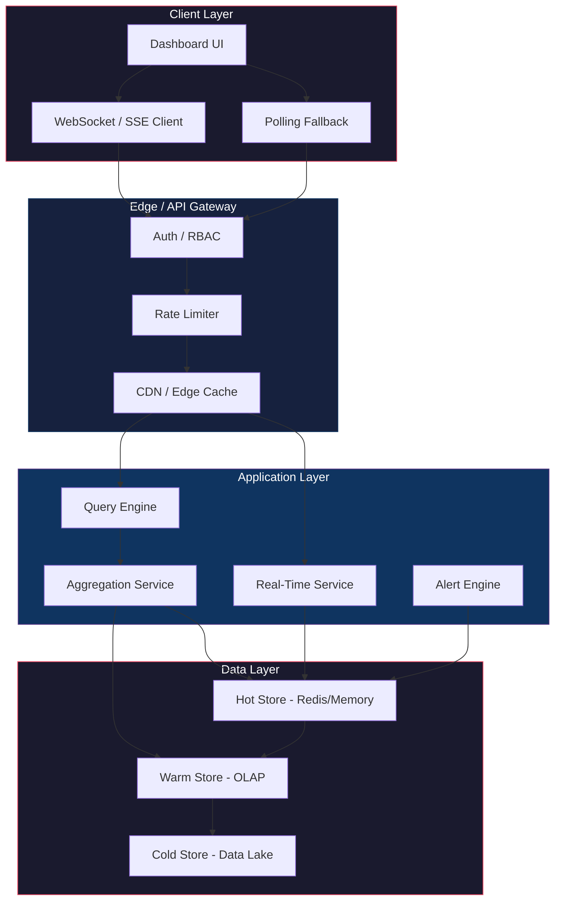

# Continuous Business Intelligence Research

## 1. Platform Comparison

| Dimension | Looker | Tableau | Power BI | Sisense | ThoughtSpot |
|---|---|---|---|---|---|
| **Vendor** | Google Cloud | Salesforce | Microsoft | Perforce | ThoughtSpot Inc. |
| **Core Model** | LookML semantic layer | VizQL + Hyper engine | DAX + Composite models | ElastiCube in-memory | Search + SpotIQ AI |
| **Real-time** | Live connection to BigQuery/DW | Live connections + WDC | Streaming datasets + DirectQuery | Live models + ElastiCube refresh | Liveboards + in-memory engine |
| **Data Volume** | Unlimited (pushdown to DW) | Hyper extracts (billions of rows) | 200K rows push; unlimited DQ | 1B records per ElastiCube | Billions of rows in-memory |
| **Streaming Native** | No (DW-dependent) | No (live query only) | Yes (REST API, ASA, PubNub) | No (live connection) | No (in-memory cache) |
| **AI/ML** | Gemini-powered agents | Einstein Copilot | Copilot + AutoML | Fusion AI (NL, anomaly) | SpotIQ automated insights |
| **Embedding** | iframe + JS SDK + Extensions | Extensions API + Embed SDK | Power BI Embedded | Compose SDK (REST/GraphQL) | Liveboard embed + SDK |
| **Governance** | Git-versioned LookML | Tableau Catalog | Microsoft Purview | Row-level security | Object/row/column security |
| **Deployment** | SaaS (GCP) | SaaS / On-prem | SaaS / Fabric | Cloud / On-prem / K8s | SaaS / On-prem |
| **Pricing** | Custom (platform + user) | Creator/Explorer/Viewer | Pro/PPU/Fabric | Custom (workspace-based) | Custom (user-based) |
| **Best For** | Governed semantic analytics | Visual exploration | Microsoft ecosystem | Embedded SaaS analytics | Search-driven self-service |

### Key Differentiators

- **Looker**: LookML modeling language provides a Git-versioned, code-first semantic layer. Queries push down to the underlying DW (BigQuery, Snowflake, Redshift). No data movement into the BI layer.
- **Tableau**: VizQL compiles visualizations into native queries. Hyper engine provides 10-20x columnar compression. Live connections to Databricks SQL, Snowflake, BigQuery with full analytical functionality.
- **Power BI**: Native streaming datasets (REST API, Azure Stream Analytics, PubNub). Fabric Real-Time Intelligence (Eventstreams, Eventhouse, KQL). DirectQuery with automatic page refresh up to 1-second intervals.
- **Sisense**: ElastiCube columnar in-memory engine with In-Chip (FPGA) acceleration. Live models for real-time DW queries. Strong multi-tenant embedded analytics with white-labeling.
- **ThoughtSpot**: Search-driven analytics with SpotIQ AI engine. In-memory calculation engine analyzes billions of rows in seconds. Liveboards with AI-generated insights and anomaly detection.

---

## 2. Real-Time BI Architecture

---

## 3. Streaming Data Patterns

### 3.1 Lambda Architecture (Batch + Speed)

### 3.2 Kappa Architecture (Stream-Only)

### 3.3 Key Streaming Patterns

| Pattern | Description | Use Case |
|---|---|---|
| **CDC** | Stream DB changes via log-based capture | Keep BI in sync with operational DB |
| **Materialized Views** | Pre-computed rollups updated on insert | Sub-second dashboard queries |
| **Fan-Out** | One stream consumed by multiple processors | Simultaneous analytics + alerting |
| **Stream-Table Join** | Enrich events with static reference data | Add customer/product dimensions |
| **Log Compaction** | Keep only latest value per key | Current state dashboards |
| **Windowed Aggregation** | Tumbling/hopping/session windows | Time-series KPIs |
| **Push Dataset** | REST API streaming to BI service | Power BI real-time tiles |

### 3.4 Processing Semantics

- **Event Time**: When the event actually occurred (source timestamp)
- **Processing Time**: When the system processes the event
- **Watermarks**: Progress indicators for event-time completeness
- **Late Data**: Events arriving after watermark — define allowed lateness
- **Corrections**: Updates/reversals that change prior results

---

## 4. Dashboard Architecture

### Dashboard Freshness States

| State | Indicator | User Action |
|---|---|---|
| **Provisional** | Window still accepting data | Wait for decision-safe |
| **Decision-Safe** | Completeness rule passed | Safe to act |
| **Stale** | Data age exceeds contract | Refresh / investigate |
| **Partial** | Source/partition missing | Check source health |
| **Revised** | Late event changed prior value | Review change |
| **Disconnected** | Live delivery stopped | Auto-reconnect |

### Performance Tiers

| Tier | Latency | Architecture |
|---|---|---|
| **Sub-second** | < 1s | WebSocket push + in-memory pre-aggregation |
| **Near-real-time** | 1-30s | SSE + materialized views (5-10s windows) |
| **Periodic** | 1-5 min | Polling API + query cache (60s TTL) |

---

## 5. Integration Requirements

### 5.1 Data Source Connectivity

| Source Type | Looker | Tableau | Power BI | Sisense | ThoughtSpot |
|---|---|---|---|---|---|
| Cloud DW (BigQuery, Snowflake, Redshift) | Native | Native | Native | Native | Native |
| RDBMS (Postgres, MySQL, SQL Server) | Native | Native | Native | Native | Native |
| Streaming (Kafka, Kinesis) | Via DW | Via DW | Native (ASA) | Via DW | Via DW |
| APIs / REST | Action Hub | WDC | Power Query | REST connector | Via DW |
| Files (CSV, Excel) | Limited | Native | Native | Native | Limited |
| SaaS (Salesforce, etc.) | Native | Native | Native | Native | Native |

### 5.2 Authentication & Security

- **SSO/SAML**: All five platforms support enterprise SSO
- **OAuth 2.0**: API access and embedded analytics
- **Row-Level Security (RLS)**: Looker (user attributes), Tableau (user filters), Power BI (RLS roles), Sisense (data security), ThoughtSpot (row-level permissions)
- **Column-Level Security**: ThoughtSpot native; others via data model design
- **Multi-Tenancy**: Sisense (strongest), Looker (Git branches), Power BI (workspaces)

### 5.3 API & Embedding

| Capability | Looker | Tableau | Power BI | Sisense | ThoughtSpot |
|---|---|---|---|---|---|
| REST API | Full | Full | Full | Full + GraphQL | Full |
| JavaScript SDK | Embed SDK | Embed SDK | JavaScript API | Compose SDK | Liveboard SDK |
| iframe Embed | Yes | Yes | Yes | Yes | Yes |
| Custom Viz | Extensions API | Extensions API | Custom Visuals | Plugin API | Developer Tools |
| Webhooks | Action Hub | Webhooks | Data Activator | Webhooks | Webhooks |

### 5.4 Operational Requirements

| Requirement | Implementation |
|---|---|
| **High Availability** | Multi-node clustering, auto-failover, health checks |
| **Scalability** | Horizontal scaling of stream processors and query nodes |
| **Monitoring** | Consumer lag, watermark delay, query latency, freshness SLA |
| **Backpressure** | Bounded queues, load shedding, auto-scaling consumers |
| **Idempotency** | Event IDs, deduplication, exactly-once processing |
| **Reconciliation** | Periodic batch correction against authoritative source |
| **Disaster Recovery** | Stream replay from log, checkpoint restore, multi-region |
| **Data Quality** | Schema validation, constraint enforcement, DLQ for bad records |

### 5.5 Technology Stack Reference

| Layer | Technologies |
|---|---|
| **Ingestion** | Kafka, Kinesis, Event Hubs, IoT Hub, Debezium CDC |
| **Processing** | Flink, Spark Streaming, ksqlDB, Stream Analytics |
| **Serving** | ClickHouse, Druid, Pinot, TimescaleDB, Redis |
| **Warehouse** | BigQuery, Snowflake, Redshift, Databricks |
| **Orchestration** | Airflow, Dagster, Prefect, Fabric Data Factory |
| **BI** | Looker, Tableau, Power BI, Sisense, ThoughtSpot |
| **Delivery** | WebSocket, SSE, REST API, GraphQL |

---

## Summary

Continuous BI requires a streaming-first architecture with pre-aggregation, low-latency serving, and push-based delivery. The choice of BI platform depends on the existing data stack, governance needs, and embedding requirements. Power BI leads in native streaming; Looker leads in governed semantics; Tableau leads in visual exploration; Sisense leads in embedded analytics; ThoughtSpot leads in AI-driven search.
