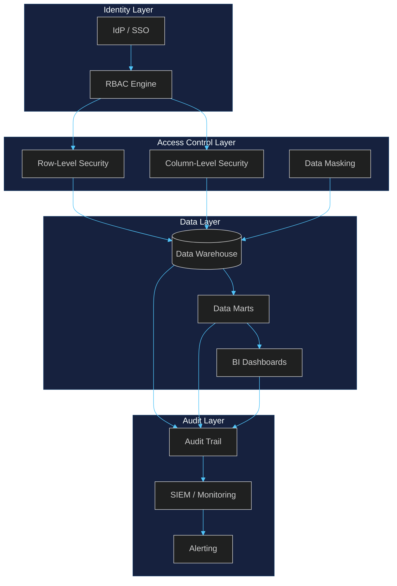
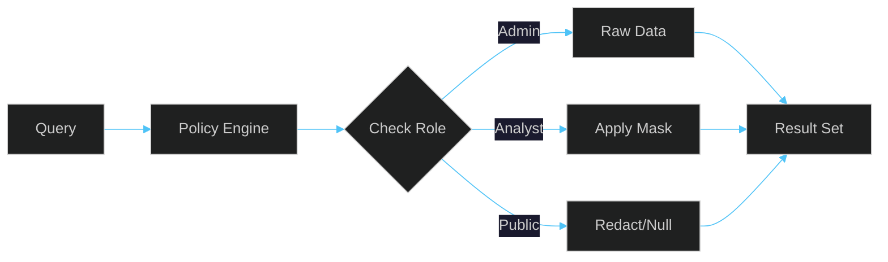
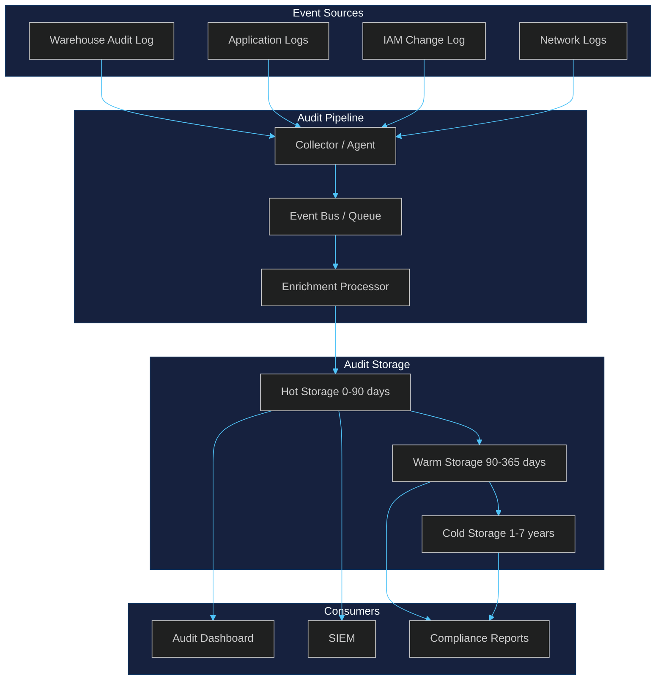
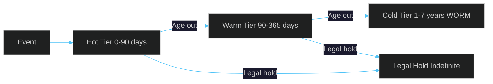

# Continuous BI Security

Security architecture for continuous BI platforms covering row-level security, column-level security, data masking, and audit trails.

## 1. Security Architecture



## 2. Row-Level Security Patterns

Row-level security (RLS) restricts which rows a user can see within a table based on their identity, role, or session context.

### Pattern A: Static Role-Based RLS

```sql
CREATE ROW ACCESS POLICY region_filter
ON project.dataset.sales
GRANT TO ("group:emea-team@company.com")
FILTER USING (region = 'EMEA');
```

### Pattern B: Dynamic User-Context RLS

```sql
CREATE ROW ACCESS POLICY user_region_filter
ON project.dataset.sales
FILTER USING (
    region = (SELECT assigned_region FROM security.user_mapping
              WHERE user_email = SESSION_USER())
);
```

### Pattern C: Hierarchical RLS (Manager → Subordinate)

```sql
CREATE ROW ACCESS POLICY manager_hierarchy
ON project.dataset.employee_data
FILTER USING (
    employee_id IN (SELECT subordinate_id FROM security.org_chart
                    WHERE manager_email = SESSION_USER())
    OR employee_id = SESSION_USER()
);
```

### Pattern D: Multi-Tenant Isolation

```sql
CREATE ROW ACCESS POLICY tenant_isolation
ON project.dataset.transactions
FILTER USING (
    tenant_id = CAST(CURRENT_SETTING('app.tenant_id') AS INT)
);
```

### RLS Best Practices

| Practice | Description |
|----------|-------------|
| Least privilege | Grant minimum row access needed |
| Default deny | No policy = no access |
| Policy as code | Version-control all RLS definitions |
| Test matrix | Validate each role sees only authorized rows |
| Performance | Index filter columns; avoid subqueries per row |

## 3. Column-Level Security Patterns

Column-level security (CLS) controls access to specific columns within a table, either by masking, tokenizing, or fully restricting access.

### Pattern A: Policy Tag + Masking (BigQuery)

```sql
CREATE POLICY TAG sensitivity_tags ON PROJECT dataset
ON COLUMN customers.ssn WITH MASKING POLICY partial_mask;
ALTER TABLE customers MODIFY COLUMN ssn
SET OPTIONS (policy_tags = ['sensitivity_tags.high']);
```

### Pattern B: Snowflake Masking Policy

```sql
CREATE MASKING POLICY email_mask AS (val STRING) RETURNS STRING ->
    CASE WHEN CURRENT_ROLE() IN ('ANALYST', 'ADMIN') THEN val
    ELSE REGEXP_REPLACE(val, '.+@', '***@') END;
ALTER TABLE customers MODIFY COLUMN email SET MASKING POLICY email_mask;
```

### Pattern C: SQL Server Dynamic Data Masking

```sql
ALTER TABLE customers ALTER COLUMN ssn ADD MASKED WITH (FUNCTION = 'partial(0,"XXX-XX-",4)');
ALTER TABLE customers ALTER COLUMN email ADD MASKED WITH (FUNCTION = 'email()');
ALTER TABLE customers ALTER COLUMN salary ADD MASKED WITH (FUNCTION = 'default()');
```

### CLS Best Practices

| Practice | Description |
|----------|-------------|
| Tag-driven | Use metadata tags to auto-apply policies |
| Role-aware | Different masks per role (analyst vs. admin) |
| Tokenization | Replace PII with tokens; detokenize only when needed |
| Avoid view explosion | Prefer masking policies over per-role views |

## 4. Data Masking Techniques

Data masking transforms sensitive data to protect it while preserving usability for analytics and testing.

### Masking Techniques Matrix

| Technique | Use Case | Reversible | Example |
|-----------|----------|-----------|---------|
| **Full masking** | Hide entire value | No | `****` |
| **Partial masking** | Show last N chars | No | `***-XX-1234` |
| **Hashing** | Irreversible transform | No | `a3f2b8c1...` |
| **Tokenization** | Replace with token | Yes (via vault) | `tok_abc123` |
| **Encryption** | Cryptographic protection | Yes (with key) | `AES256(...)` |
| **Nulling** | Replace with NULL | No | `NULL` |
| **Shuffling** | Randomize within column | No | Permuted values |
| **Date fuzzing** | Shift dates by random offset | No | `2024-01-15` → `2024-03-22` |
| **Averaging** | Replace with group average | No | Salary → dept average |

### Dynamic Masking Pipeline



### Masking by Role Example

```sql
CREATE MASKING POLICY salary_mask AS (val DECIMAL) RETURNS DECIMAL ->
    CASE WHEN CURRENT_ROLE() = 'HR_ADMIN' THEN val
    WHEN CURRENT_ROLE() = 'MANAGER' THEN ROUND(val, -3)
    WHEN CURRENT_ROLE() = 'ANALYST' THEN
        CASE WHEN val > 100000 THEN '>100K' ELSE '<=100K' END
    ELSE NULL END;
```

## 5. Audit Trail Strategies

Audit trails provide immutable records of who accessed what data, when, and what they did — essential for compliance and incident response.

### Audit Event Categories

| Category | Events | Retention |
|----------|--------|-----------|
| **Authentication** | Login/logout, MFA, token refresh | 1 year |
| **Authorization** | Role grants, policy changes, privilege escalation | 7 years |
| **Data access** | SELECT, INSERT, UPDATE, DELETE on sensitive tables | 3 years |
| **Schema changes** | DDL, masking policy edits, column additions | 7 years |
| **Data movement** | EXPORT, COPY, bulk download, stage writes | 3 years |
| **Configuration** | Warehouse settings, network policy changes | 7 years |

### Audit Architecture



### Audit Table Schema

```sql
CREATE TABLE audit.data_access_log (
    event_id UUID PRIMARY KEY, event_timestamp TIMESTAMPTZ NOT NULL,
    event_type VARCHAR(50) NOT NULL, user_identity VARCHAR(255) NOT NULL,
    user_role VARCHAR(100), client_ip INET, session_id VARCHAR(255),
    database_name VARCHAR(255), schema_name VARCHAR(255),
    table_name VARCHAR(255), column_names TEXT[], rows_accessed INT,
    query_text TEXT, query_hash VARCHAR(64), action_taken VARCHAR(50),
    policy_applied VARCHAR(255), success BOOLEAN, error_message TEXT,
    bytes_processed BIGINT, execution_time_ms INT
);
```

### Audit Trail Best Practices

| Practice | Description |
|----------|-------------|
| Immutable storage | Write-once, append-only; separate audit project |
| Tamper detection | Cryptographic hash chains on log batches |
| Tiered retention | Hot → warm → cold based on age and sensitivity |
| Real-time alerting | SIEM integration for anomaly detection |
| Access auditing | Log who accesses the audit logs themselves |
| Compliance mapping | Map events to SOC2, GDPR, HIPAA, PCI DSS controls |
| Regular reviews | Automated access reviews with attested sign-offs |

### Retention Tier Model



---

## Summary

| Layer | Key Controls | Primary Tools |
|-------|-------------|---------------|
| Row-Level Security | Role-based filters, tenant isolation, hierarchy | BigQuery RLS, Snowflake RAP, SQL Server RLS |
| Column-Level Security | Policy tags, masking policies, encryption | Snowflake CLS, SQL Server DDM, BigQuery policy tags |
| Data Masking | Partial, full, tokenization, hashing | Dynamic masking, tokenization vaults |
| Audit Trails | Immutable logs, tiered retention, real-time alerts | ACCOUNT_USAGE, Cloud Audit Logs, SIEM |
