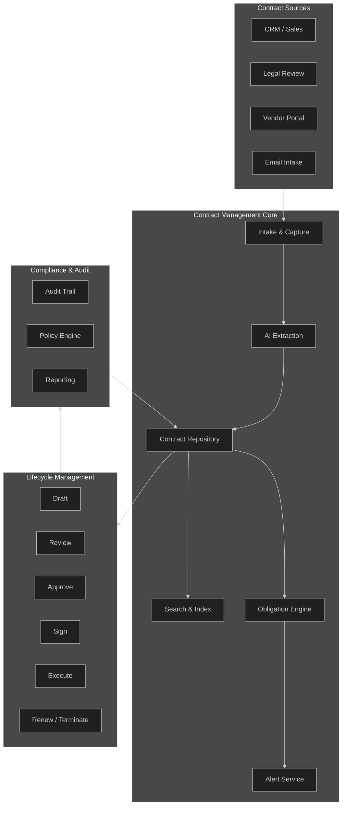
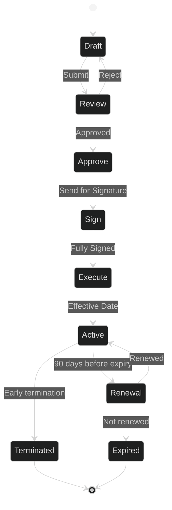
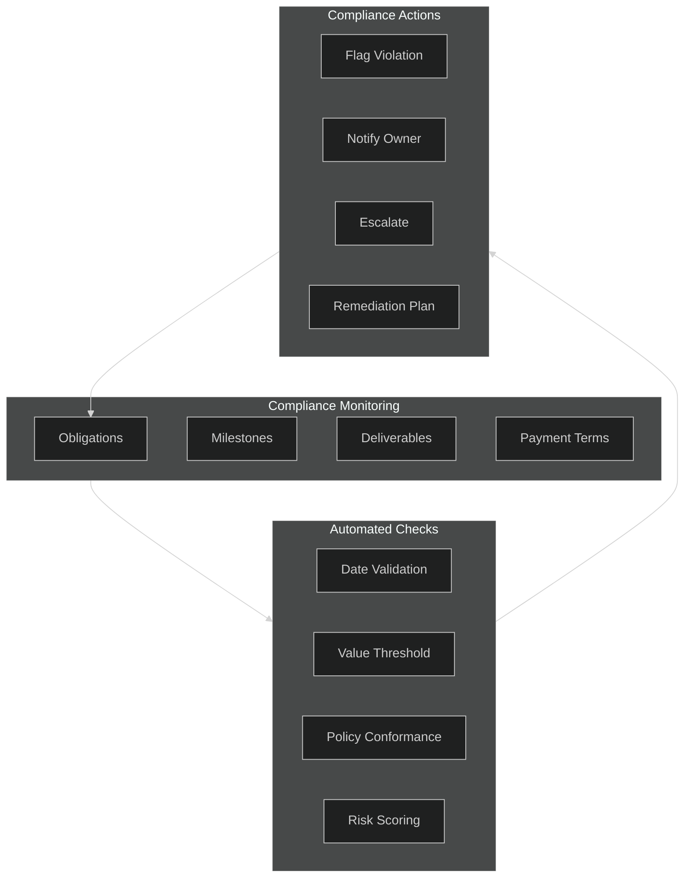
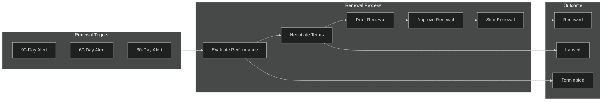

# Contract Management

## 1. Architecture

## 2. Contract Lifecycle

### Stage Definitions

| Stage | Owner | Key Actions |
|-------|-------|-------------|
| Draft | Requestor | Create, attach, populate terms |
| Review | Legal / Manager | Redline, negotiate, approve |
| Approve | Authorized Signatory | Final approval |
| Sign | Both Parties | E-signature execution |
| Execute | System | Store, index, activate obligations |
| Active | Account Manager | Monitor compliance, obligations |
| Renewal | Account Manager | Initiate renewal or termination |

## 3. Contract Templates

```mermaid
%%{init: {'theme': 'dark'}}%%
flowchart LR
    subgraph Templates["Template Library"]
        MSA[MSA Template]
        NDA[NDA Template]
        SOW[SOW Template]
        DPA[DPA Template]
        SLA[SLA Template]
        AMEND[Amendment Template]
    end

    subgraph Variables["Template Variables"]
        PARTY[Party Name]
        DATE[Effective Date]
        TERM[Term / Duration]
        VALUE[Contract Value]
        JURIS[Jurisdiction]
    end

    Templates --> Variables
    Variables --> GEN[Generated Contract]
```

### Template Types

- **MSA** — Master Service Agreement (umbrella terms)
- **NDA** — Non-Disclosure Agreement (mutual / one-way)
- **SOW** — Statement of Work (project scope, deliverables)
- **DPA** — Data Processing Agreement (privacy compliance)
- **SLA** — Service Level Agreement (performance metrics)
- **Amendment** — Contract modification / extension

### Template Variables

| Variable | Description | Example |
|----------|-------------|---------|
| `{{party_name}}` | Counterparty legal name | Acme Corp |
| `{{effective_date}}` | Contract start date | 2026-01-01 |
| `{{term_months}}` | Duration in months | 12 |
| `{{value}}` | Total contract value | $500,000 |
| `{{jurisdiction}}` | Governing law | Delaware, USA |
| `{{renewal_notice_days}}` | Notice period for renewal | 90 |

## 4. Contract Compliance

### Compliance Rules

| Rule | Description | Severity |
|------|-------------|----------|
| Expiry Alert | Notify 90/60/30 days before expiry | High |
| Payment Due | Alert 7 days before payment due date | Medium |
| Deliverable Missed | Flag overdue deliverables | High |
| Value Threshold | Escalate contracts > $100K for review | Medium |
| Policy Violation | Auto-flag non-standard clauses | High |
| Auto-Renewal | Flag auto-renewal clauses without opt-out | Medium |

### Risk Scoring

- **Low (0-30)** — Standard terms, reputable counterparty
- **Medium (31-60)** — Non-standard clauses, moderate value
- **High (61-100)** — Unusual terms, high value, or compliance flags

## 5. Contract Renewal

### Renewal Timeline

| Days Before Expiry | Action | Owner |
|-------------------|--------|-------|
| 90 | Initial alert, performance review | Account Manager |
| 60 | Renewal recommendation, negotiation start | Account Manager + Legal |
| 30 | Final renewal terms, approval | Legal + Management |
| 15 | Signature collection | Both Parties |
| 7 | Execution, archive old version | System |
| 0 | New contract effective | System |

### Renewal Decision Matrix

| Performance | Recommendation | Action |
|-------------|---------------|--------|
| Exceeds expectations | Renew + expand | Negotiate better terms |
| Meets expectations | Renew as-is | Standard renewal |
| Below expectations | Renegotiate | Adjust terms or scope |
| Unsatisfactory | Terminate | Initiate exit plan |

---

## API Endpoints

| Method | Endpoint | Description |
|--------|----------|-------------|
| GET | `/api/contracts` | List all contracts |
| POST | `/api/contracts` | Create new contract |
| GET | `/api/contracts/{id}` | Get contract details |
| PUT | `/api/contracts/{id}` | Update contract |
| DELETE | `/api/contracts/{id}` | Delete draft contract |
| POST | `/api/contracts/{id}/submit` | Submit for review |
| POST | `/api/contracts/{id}/approve` | Approve contract |
| POST | `/api/contracts/{id}/sign` | Mark as signed |
| GET | `/api/contracts/{id}/obligations` | List obligations |
| GET | `/api/contracts/{id}/audit` | Get audit trail |
| POST | `/api/contracts/{id}/renew` | Initiate renewal |
| GET | `/api/templates` | List templates |
| POST | `/api/templates/generate` | Generate from template |
