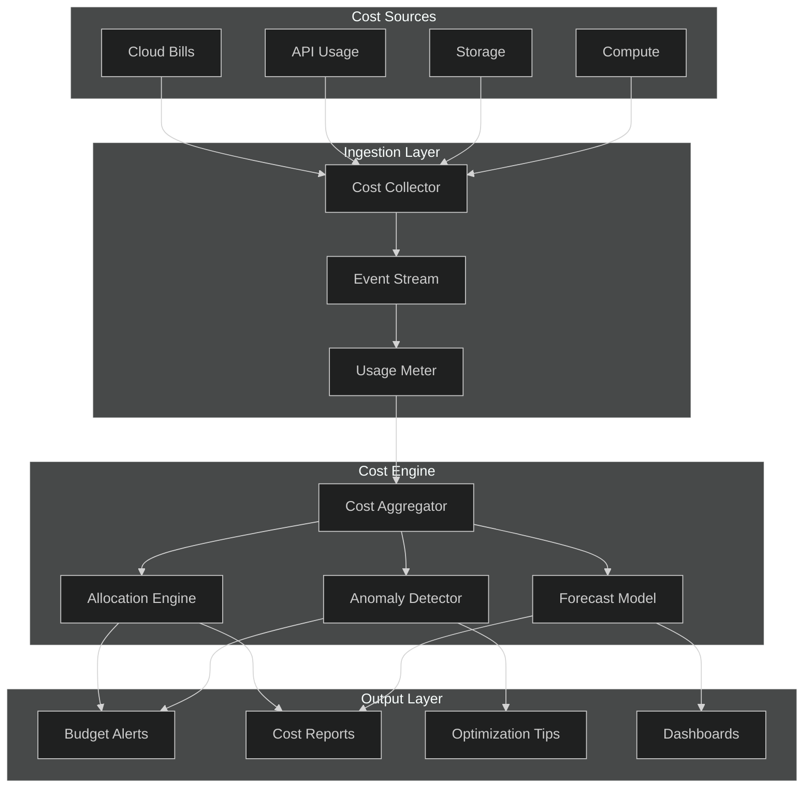
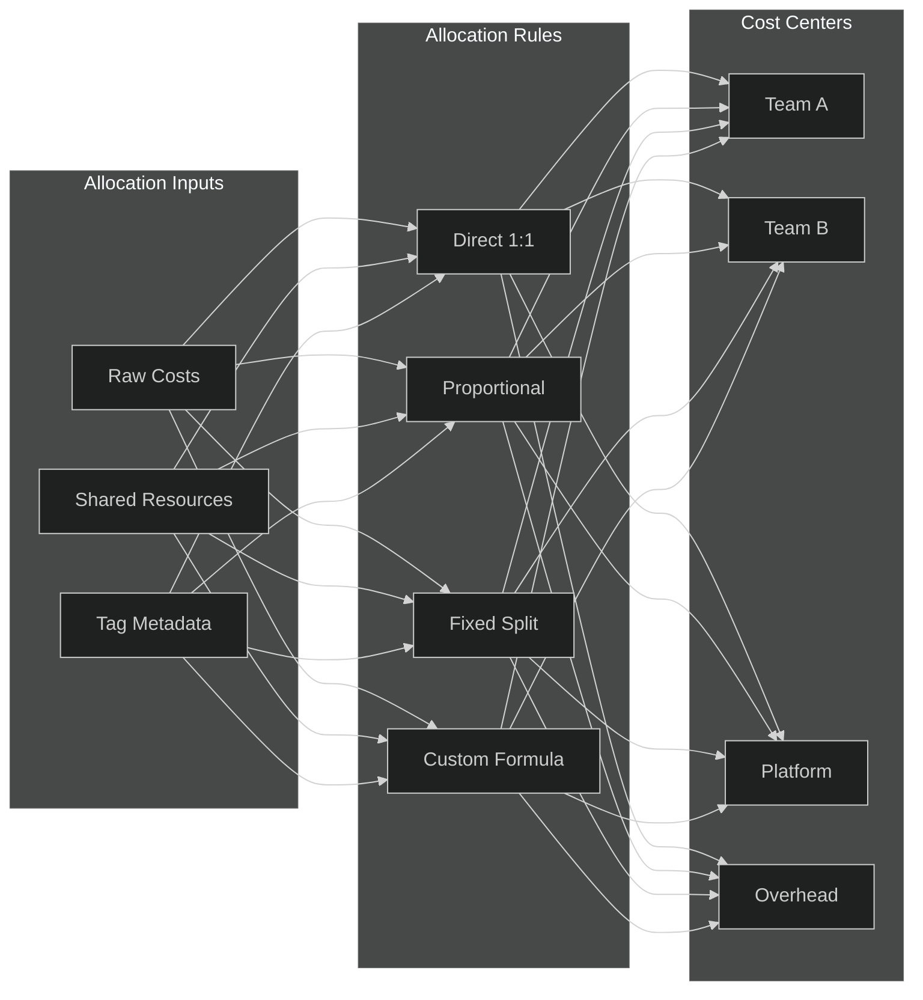
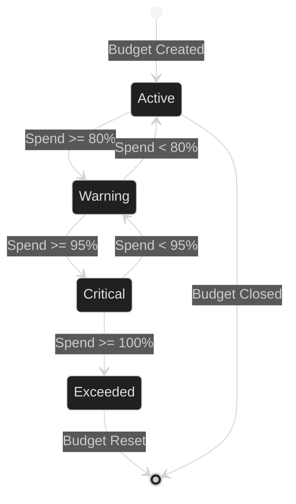

# Cost Management

## 1. Architecture

## 2. Cost Tracking

- **Real-time metering**: Usage events streamed via Kafka; costs computed per transaction.
- **Tagging strategy**: Every resource tagged with `project`, `environment`, `team`, `service`.
- **Granularity**: Per-request, per-endpoint, per-model, per-tenant.
- **Storage**: TimescaleDB for time-series cost data; 90-day hot retention, 2-year cold.
- **Reconciliation**: Nightly job matches cloud invoices vs. tracked usage; drift >2% triggers alert.

## 3. Cost Allocation

- **Direct costs**: Mapped 1:1 to cost center via tags.
- **Shared resources**: Distributed proportionally by usage share.
- **Unallocated**: Flagged daily; auto-assigned to platform overhead after 7 days.
- **Showback**: Monthly per-team cost report with trend and variance.

## 4. Cost Optimization

- **Idle resource detection**: Resources with <5% utilization for 7 days flagged for downsizing.
- **Spot/preemptible**: Non-critical workloads auto-migrated to spot instances.
- **Model routing**: Route requests to cheapest model meeting quality threshold.
- **Caching**: Semantic cache reduces redundant LLM calls; hit-rate target >30%.
- **Right-sizing**: Weekly recommendation engine suggests instance/type changes.
- **Anomaly detection**: 3-sigma rule on daily spend; alerts to team Slack channel.

## 5. Budget Management

- **Budget types**: Monthly team budgets, quarterly project budgets, annual platform budget.
- **Enforcement**: Soft limit at 80% (alert), hard limit at 100% (throttle non-critical).
- **Forecasting**: Linear regression on trailing 30-day spend; projects month-end total.
- **Approval flow**: Budget increases require manager + finance sign-off via workflow.
- **Multi-currency**: All costs normalized to USD using daily FX rates.
