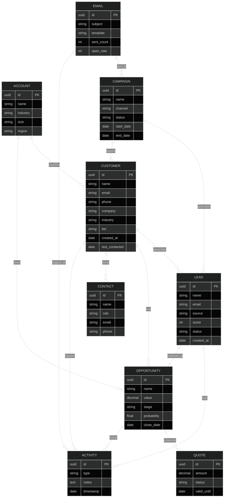
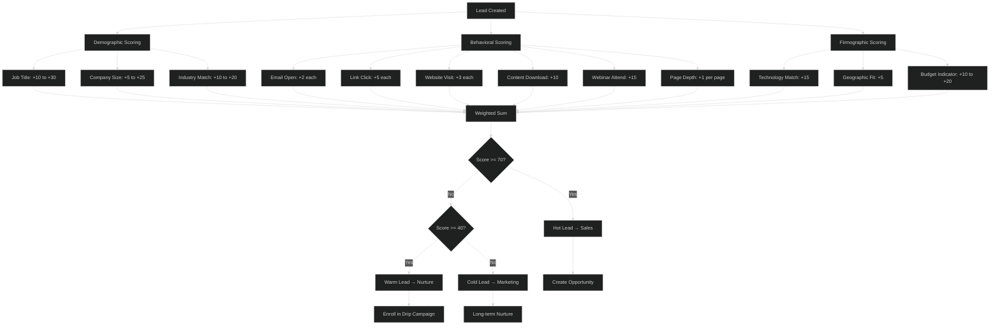
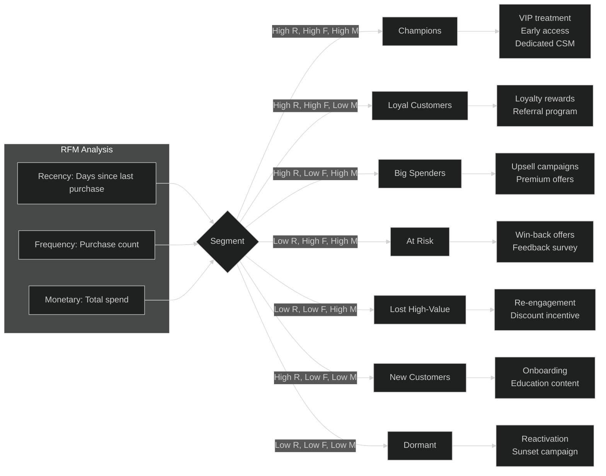
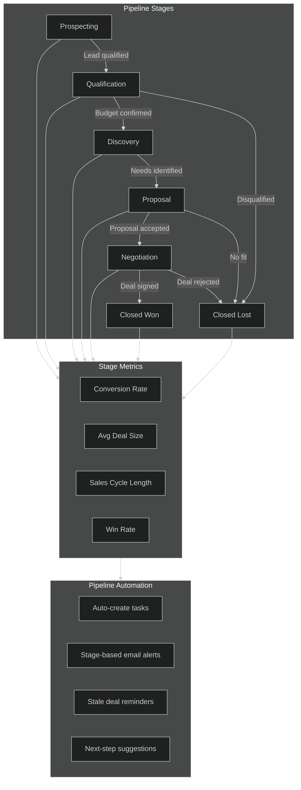
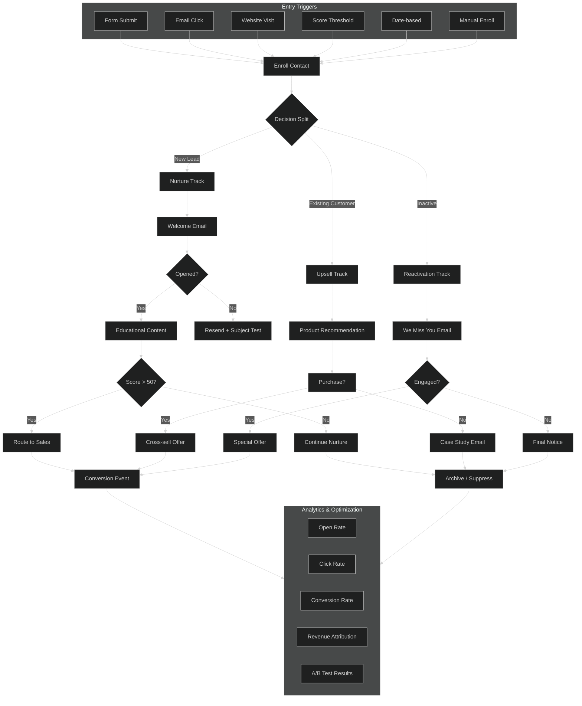

# CRM Architecture

## 1. CRM Data Model

```mermaid
%%{init: {'theme': 'dark'}}%%
erDiagram
    CUSTOMER ||--o{ LEAD : generates
    CUSTOMER ||--o{ OPPORTUNITY : has
    CUSTOMER ||--o{ CONTACT : owns
    CUSTOMER ||--o{ ACTIVITY : triggers
    LEAD ||--o{ ACTIVITY : logs
    LEAD ||--|| OPPORTUNITY : converts_to
    OPPORTUNITY ||--o{ QUOTE : produces
    OPPORTUNITY ||--o{ ACTIVITY : tracks
    ACCOUNT ||--o{ CUSTOMER : contains
    ACCOUNT ||--o{ OPPORTUNITY : owns
    CAMPAIGN ||--o{ LEAD : generates
    CAMPAIGN ||--o{ CUSTOMER : targets
    EMAIL ||--o{ CAMPAIGN : part_of
    EMAIL ||--o{ ACTIVITY : logged_as

    CUSTOMER {
        uuid id PK
        string name
        string email
        string phone
        string company
        string industry
        string tier
        date created_at
        date last_contacted
    }
    LEAD {
        uuid id PK
        string name
        string email
        string source
        int score
        string status
        date created_at
    }
    OPPORTUNITY {
        uuid id PK
        string name
        decimal value
        string stage
        float probability
        date close_date
    }
    ACCOUNT {
        uuid id PK
        string name
        string industry
        string size
        string region
    }
    CONTACT {
        uuid id PK
        string name
        string role
        string email
        string phone
    }
    ACTIVITY {
        uuid id PK
        string type
        text notes
        date timestamp
    }
    CAMPAIGN {
        uuid id PK
        string name
        string channel
        string status
        date start_date
        date end_date
    }
    QUOTE {
        uuid id PK
        decimal amount
        string status
        date valid_until
    }
    EMAIL {
        uuid id PK
        string subject
        string template
        int sent_count
        int open_rate
    }
```

## 2. Lead Scoring Engine

```mermaid
%%{init: {'theme': 'dark'}}%%
flowchart TD
    A[Lead Created] --> B[Demographic Scoring]
    A --> C[Behavioral Scoring]
    A --> D[Firmographic Scoring]

    B --> B1[Job Title: +10 to +30]
    B --> B2[Company Size: +5 to +25]
    B --> B3[Industry Match: +10 to +20]

    C --> C1[Email Open: +2 each]
    C --> C2[Link Click: +5 each]
    C --> C3[Website Visit: +3 each]
    C --> C4[Content Download: +10]
    C --> C5[Webinar Attend: +15]
    C --> C6[Page Depth: +1 per page]

    D --> D1[Technology Match: +15]
    D --> D2[Geographic Fit: +5]
    D --> D3[Budget Indicator: +10 to +20]

    B1 & B2 & B3 --> E[Weighted Sum]
    C1 & C2 & C3 & C4 & C5 & C6 --> E
    D1 & D2 & D3 --> E

    E --> F{Score >= 70?}
    F -->|Yes| G[Hot Lead → Sales]
    F -->|No| H{Score >= 40?}
    H -->|Yes| I[Warm Lead → Nurture]
    H -->|No| J[Cold Lead → Marketing]

    G --> K[Create Opportunity]
    I --> L[Enroll in Drip Campaign]
    J --> M[Long-term Nurture]
```

## 3. Customer Segmentation

```mermaid
%%{init: {'theme': 'dark'}}%%
flowchart LR
    subgraph RFM["RFM Analysis"]
        R[Recency: Days since last purchase]
        F[Frequency: Purchase count]
        M[Monetary: Total spend]
    end

    R & F & M --> SEG{Segment}

    SEG -->|High R, High F, High M| VVIP[Champions]
    SEG -->|High R, High F, Low M| LOYAL[Loyal Customers]
    SEG -->|High R, Low F, High M| BIG[Big Spenders]
    SEG -->|Low R, High F, High M| AT_RISK[At Risk]
    SEG -->|Low R, Low F, High M| LOST[Lost High-Value]
    SEG -->|High R, Low F, Low M| NEW[New Customers]
    SEG -->|Low R, Low F, Low M| DORMANT[Dormant]

    VVIP --> A1[VIP treatment\nEarly access\nDedicated CSM]
    LOYAL --> A2[Loyalty rewards\nReferral program]
    BIG --> A3[Upsell campaigns\nPremium offers]
    AT_RISK --> A4[Win-back offers\nFeedback survey]
    LOST --> A5[Re-engagement\nDiscount incentive]
    NEW --> A6[Onboarding\nEducation content]
    DORMANT --> A7[Reactivation\nSunset campaign]
```

## 4. Sales Pipeline

```mermaid
%%{init: {'theme': 'dark'}}%%
flowchart TD
    subgraph Stages["Pipeline Stages"]
        S1[Prospecting]
        S2[Qualification]
        S3[Discovery]
        S4[Proposal]
        S5[Negotiation]
        S6[Closed Won]
        S7[Closed Lost]
    end

    S1 -->|Lead qualified| S2
    S2 -->|Budget confirmed| S3
    S3 -->|Needs identified| S4
    S4 -->|Proposal accepted| S5
    S5 -->|Deal signed| S6
    S5 -->|Deal rejected| S7
    S4 -->|No fit| S7
    S2 -->|Disqualified| S7

    subgraph Metrics["Stage Metrics"]
        M1[Conversion Rate]
        M2[Avg Deal Size]
        M3[Sales Cycle Length]
        M4[Win Rate]
    end

    S1 & S2 & S3 & S4 & S5 & S6 & S7 --> Metrics

    subgraph Automation["Pipeline Automation"]
        A1[Auto-create tasks]
        A2[Stage-based email alerts]
        A3[Stale deal reminders]
        A4[Next-step suggestions]
    end

    Metrics --> Automation
```

## 5. Marketing Automation

```mermaid
%%{init: {'theme': 'dark'}}%%
flowchart TD
    subgraph Triggers["Entry Triggers"]
        T1[Form Submit]
        T2[Email Click]
        T3[Website Visit]
        T4[Score Threshold]
        T5[Date-based]
        T6[Manual Enroll]
    end

    T1 & T2 & T3 & T4 & T5 & T6 --> ENROLL[Enroll Contact]

    ENROLL --> SPLIT{Decision Split}

    SPLIT -->|New Lead| NURTURE[Nurture Track]
    SPLIT -->|Existing Customer| UPSELL[Upsell Track]
    SPLIT -->|Inactive| REACTIVATE[Reactivation Track]

    NURTURE --> N1[Welcome Email]
    N1 --> N2{Opened?}
    N2 -->|Yes| N3[Educational Content]
    N2 -->|No| N4[Resend + Subject Test]
    N3 --> N5{Score > 50?}
    N5 -->|Yes| N6[Route to Sales]
    N5 -->|No| N7[Continue Nurture]

    UPSELL --> U1[Product Recommendation]
    U1 --> U2[Purchase?]
    U2 -->|Yes| U3[Cross-sell Offer]
    U2 -->|No| U4[Case Study Email]

    REACTIVATE --> R1[We Miss You Email]
    R1 --> R2{Engaged?}
    R2 -->|Yes| R3[Special Offer]
    R2 -->|No| R4[Final Notice]

    N6 & U3 & R3 --> CONVERT[Conversion Event]
    N7 & U4 & R4 --> ARCHIVE[Archive / Suppress]

    subgraph Tracking["Analytics & Optimization"]
        TR1[Open Rate]
        TR2[Click Rate]
        TR3[Conversion Rate]
        TR4[Revenue Attribution]
        TR5[A/B Test Results]
    end

    CONVERT & ARCHIVE --> Tracking
```
