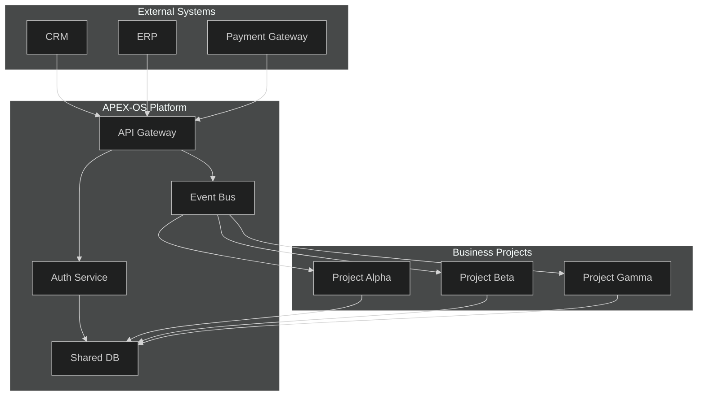
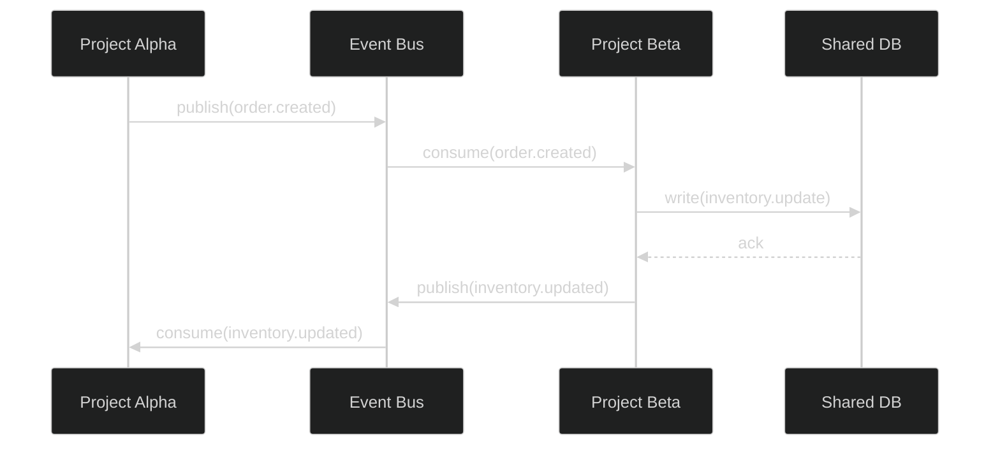
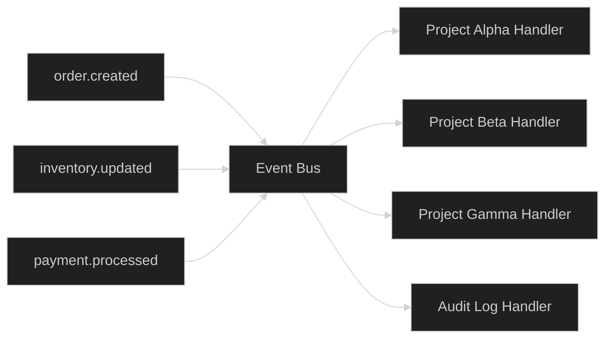

# Cross-Project Integration

## 1. Integration Architecture



## 2. Shared Services

| Service | Purpose | Endpoint |
|---------|---------|----------|
| Auth Service | Authentication & authorization | `/auth/*` |
| Event Bus | Async event distribution | `/events/*` |
| Shared DB | Cross-project data store | Internal |
| API Gateway | Rate limiting, routing | `/api/*` |
| Notification | Email, SMS, push alerts | `/notify/*` |
| Audit Log | Compliance & traceability | `/audit/*` |

## 3. Data Flow Between Projects



## 4. API Contracts

### 4.1 Authentication

```
POST /auth/login
Request:  { "email": "string", "password": "string" }
Response: { "token": "string", "expires_in": 3600 }
```

### 4.2 Event Publishing

```
POST /events/publish
Headers: Authorization: Bearer <token>
Request:  { "topic": "string", "payload": object }
Response: { "event_id": "uuid", "status": "published" }
```

### 4.3 Shared Data Access

```
GET /api/v1/shared-data/{project_id}
Headers: Authorization: Bearer <token>
Response: { "data": array, "meta": { "page": 1, "total": 100 } }
```

### 4.4 Notification

```
POST /notify/send
Headers: Authorization: Bearer <token>
Request:  { "channel": "email|sms|push", "recipient": "string", "message": "string" }
Response: { "notification_id": "uuid", "status": "queued" }
```

## 5. Event-Driven Integration

### 5.1 Event Topics

| Topic | Producer | Consumers |
|-------|----------|-----------|
| `order.created` | Project Alpha | Project Beta, Gamma |
| `inventory.updated` | Project Beta | Project Alpha |
| `payment.processed` | External | All projects |
| `user.registered` | Auth Service | All projects |
| `audit.entry` | All projects | Audit Log |

### 5.2 Event Schema

```json
{
  "event_id": "uuid",
  "topic": "string",
  "timestamp": "ISO8601",
  "source": "project_name",
  "payload": {},
  "metadata": {
    "version": "1.0",
    "trace_id": "uuid"
  }
}
```

### 5.3 Event Flow Diagram



### 5.4 Retry & Dead Letter Policy

- Max retries: 3
- Backoff: exponential (1s, 2s, 4s)
- Dead letter queue after max retries
- DLQ retention: 7 days
