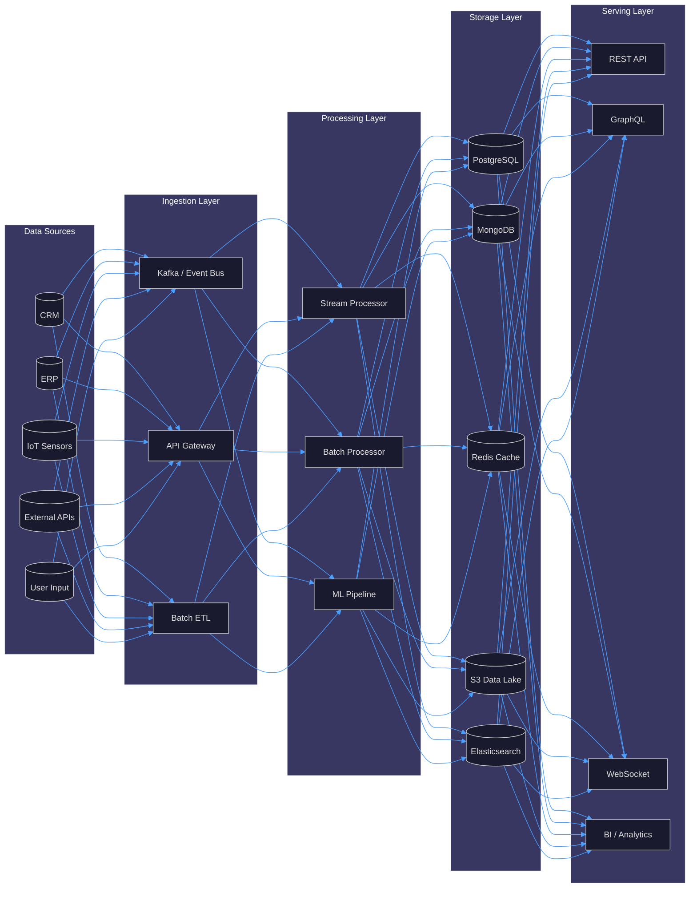
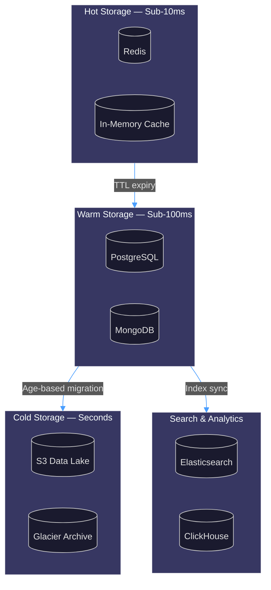
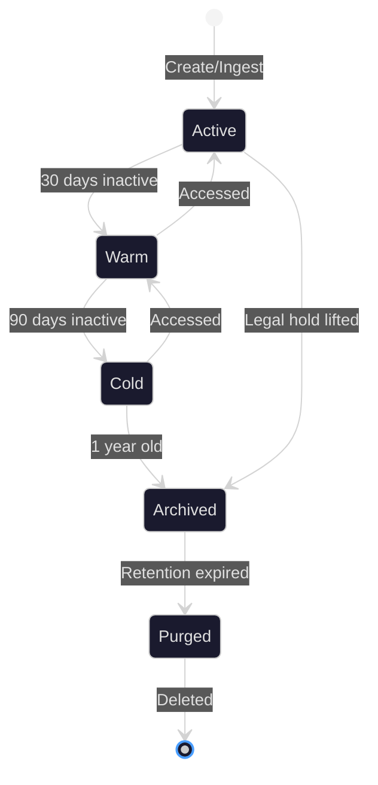
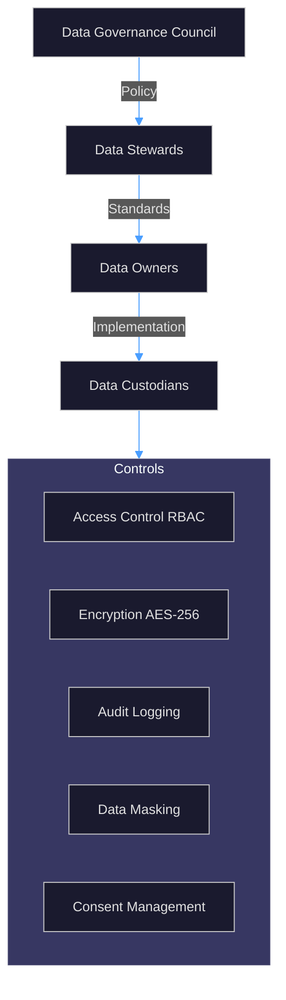
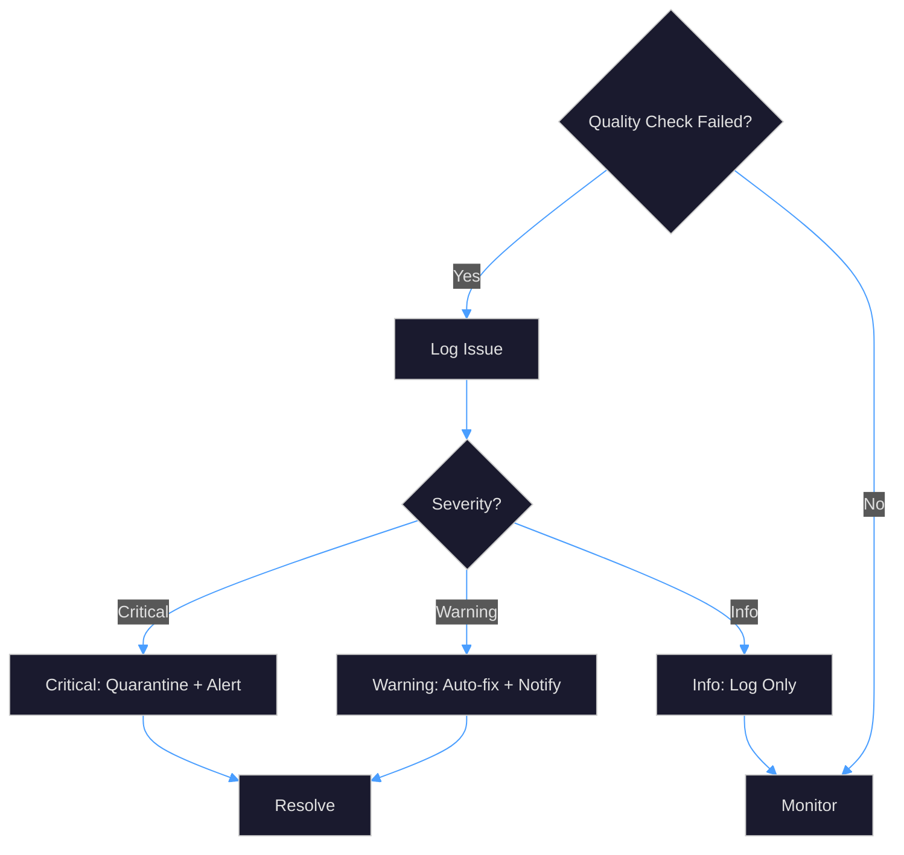

# APEX-OS Data Architecture

## 1. Data Flow Architecture

### Data Flow Patterns

| Pattern | Use Case | Technology |
|---------|----------|------------|
| Event-Driven | Real-time updates, IoT | Kafka, WebSockets |
| Request-Response | CRUD operations | REST, GraphQL |
| Batch ETL | Nightly sync, reporting | Airflow, Spark |
| CQRS | High-read workloads | Separate read/write models |

---

## 2. Data Storage Strategy

### Storage Technology Matrix

| Store | Data Type | Retention | Scaling Strategy |
|-------|-----------|-----------|-----------------|
| PostgreSQL | Relational, transactional | 7 years | Read replicas, sharding |
| MongoDB | Documents, semi-structured | 3 years | Sharding, replica sets |
| Redis | Sessions, cache, ephemeral | 24h–7d | Cluster mode |
| S3 | Files, blobs, backups | Infinite | Lifecycle policies |
| Elasticsearch | Search indices, logs | 90 days | Index rollover |
| ClickHouse | Analytics, time-series | 2 years | Partitioning |

---

## 3. Data Lifecycle Management

### Lifecycle Policies

| Stage | Trigger | Action | Owner |
|-------|---------|--------|-------|
| Active | Data created | Store in hot/warm tier | Application |
| Warm | 30d inactivity | Migrate to cold storage | Automated |
| Cold | 90d inactivity | Compress + archive | Automated |
| Archived | 1 year | Move to glacier | Automated |
| Purged | Retention period end | Crypto-shred | Compliance |

### Retention Schedule

- **Transactional data**: 7 years (regulatory)
- **User activity logs**: 90 days hot, 1 year cold
- **Session data**: 24 hours
- **Analytics events**: 2 years
- **Backups**: 30 days incremental, 12 months full

---

## 4. Data Governance Framework

### Governance Policies

| Policy | Description | Enforcement |
|--------|-------------|-------------|
| Data Classification | Public, Internal, Confidential, Restricted | Automated tagging |
| Access Control | RBAC + ABAC hybrid | API gateway + DB policies |
| Encryption | AES-256 at rest, TLS 1.3 in transit | Infrastructure-level |
| Audit Trail | Immutable log of all data access | Append-only audit table |
| Consent Management | GDPR/CCPA consent tracking | Consent service |
| Data Residency | Geo-fencing for PII | Region-locked storage |

### Roles & Responsibilities

- **Data Governance Council**: Policy approval, dispute resolution
- **Data Stewards**: Domain-level quality, classification
- **Data Owners**: Business accountability, access approval
- **Data Custodians**: Technical implementation, backup/restore

---

## 5. Data Quality Framework

### Quality Metrics

| Dimension | Metric | Target | Measurement |
|-----------|--------|--------|-------------|
| Completeness | % non-null fields | ≥ 99% | Column-level scan |
| Accuracy | % matching source | ≥ 98% | Sample validation |
| Consistency | % cross-system match | ≥ 99.5% | Reconciliation job |
| Timeliness | Latency from source | < 5 min | Pipeline monitoring |
| Uniqueness | % duplicate records | ≤ 0.1% | Hash-based dedup |
| Validity | % passing schema | ≥ 99.9% | Schema validation |

### Quality Gates

1. **Ingestion Gate**: Schema validation, null checks
2. **Processing Gate**: Business rule validation, dedup
3. **Storage Gate**: Referential integrity, constraint checks
4. **Serving Gate**: Freshness check, cache invalidation

### Remediation Workflow

---

## Appendix: Data Classification Levels

| Level | Label | Examples | Handling |
|-------|-------|----------|----------|
| L1 | Public | Marketing content | No restriction |
| L2 | Internal | Org charts, policies | Authenticated access |
| L3 | Confidential | Customer PII, financials | Encrypted, need-to-know |
| L4 | Restricted | Credentials, health data | Tokenized, audit required |
