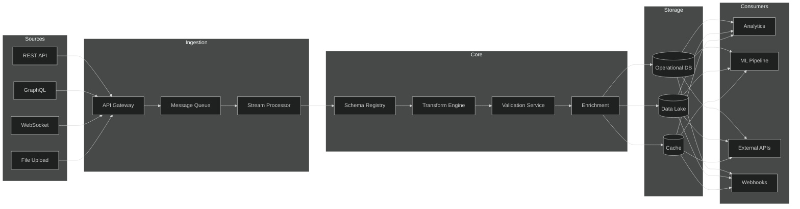
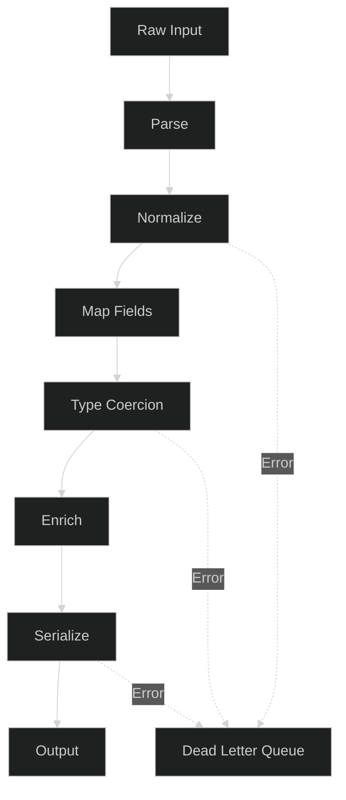
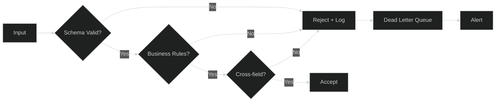
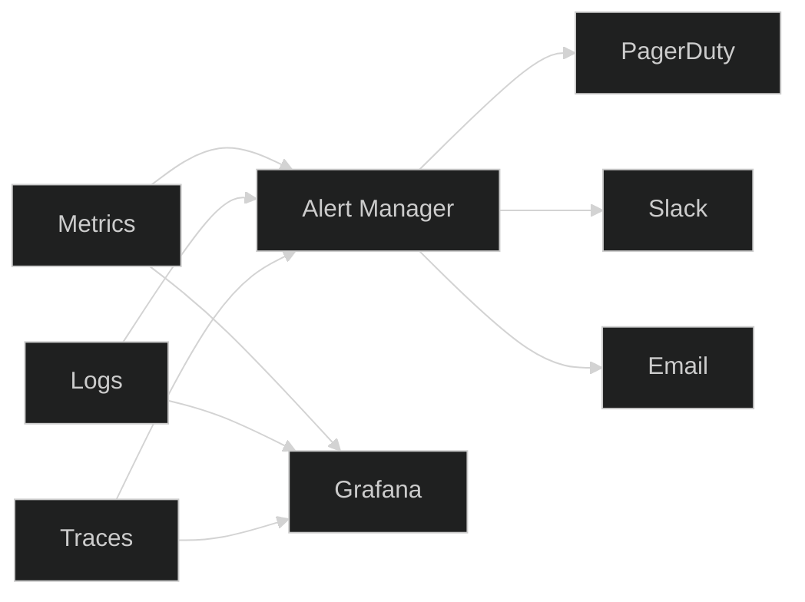

# Data Exchange

## 1. Architecture



## 2. Data Formats

| Format | Use Case | Schema | Versioning |
|--------|----------|--------|------------|
| JSON | REST APIs, Webhooks | JSON Schema | `v1`, `v2` |
| Avro | Message Queue, Streaming | Avro Schema | Registry-managed |
| Protobuf | gRPC, Internal RPC | `.proto` files | Semantic |
| Parquet | Data Lake, Analytics | Hive-compatible | Partition-based |
| CSV | File Upload, Export | Header row + DDL | Column-order |

### JSON Schema Example

```json
{
  "$schema": "https://json-schema.org/draft/2020-12/schema",
  "$id": "https://apex-os.io/schemas/order.json",
  "title": "Order",
  "type": "object",
  "required": ["id", "customer_id", "items", "total"],
  "properties": {
    "id": { "type": "string", "format": "uuid" },
    "customer_id": { "type": "string", "minLength": 1 },
    "items": {
      "type": "array",
      "minItems": 1,
      "items": { "$ref": "#/$defs/OrderItem" }
    },
    "total": { "type": "number", "minimum": 0 },
    "currency": { "type": "string", "enum": ["USD", "EUR", "GBP"] },
    "created_at": { "type": "string", "format": "date-time" }
  },
  "$defs": {
    "OrderItem": {
      "type": "object",
      "required": ["sku", "quantity", "unit_price"],
      "properties": {
        "sku": { "type": "string", "pattern": "^[A-Z0-9-]+$" },
        "quantity": { "type": "integer", "minimum": 1 },
        "unit_price": { "type": "number", "minimum": 0 }
      }
    }
  }
}
```

## 3. Data Transformation



### Transformation Pipeline

| Stage | Operation | Example |
|-------|-----------|---------|
| Parse | Deserialize raw bytes | Avro → dict |
| Normalize | Trim, case-fold, deduplicate | `"  New York "` → `"new york"` |
| Map Fields | Rename, restructure | `cust_id` → `customer_id` |
| Type Coercion | Cast to target type | `"42"` → `42` |
| Enrich | Join reference data | `country_code` → `country_name` |
| Serialize | Convert to output format | dict → Protobuf |

### Mapping Configuration

```yaml
transform:
  source_format: avro
  target_format: json
  mappings:
    - source: order_id
      target: id
      type: string
    - source: cust.id
      target: customer_id
      type: string
    - source: items[*].sku
      target: items[*].sku
      type: string
    - source: items[*].qty
      target: items[*].quantity
      type: integer
      coerce: to_int
    - source: total_cents
      target: total
      type: number
      coerce: cents_to_dollars
  enrich:
    - field: shipping_country
      lookup: countries
      on: code
      target: shipping_country_name
```

## 4. Data Validation



### Validation Layers

| Layer | Checks | Action on Fail |
|-------|--------|----------------|
| Syntax | JSON/Avro parse, encoding | Reject immediately |
| Schema | Types, required, formats, ranges | Reject + error detail |
| Business | Uniqueness, state transitions, quotas | Reject + reason code |
| Cross-field | `end_date > start_date`, `total = sum(items)` | Reject + field refs |
| Referential | FK exists, enum valid | Reject + lookup key |

### Validation Rules (YAML)

```yaml
rules:
  - name: order_total_matches_items
    type: cross_field
    expression: "total == sum(items[*].quantity * items[*].unit_price)"
    severity: error
    message: "Order total does not match line items"

  - name: valid_sku_format
    type: pattern
    field: items[*].sku
    pattern: "^[A-Z]{2,4}-[0-9]{4,8}$"
    severity: error

  - name: customer_not_blocked
    type: referential
    field: customer_id
    lookup: blocked_customers
    severity: error
    message: "Customer is blocked"

  - name: order_within_quota
    type: business
    field: customer_id
    window: 24h
    max: 50
    severity: warning
```

## 5. Data Monitoring



### Key Metrics

| Metric | Type | Threshold | Alert |
|--------|------|-----------|-------|
| `exchange_records_total` | Counter | — | — |
| `exchange_records_failed` | Counter | > 1%/min | PagerDuty |
| `exchange_latency_p99` | Histogram | > 500ms | Slack |
| `exchange_dlq_size` | Gauge | > 100 | PagerDuty |
| `exchange_schema_violations` | Counter | > 0 | Slack |
| `exchange_freshness` | Gauge | > 5min | Slack |

### Log Structure

```json
{
  "ts": "2026-10-02T12:00:00Z",
  "level": "ERROR",
  "service": "exchange-transform",
  "trace_id": "abc123",
  "span_id": "def456",
  "event": "validation_failed",
  "record_id": "order-789",
  "rule": "order_total_matches_items",
  "details": {
    "expected": 150.00,
    "actual": 149.99,
    "delta": 0.01
  }
}
```

### Alert Routing

| Severity | Channel | Response SLA |
|----------|---------|--------------|
| P1 Critical | PagerDuty + Phone | 5 min |
| P2 High | PagerDuty | 15 min |
| P3 Warning | Slack #data-alerts | 4 hours |
| P4 Info | Slack #data-ops | Next business day |

### Dashboard Panels

1. **Throughput** — records/sec by source and target
2. **Error Rate** — % failed by error category
3. **Latency** — p50/p95/p99 by pipeline stage
4. **DLQ Depth** — messages awaiting review
5. **Schema Health** — violations by schema and version
6. **Freshness** — last successful sync per source
