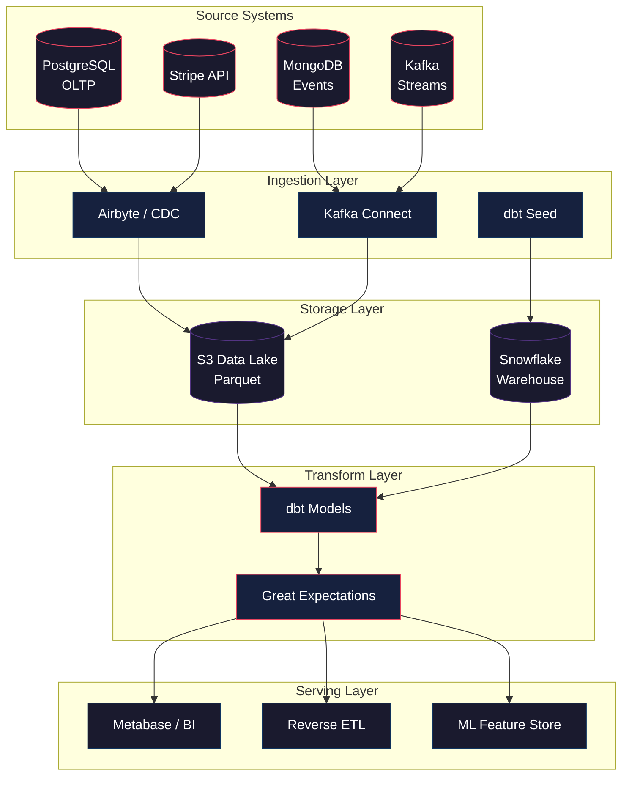
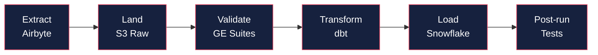
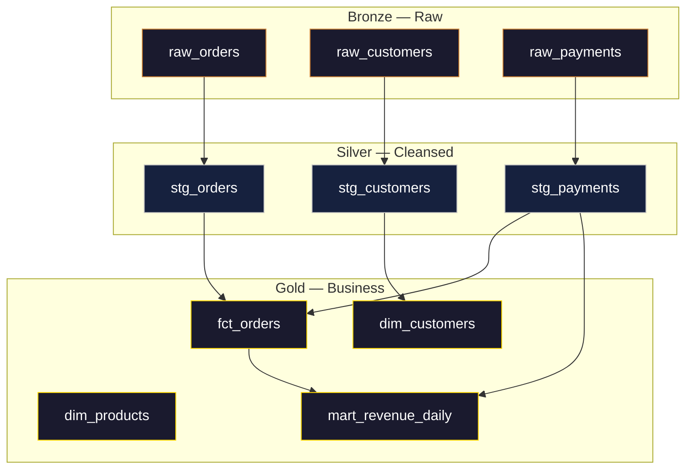
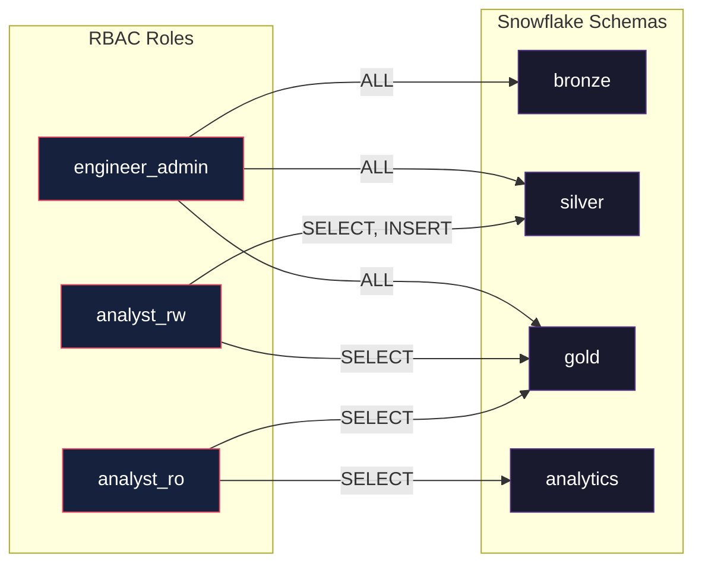
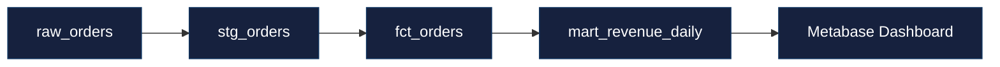
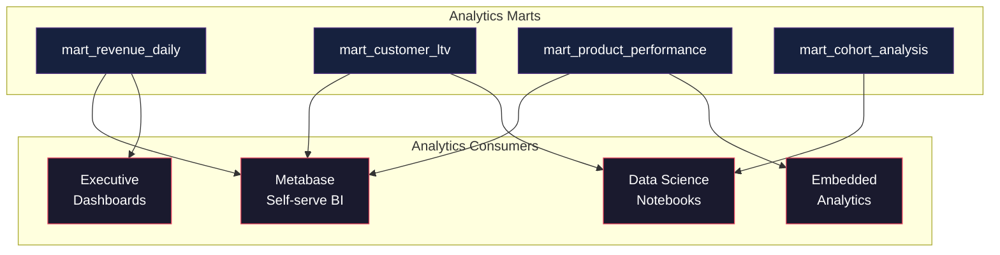
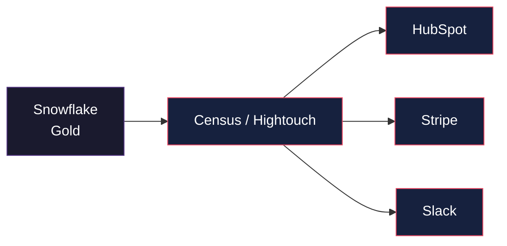

# APEX-OS Data Warehouse

## 1. Architecture



---

## 2. ETL Pipeline

### 2.1 Batch Pipeline (Nightly)



### 2.2 Streaming Pipeline (Real-time)


### 2.3 Pipeline Stages

| Stage | Tool | Schedule | SLA |
|-------|------|----------|-----|
| Extract | Airbyte CDC | Continuous | 5 min lag |
| Land | S3 (Parquet) | Per batch | — |
| Validate | Great Expectations | Per batch | Block on fail |
| Transform | dbt | 02:00 UTC | 04:00 UTC |
| Load | Snowflake | 04:00 UTC | 06:00 UTC |
| Test | dbt tests | 06:00 UTC | 06:30 UTC |

---

## 3. Data Modeling

### 3.1 Layered Architecture



### 3.2 Dimensional Model (Star Schema)

```mermaid
erDiagram
    FACT_ORDERS {
        order_id PK
        customer_id FK
        product_id FK
        date_id FK
        quantity INT
        unit_price DECIMAL
        discount DECIMAL
        total_amount DECIMAL
    }
    DIM_CUSTOMERS {
        customer_id PK
        name STRING
        email STRING
        segment STRING
        created_at TIMESTAMP
    }
    DIM_PRODUCTS {
        product_id PK
        name STRING
        category STRING
        price DECIMAL
    }
    DIM_DATE {
        date_id PK
        date DATE
        week INT
        month INT
        quarter INT
        year INT
    }
    FACT_ORDERS ||--|| DIM_CUSTOMERS : "placed by"
    FACT_ORDERS ||--|| DIM_PRODUCTS : "contains"
    FACT_ORDERS ||--|| DIM_DATE : "on date"
```

### 3.3 Naming Conventions

| Layer | Prefix | Example |
|-------|--------|---------|
| Bronze | `raw_` | `raw_orders` |
| Silver | `stg_` | `stg_orders` |
| Gold Fact | `fct_` | `fct_orders` |
| Gold Dim | `dim_` | `dim_customers` |
| Gold Mart | `mart_` | `mart_revenue_daily` |

---

## 4. Data Governance

### 4.1 Access Control



### 4.2 Data Quality Framework

| Check Type | Tool | Scope | Action |
|------------|------|-------|--------|
| Schema | dbt | All models | Block pipeline |
| Nulls | GE | Critical columns | Warn / Block |
| Uniqueness | dbt | PKs | Block |
| Referential | dbt | FKs | Block |
| Freshness | GE | Source tables | Alert |
| Volume | GE | Daily aggregates | Alert |
| Custom | GE | Business rules | Block |

### 4.3 PII Handling

- **Classification**: Automated scanning via `presidio` + manual tagging
- **Masking**: Dynamic data masking in Snowflake for `analyst_ro`
- **Retention**: 7-year financial, 2-year behavioral, 90-day raw events
- **Right to deletion**: Automated purge workflow triggered by API

### 4.4 Lineage



---

## 5. Analytics

### 5.1 BI & Reporting



### 5.2 Key Metrics

| Domain | Metric | Grain | Refresh |
|--------|--------|-------|---------|
| Revenue | MRR / ARR | Daily | 06:00 UTC |
| Revenue | ARPU | Monthly | 06:00 UTC |
| Customers | LTV | Cohort | Daily |
| Customers | Churn Rate | Weekly | 06:00 UTC |
| Product | NPS | Monthly | 06:00 UTC |
| Product | Conversion Funnel | Daily | 06:00 UTC |

### 5.3 Reverse ETL



### 5.4 ML Feature Store

- **Store**: Snowflake + Feast
- **Features**: Customer embeddings, product affinity, session aggregates
- **Serving**: Online (Redis) for real-time inference, Offline (Snowflake) for training
- **Versioning**: dbt + MLflow integration
