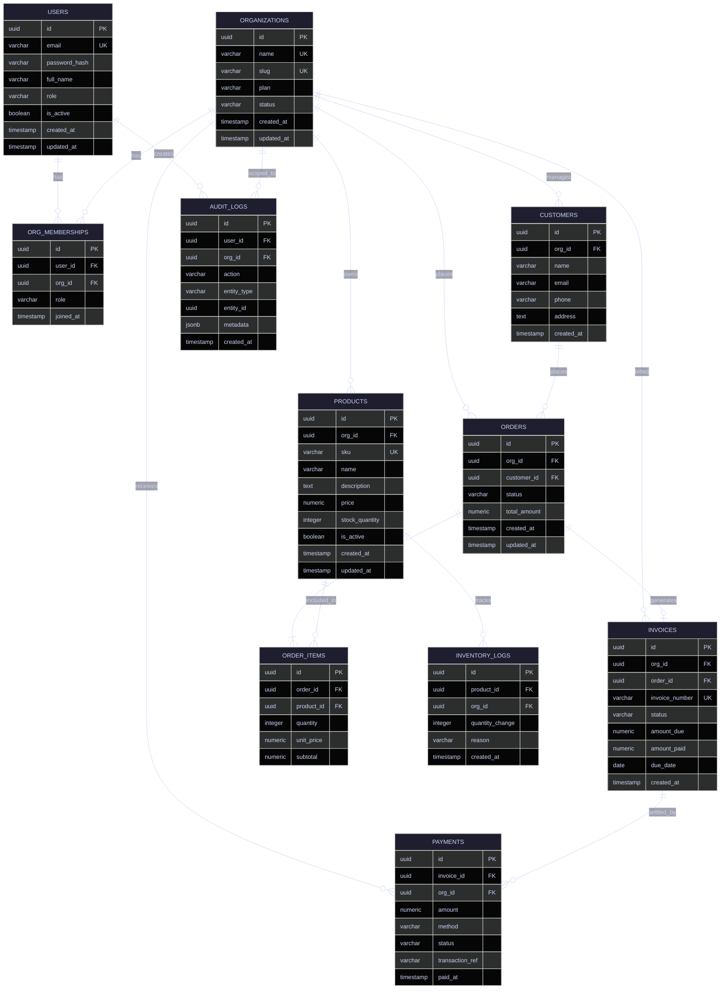

# APEX-OS Business Platform — Database Schema

## 1. Database Schema

## 2. Table Relationships

| Relationship | Type | Description |
|---|---|---|
| USERS ↔ ORGANIZATIONS | Many-to-Many | Via ORG_MEMBERSHIPS; a user can belong to multiple orgs |
| ORGANIZATIONS → PRODUCTS | One-to-Many | Each product belongs to one org |
| ORGANIZATIONS → CUSTOMERS | One-to-Many | Customers are scoped per org |
| ORGANIZATIONS → ORDERS | One-to-Many | Orders are placed within an org |
| CUSTOMERS → ORDERS | One-to-Many | A customer can have many orders |
| ORDERS → ORDER_ITEMS | One-to-Many | Each order has multiple line items |
| PRODUCTS → ORDER_ITEMS | One-to-Many | A product appears in many order items |
| ORDERS → INVOICES | One-to-One | Each order generates at most one invoice |
| INVOICES → PAYMENTS | One-to-Many | An invoice can have multiple partial payments |
| PRODUCTS → INVENTORY_LOGS | One-to-Many | Stock movement history per product |
| USERS → AUDIT_LOGS | One-to-Many | Audit trail per user action |
| ORGANIZATIONS → AUDIT_LOGS | One-to-Many | Audit trail scoped per org |

## 3. Indexing Strategy

| Table | Index | Columns | Purpose |
|---|---|---|---|
| USERS | idx_users_email | email | Login lookup |
| ORGANIZATIONS | idx_org_slug | slug | Public-facing org pages |
| ORG_MEMBERSHIPS | idx_orgmem_user | user_id | List user's orgs |
| ORG_MEMBERSHIPS | idx_orgmem_org | org_id | List org members |
| CUSTOMERS | idx_customers_org | org_id | Filter customers by org |
| CUSTOMERS | idx_customers_email | org_id, email | Unique email per org |
| PRODUCTS | idx_products_org | org_id | List org products |
| PRODUCTS | idx_products_sku | org_id, sku | SKU lookup per org |
| ORDERS | idx_orders_org | org_id | List org orders |
| ORDERS | idx_orders_customer | customer_id | Customer order history |
| ORDERS | idx_orders_status | org_id, status | Filter by status |
| ORDER_ITEMS | idx_orderitems_order | order_id | Fetch order line items |
| INVOICES | idx_invoices_org | org_id | List org invoices |
| INVOICES | idx_invoices_status | org_id, status | Filter by status |
| PAYMENTS | idx_payments_invoice | invoice_id | Payments per invoice |
| INVENTORY_LOGS | idx_invlog_product | product_id | Stock history per product |
| AUDIT_LOGS | idx_audit_org | org_id | Audit trail per org |
| AUDIT_LOGS | idx_audit_entity | entity_type, entity_id | Entity audit lookup |

**Additional Notes:**
- All primary keys are UUID v7 (time-ordered) for index locality.
- Foreign keys are indexed by default; composite indexes follow leftmost-prefix rule.
- Partial indexes on `is_active = true` for USERS and PRODUCTS.
- GIN index on `AUDIT_LOGS.metadata` (jsonb) for flexible querying.

## 4. Partitioning Strategy

| Table | Partition Key | Strategy | Rationale |
|---|---|---|---|
| ORDERS | created_at | RANGE (monthly) | High write volume; time-based queries |
| ORDER_ITEMS | order_id | REFERENCE (via ORDERS) | Cascade partition with parent |
| INVOICES | created_at | RANGE (monthly) | Time-series billing data |
| PAYMENTS | paid_at | RANGE (monthly) | High-volume transactional data |
| INVENTORY_LOGS | created_at | RANGE (monthly) | Append-only log; archival candidate |
| AUDIT_LOGS | created_at | RANGE (monthly) | Compliance retention; time-scoped queries |

**Partition Management:**
- Monthly partitions created 3 months ahead via pg_cron job.
- Partitions older than 24 months moved to cold storage (S3) and detached.
- Hot partitions remain on SSD-backed tablespaces.
- Archive partitions compressed with ZFS gzip-9.

## 5. Backup Strategy

| Layer | Method | Frequency | Retention |
|---|---|---|---|
| WAL Archiving | Continuous (archive_command) | Real-time | 7 days |
| Full Backup | pg_basebackup | Daily (02:00 UTC) | 30 days |
| Incremental | pgBackRest delta | Every 6 hours | 14 days |
| Logical Dump | pg_dump (schema + data) | Weekly (Sunday) | 90 days |
| Cross-Region | Replica to secondary region | Continuous | N/A |
| Point-in-Time | PITR via WAL replay | On-demand | 35 days |

**Recovery Objectives:**
- **RPO:** ≤ 5 minutes (WAL streaming)
- **RTO:** ≤ 30 minutes (automated failover to standby)

**Backup Verification:**
- Weekly automated restore to staging cluster.
- Monthly disaster recovery drill with full PITR test.
- Checksum validation on all backup files.
- Encryption at rest (AES-256) and in transit (TLS 1.3).
