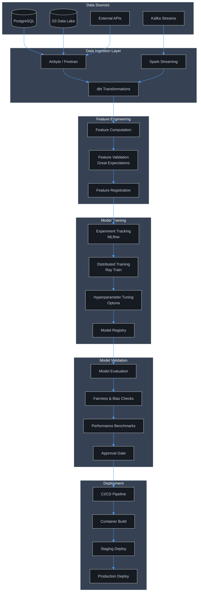
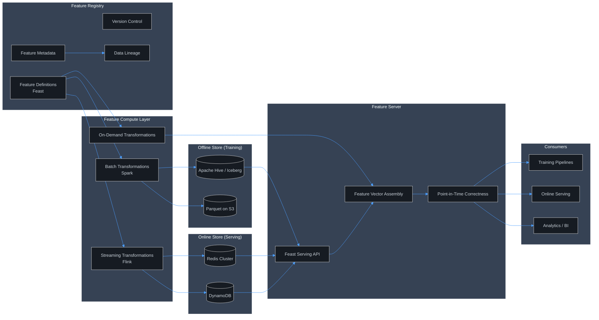
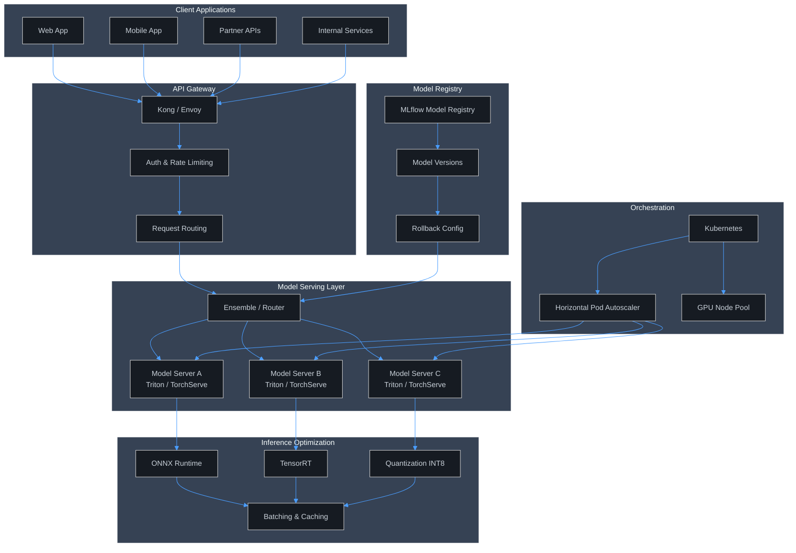
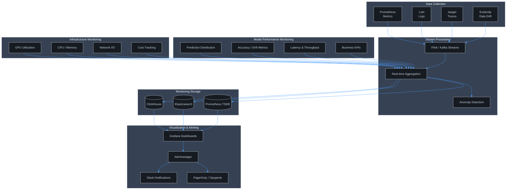
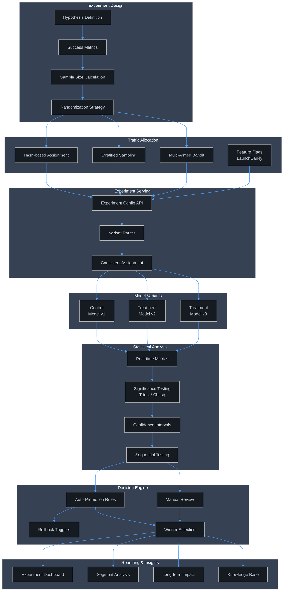

# APEX-OS Data Science Architecture

## 1. ML Pipeline Architecture

## 2. Feature Store Architecture

## 3. Model Serving Architecture

## 4. Monitoring Architecture

## 5. A/B Testing Framework

## Technology Stack Summary

| Layer | Technology |
|-------|-----------|
| Orchestration | Apache Airflow, Prefect |
| Data Processing | Apache Spark, Apache Flink, dbt |
| Feature Store | Feast, Redis, DynamoDB |
| Model Training | MLflow, Ray, Optuna |
| Model Serving | Triton Inference Server, TorchServe, KServe |
| Container Orchestration | Kubernetes, Helm |
| Monitoring | Prometheus, Grafana, Evidently, Jaeger |
| A/B Testing | LaunchDarkly, custom experiment platform |
| CI/CD | GitHub Actions, ArgoCD |
| Infrastructure | Terraform, AWS/GCP/Azure |
