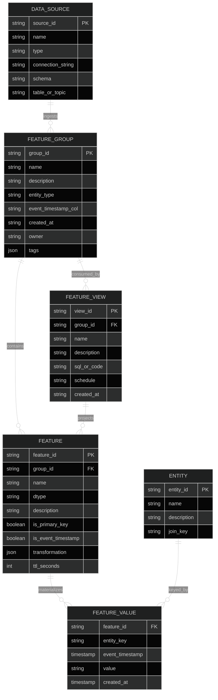
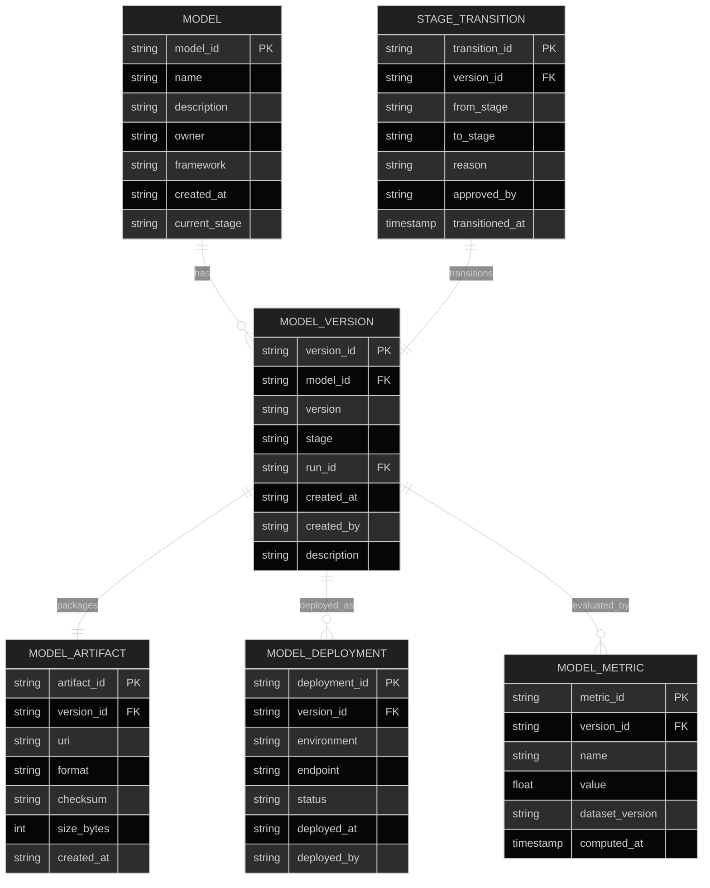
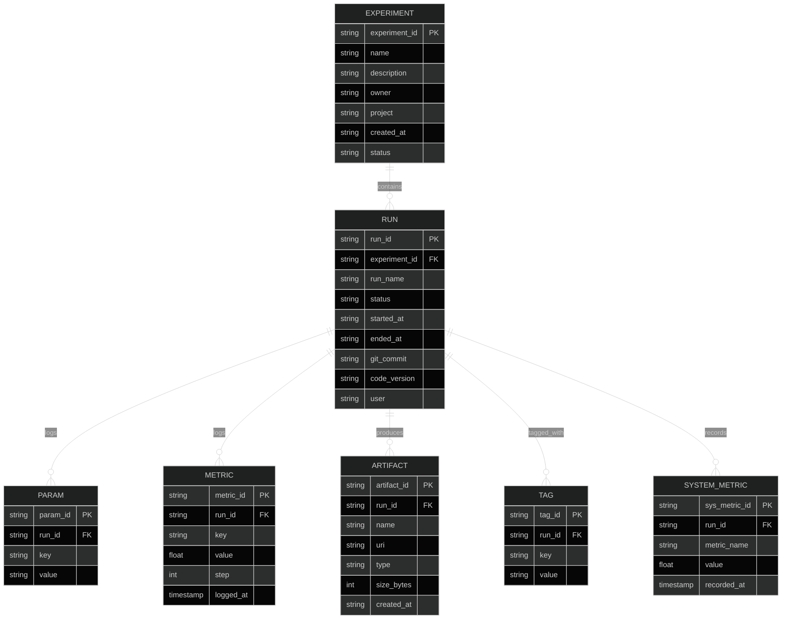
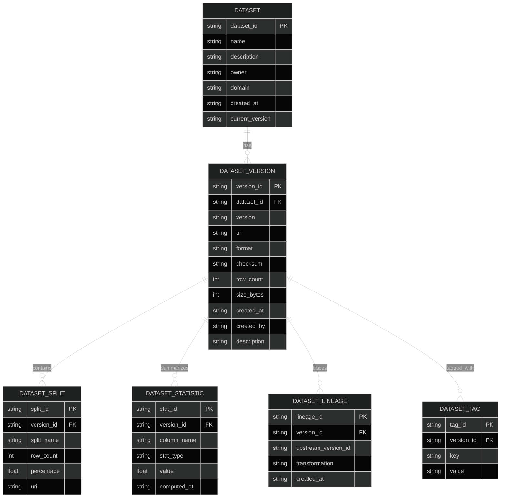
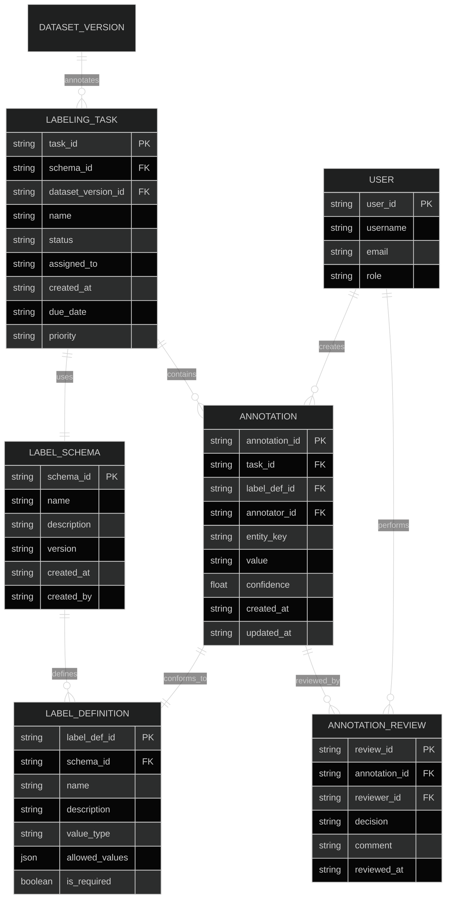

# Data Science Data Model

> APEX-OS Business Platform — ML data architecture reference.
> All diagrams use the dark theme for readability.

---

## 1. Feature Store Schema

---

## 2. Model Registry Schema

---

## 3. Experiment Tracking Schema

---

## 4. Dataset Versioning Schema

---

## 5. Label Management

---

## Entity Relationship Summary

| Domain | Core Entities | Key Relationships |
|--------|--------------|-------------------|
| Feature Store | FeatureGroup, Feature, FeatureValue, FeatureView | Group → Features → Values; View projects Features |
| Model Registry | Model, ModelVersion, Artifact, Deployment | Model → Versions → Artifacts/Deployments |
| Experiment Tracking | Experiment, Run, Param, Metric, Artifact | Experiment → Runs → Params/Metrics/Artifacts |
| Dataset Versioning | Dataset, Version, Split, Statistic, Lineage | Dataset → Versions → Splits/Stats/Lineage |
| Label Management | Schema, Task, Annotation, Review | Schema → Task → Annotations → Reviews |

---

## Conventions

- All primary keys are UUIDs or ULIDs.
- All timestamps are UTC ISO 8601.
- All `*_at` fields are auto-populated.
- Soft deletes via `deleted_at` timestamp (not shown for brevity).
- JSON columns store flexible metadata (tags, transformations, allowed values).
- Foreign keys are logical; enforcement is application-level for cross-service references.
